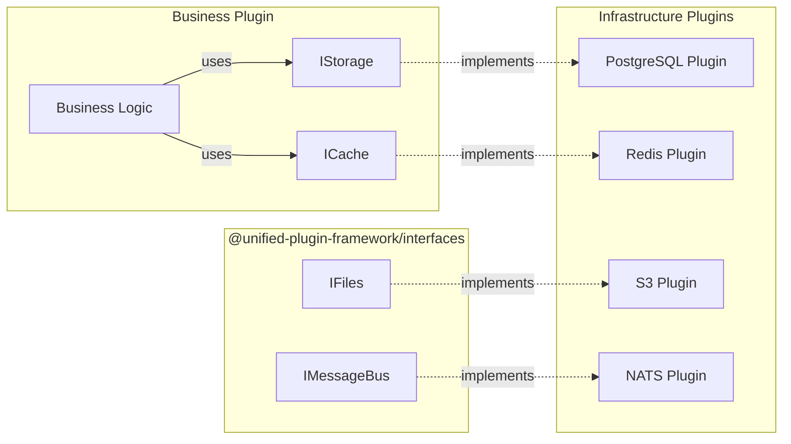

# ADR-004: Interface-First Plugin Contracts

## Status

**Accepted**

## Context

UPF needs a mechanism for plugins to communicate with infrastructure services (storage, cache, files, message bus) while maintaining:

- Loose coupling between plugins and implementations
- Ability to swap implementations without code changes
- Type safety and contract enforcement
- Clear boundaries between business and infrastructure

### Options Considered

1. **Direct library imports** (e.g., `import { PrismaClient } from '@prisma/client'`)
2. **Service locator pattern**
3. **Interface-first design with dependency injection**
4. **Abstract factory pattern**

## Decision

We have decided to use **Interface-First Design** where all infrastructure services are accessed through versioned interfaces, with implementations injected at runtime.

## Rationale

### Interface-First Principles



### Decoupling Benefits

| Approach         | Coupling | Testability | Flexibility |
| ---------------- | -------- | ----------- | ----------- |
| Direct imports   | High     | Low         | Low         |
| Service locator  | Medium   | Medium      | Medium      |
| Interface-first  | Low      | High        | High        |
| Abstract factory | Low      | High        | Medium      |

### Type Safety with TypeScript

Interfaces provide compile-time contract enforcement:

```typescript
// @unified-plugin-framework/interfaces
export interface IStorage {
  query(sql: string, params?: unknown[]): Promise<QueryResult>;
  execute(sql: string, params?: unknown[]): Promise<QueryResult>;
  transaction<T>(fn: (ctx: TransactionContext) => Promise<T>): Promise<T>;
}

// Business plugin - uses interface
export class OrderService {
  constructor(private storage: IStorage) {}

  async getOrders(): Promise<Order[]> {
    // Works with any IStorage implementation
    const result = await this.storage.query('SELECT * FROM orders');
    return result.rows;
  }
}

// PostgreSQL implementation
export class PostgresStorage implements IStorage {
  async query(sql: string, params?: unknown[]): Promise<QueryResult> {
    // PostgreSQL-specific implementation
  }
}

// MongoDB implementation (same interface)
export class MongoStorage implements IStorage {
  async query(sql: string, params?: unknown[]): Promise<QueryResult> {
    // MongoDB-specific implementation (translates SQL to queries)
  }
}
```

### Runtime Implementation Resolution

The framework resolves implementations at runtime:

```typescript
// Registry resolves interfaces to implementations
const storage = await registry.resolve<IStorage>('IStorage');

// Business plugins declare requirements
// manifest.yaml
requires:
  interfaces:
    - interface: IStorage
      version: ^1.0.0
    - interface: ICache
      version: ^1.0.0
```

### Versioned Interfaces

Interfaces are versioned for compatibility:

```typescript
// v1.0.0
interface IStorage_v1 {
  query(sql: string): Promise<QueryResult>;
}

// v1.1.0 - backward compatible addition
interface IStorage_v1_1 extends IStorage_v1 {
  queryWithTimeout(sql: string, timeout: number): Promise<QueryResult>;
}

// v2.0.0 - breaking change (new major version)
interface IStorage_v2 {
  query(options: QueryOptions): Promise<QueryResult>;
}
```

## Consequences

### Positive

1. **Implementation Independence**
   - Switch from PostgreSQL to MongoDB without changing business code
   - Test with in-memory implementations
   - Support multiple implementations simultaneously

2. **Type Safety**
   - Compile-time verification of contracts
   - IDE autocompletion and documentation
   - Refactoring confidence

3. **Testability**
   - Easy to mock interfaces
   - No external dependencies in unit tests
   - Deterministic test behavior

4. **Evolution**
   - Versioned interfaces allow gradual migration
   - Backward compatibility rules
   - Clear deprecation path

### Negative

1. **Additional Abstraction**
   - Interfaces add indirection
   - Potential performance overhead (minimal)
   - More files to maintain

2. **Learning Curve**
   - Developers must understand DI patterns
   - Different mental model from direct imports
   - Interface design skills required

3. **Resolution Complexity**
   - Runtime resolution adds complexity
   - Dependency graph management
   - Potential circular dependency issues

### Mitigation Strategies

1. **Clear Documentation**
   - Document all interfaces thoroughly
   - Provide example implementations
   - Migration guides for version changes

2. **SDK Simplification**
   - Hide DI complexity in SDK
   - Simple decorators for injection
   - Automatic registration

3. **Tooling Support**
   - IDE integration for interfaces
   - Validation at build time
   - Dependency graph visualization

## Implementation

### Interface Definition

```typescript
// @unified-plugin-framework/interfaces/storage.ts
export interface IStorage {
  /**
   * Execute a read query
   */
  query(sql: string, params?: unknown[]): Promise<QueryResult>;

  /**
   * Execute a write operation
   */
  execute(sql: string, params?: unknown[]): Promise<QueryResult>;

  /**
   * Execute operations in a transaction
   */
  transaction<T>(fn: (ctx: TransactionContext) => Promise<T>): Promise<T>;

  /**
   * Run migrations
   */
  migrate(migrations: Migration[]): Promise<void>;
}

export interface QueryResult {
  rows: Record<string, unknown>[];
  rowCount: number;
}

export interface TransactionContext {
  query(sql: string, params?: unknown[]): Promise<QueryResult>;
  execute(sql: string, params?: unknown[]): Promise<QueryResult>;
}
```

### Dependency Injection

```typescript
// Business plugin service
import { injectable, inject } from '@unified-plugin-framework/backend-sdk';
import { IStorage, ICache } from '@unified-plugin-framework/interfaces';

@injectable()
export class OrderService {
  constructor(
    @inject('IStorage') private storage: IStorage,
    @inject('ICache') private cache: ICache,
  ) {}

  async getOrder(orderId: string): Promise<Order> {
    // Try cache first
    const cached = await this.cache.get(`order:${orderId}`);
    if (cached) return JSON.parse(cached);

    // Query storage
    const result = await this.storage.query('SELECT * FROM orders WHERE id = ?', [orderId]);

    const order = result.rows[0] as Order;

    // Cache result
    await this.cache.set(`order:${orderId}`, JSON.stringify(order), { ttl: 300 });

    return order;
  }
}
```

### Manifest Declaration

```yaml
# manifest.yaml
plugin:
  id: orders-plugin
  name: Orders Plugin

requires:
  interfaces:
    - interface: IStorage
      version: ^1.0.0
      required: true
    - interface: ICache
      version: ^1.0.0
      required: true
    - interface: IMessageBus
      version: ^1.0.0
      required: false # Optional dependency

provides:
  services:
    - name: OrderService
      proto: proto/order.proto
```

### Implementation Registration

```typescript
// Infrastructure plugin (e.g., storage-postgres)
import { registerInterface } from '@unified-plugin-framework/backend-sdk';
import { IStorage } from '@unified-plugin-framework/interfaces';
import { PostgresStorage } from './postgres-storage';

// Register as implementation of IStorage
registerInterface('IStorage', PostgresStorage, {
  version: '1.0.0',
  priority: 10, // Higher priority = preferred
});
```

### Testing with Mocks

```typescript
// Unit test with mock
import { createMock } from '@unified-plugin-framework/testing';
import { IStorage, ICache } from '@unified-plugin-framework/interfaces';
import { OrderService } from './order-service';

describe('OrderService', () => {
  it('should fetch order from cache', async () => {
    const mockStorage = createMock<IStorage>();
    const mockCache = createMock<ICache>();

    mockCache.get.mockResolvedValue(JSON.stringify({ id: '123', total: 100 }));

    const service = new OrderService(mockStorage, mockCache);
    const order = await service.getOrder('123');

    expect(order.id).toBe('123');
    expect(mockStorage.query).not.toHaveBeenCalled(); // Storage not hit
  });

  it('should query storage on cache miss', async () => {
    const mockStorage = createMock<IStorage>();
    const mockCache = createMock<ICache>();

    mockCache.get.mockResolvedValue(null);
    mockStorage.query.mockResolvedValue({
      rows: [{ id: '123', total: 100 }],
      rowCount: 1,
    });

    const service = new OrderService(mockStorage, mockCache);
    const order = await service.getOrder('123');

    expect(order.id).toBe('123');
    expect(mockStorage.query).toHaveBeenCalled();
    expect(mockCache.set).toHaveBeenCalled(); // Cache populated
  });
});
```

### Version Compatibility

```typescript
// Framework resolves compatible implementations
async function resolveInterface<T>(name: string, requiredVersion: string): Promise<T> {
  const implementations = registry.getImplementations(name);

  // Find compatible implementation using semver
  const compatible = implementations.find((impl) => semver.satisfies(impl.version, requiredVersion));

  if (!compatible) {
    throw new Error(`No compatible implementation found for ${name}@${requiredVersion}`);
  }

  return compatible.instance as T;
}
```

## Interface Design Guidelines

### 1. Keep Interfaces Focused

```typescript
// ❌ Too broad
interface IDataService {
  query(...): Promise<...>;
  cache(...): Promise<...>;
  sendEmail(...): Promise<...>;
}

// ✅ Focused interfaces
interface IStorage { query(...): Promise<...>; }
interface ICache { get(...): Promise<...>; set(...): Promise<...>; }
interface IEmail { send(...): Promise<...>; }
```

### 2. Use Primitive Types

```typescript
// ❌ Implementation-specific types
interface IStorage {
  query(sql: PrismaQuery): Promise<PrismaResult>;
}

// ✅ Standard types
interface IStorage {
  query(sql: string, params?: unknown[]): Promise<QueryResult>;
}
```

### 3. Return Rich Results

```typescript
// ❌ Just raw data
interface IStorage {
  query(sql: string): Promise<Record<string, unknown>[]>;
}

// ✅ Structured result with metadata
interface IStorage {
  query(sql: string): Promise<QueryResult>;
}

interface QueryResult {
  rows: Record<string, unknown>[];
  rowCount: number;
  duration?: number;
}
```

### 4. Async by Default

```typescript
// ❌ Sync operations (limits implementation options)
interface ICache {
  get(key: string): string | null;
}

// ✅ Async operations
interface ICache {
  get(key: string): Promise<string | null>;
}
```

## References

- [Dependency Inversion Principle](https://en.wikipedia.org/wiki/Dependency_inversion_principle)
- [Interface Segregation Principle](https://en.wikipedia.org/wiki/Interface_segregation_principle)
- [Ports and Adapters (Hexagonal Architecture)](https://alistair.cockburn.us/hexagonal-architecture/)
- [Semantic Versioning](https://semver.org/)

## Changelog

| Date       | Author            | Description      |
| ---------- | ----------------- | ---------------- |
| 2025-01-15 | Architecture Team | Initial decision |
