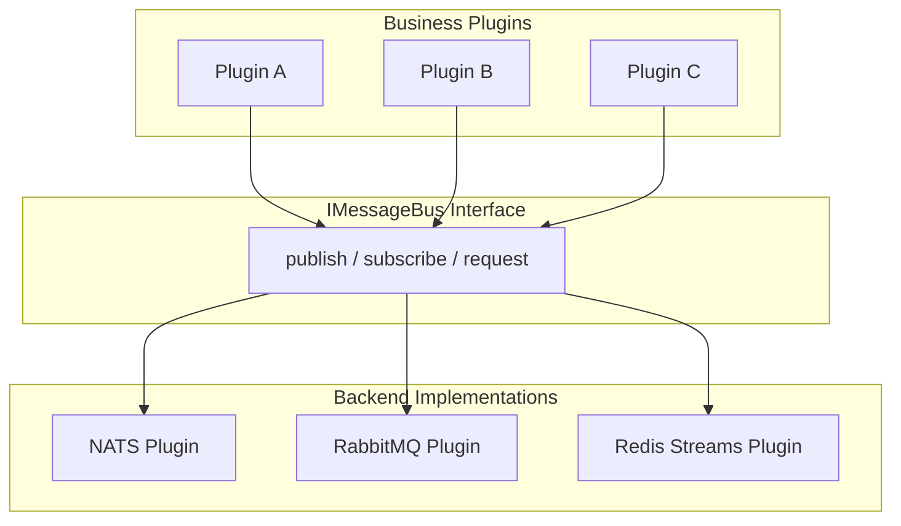

# ADR-005: Message Bus Abstraction

## Status

**Accepted**

## Context

UPF requires an asynchronous messaging system for:

- Event-driven communication between plugins
- Decoupled plugin interactions
- Scalable pub/sub patterns
- Work queue distribution
- Real-time notifications

Different deployment environments may prefer different message brokers based on existing infrastructure, operational expertise, and specific requirements.

### Options Considered

1. **Single message broker** (NATS only)
2. **Multiple independent integrations** (separate packages for each)
3. **Message bus abstraction** (unified interface, multiple backends)
4. **No message bus** (gRPC only)

## Decision

We have decided to implement a **Message Bus Abstraction** (`IMessageBus`) that supports multiple backend implementations (NATS, RabbitMQ, Redis Streams) through a unified interface.

## Rationale

### Unified Interface, Multiple Backends



### Backend Comparison

| Feature      | NATS                 | RabbitMQ            | Redis Streams  |
| ------------ | -------------------- | ------------------- | -------------- |
| Latency      | Ultra-low            | Low                 | Low            |
| Persistence  | Optional (JetStream) | Yes                 | Yes            |
| Throughput   | Very High            | High                | High           |
| Clustering   | Built-in             | Yes                 | Yes (Cluster)  |
| Complexity   | Low                  | Medium              | Low            |
| Memory usage | Low                  | Medium              | Varies         |
| Protocol     | Custom               | AMQP                | Redis Protocol |
| Best for     | Real-time, IoT       | Enterprise, routing | Redis-centric  |

### Why Abstraction Over Direct Integration?

| Approach          | Vendor Lock-in | Migration Cost | Development Complexity |
| ----------------- | -------------- | -------------- | ---------------------- |
| Single broker     | High           | Very High      | Low                    |
| Multiple packages | Medium         | High           | High                   |
| Abstraction       | Low            | Low            | Medium                 |

### Use Case Support

The abstraction supports common messaging patterns:

```typescript
// Pub/Sub - Fire and forget
await messageBus.publish('orders', 'order.created', orderData);

// Request/Reply - Synchronous over async
const response = await messageBus.request('inventory', 'check.stock', { productId });

// Work Queue - Load-balanced processing
await messageBus.subscribe(
  ['orders.process'],
  async (msg) => {
    await processOrder(msg.data);
    msg.ack();
  },
  { queue: 'order-processors' },
);

// Streaming - Ordered message processing
for await (const msg of messageBus.stream('events', { startFrom: 'beginning' })) {
  await handleEvent(msg);
}
```

## Consequences

### Positive

1. **Vendor Independence**
   - No lock-in to specific message broker
   - Deploy with existing infrastructure
   - Migrate between backends

2. **Simplified Development**
   - Single API for all messaging
   - Consistent patterns across plugins
   - Easier testing with in-memory backend

3. **Operational Flexibility**
   - Use NATS for development (simple)
   - Use RabbitMQ for enterprise (familiar)
   - Use Redis for Redis-centric architectures

4. **Future-Proof**
   - Add new backends without changing plugins
   - Evolve interface as patterns emerge
   - Support hybrid deployments

### Negative

1. **Lowest Common Denominator**
   - Cannot use broker-specific features
   - Some advanced patterns not portable
   - Potential performance overhead

2. **Abstraction Complexity**
   - Additional layer to maintain
   - Subtle behavior differences between backends
   - More testing required

3. **Feature Limitations**
   - Not all features available on all backends
   - Some patterns require specific backends
   - Complex routing may not be portable

### Mitigation Strategies

1. **Feature Flags**
   - Document which features require specific backends
   - Runtime capability checking
   - Graceful degradation

2. **Testing Matrix**
   - Test plugins against all backends
   - Document behavior differences
   - Provide compatibility matrix

3. **Escape Hatches**
   - Allow direct backend access when needed
   - Plugin can require specific backend
   - Document when abstraction isn't suitable

## Implementation

### IMessageBus Interface

```typescript
// @unified-plugin-framework/interfaces/message-bus.ts
export interface IMessageBus {
  /**
   * Publish a message to a subject
   */
  publish(stream: string, subject: string, data: unknown, options?: PublishOptions): Promise<void>;

  /**
   * Subscribe to subjects
   */
  subscribe(subjects: string[], handler: MessageHandler, options?: SubscribeOptions): Promise<Subscription>;

  /**
   * Request/Reply pattern
   */
  request<T>(subject: string, data: unknown, options?: RequestOptions): Promise<T>;

  /**
   * Create a stream iterator for ordered processing
   */
  stream(stream: string, options?: StreamOptions): AsyncIterable<Message>;
}

export interface Message {
  id: string;
  subject: string;
  data: unknown;
  timestamp: Date;
  headers?: Record<string, string>;
  ack(): Promise<void>;
  nak(delay?: number): Promise<void>;
}

export interface Subscription {
  unsubscribe(): Promise<void>;
}

export type MessageHandler = (message: Message) => Promise<void>;

export interface PublishOptions {
  headers?: Record<string, string>;
  messageId?: string;
  correlationId?: string;
}

export interface SubscribeOptions {
  queue?: string; // For load-balanced consumption
  durable?: string; // For persistent subscriptions
  startFrom?: 'beginning' | 'new' | Date;
  maxInflight?: number; // Concurrency control
  ackWait?: number; // Ack timeout in ms
}

export interface RequestOptions {
  timeout?: number;
  headers?: Record<string, string>;
}
```

### NATS Implementation

```typescript
// plugins/message-bus-nats/src/nats-message-bus.ts
import { connect, NatsConnection, JetStreamClient } from 'nats';
import { IMessageBus, Message, Subscription } from '@unified-plugin-framework/interfaces';

export class NatsMessageBus implements IMessageBus {
  private nc: NatsConnection;
  private js: JetStreamClient;

  async connect(): Promise<void> {
    this.nc = await connect({
      servers: process.env.NATS_URL || 'nats://localhost:4222',
    });
    this.js = this.nc.jetstream();
  }

  async publish(stream: string, subject: string, data: unknown, options?: PublishOptions): Promise<void> {
    const headers = nats.headers();
    if (options?.correlationId) {
      headers.set('correlation-id', options.correlationId);
    }

    await this.js.publish(`${stream}.${subject}`, JSON.stringify(data), {
      headers,
      msgID: options?.messageId,
    });
  }

  async subscribe(subjects: string[], handler: MessageHandler, options?: SubscribeOptions): Promise<Subscription> {
    const sub = await this.js.subscribe(subjects.join('|'), {
      queue: options?.queue,
      durable: options?.durable,
      deliver_policy: this.mapStartFrom(options?.startFrom),
      max_ack_pending: options?.maxInflight,
      ack_wait: options?.ackWait ? nanos(options.ackWait) : undefined,
    });

    (async () => {
      for await (const msg of sub) {
        const message = this.wrapMessage(msg);
        try {
          await handler(message);
        } catch (error) {
          await message.nak();
        }
      }
    })();

    return {
      unsubscribe: () => sub.unsubscribe(),
    };
  }

  async request<T>(subject: string, data: unknown, options?: RequestOptions): Promise<T> {
    const response = await this.nc.request(subject, JSON.stringify(data), { timeout: options?.timeout || 5000 });
    return JSON.parse(response.data) as T;
  }

  async *stream(stream: string, options?: StreamOptions): AsyncIterable<Message> {
    const consumer = await this.js.consumers.get(stream);
    const messages = await consumer.consume();

    for await (const msg of messages) {
      yield this.wrapMessage(msg);
    }
  }

  private wrapMessage(natsMsg: NatsMessage): Message {
    return {
      id: natsMsg.info.streamSequence.toString(),
      subject: natsMsg.subject,
      data: JSON.parse(natsMsg.data),
      timestamp: new Date(natsMsg.info.timestampNanos / 1_000_000),
      headers: this.extractHeaders(natsMsg.headers),
      ack: () => natsMsg.ack(),
      nak: (delay) => natsMsg.nak(delay),
    };
  }
}
```

### RabbitMQ Implementation

```typescript
// plugins/message-bus-rabbitmq/src/rabbitmq-message-bus.ts
import { connect, Connection, Channel } from 'amqplib';
import { IMessageBus, Message, Subscription } from '@unified-plugin-framework/interfaces';

export class RabbitMQMessageBus implements IMessageBus {
  private connection: Connection;
  private channel: Channel;

  async connect(): Promise<void> {
    this.connection = await connect(process.env.RABBITMQ_URL || 'amqp://localhost');
    this.channel = await this.connection.createChannel();
  }

  async publish(stream: string, subject: string, data: unknown, options?: PublishOptions): Promise<void> {
    await this.channel.assertExchange(stream, 'topic', { durable: true });

    this.channel.publish(stream, subject, Buffer.from(JSON.stringify(data)), {
      persistent: true,
      messageId: options?.messageId,
      correlationId: options?.correlationId,
      headers: options?.headers,
    });
  }

  async subscribe(subjects: string[], handler: MessageHandler, options?: SubscribeOptions): Promise<Subscription> {
    const exchange = subjects[0].split('.')[0];
    await this.channel.assertExchange(exchange, 'topic', { durable: true });

    const queueName = options?.queue || '';
    const { queue } = await this.channel.assertQueue(queueName, {
      durable: !!options?.durable,
      exclusive: !options?.queue,
    });

    for (const subject of subjects) {
      await this.channel.bindQueue(queue, exchange, subject);
    }

    await this.channel.prefetch(options?.maxInflight || 10);

    const { consumerTag } = await this.channel.consume(queue, async (msg) => {
      if (!msg) return;

      const message = this.wrapMessage(msg);
      try {
        await handler(message);
      } catch (error) {
        await message.nak();
      }
    });

    return {
      unsubscribe: () => this.channel.cancel(consumerTag),
    };
  }

  async request<T>(subject: string, data: unknown, options?: RequestOptions): Promise<T> {
    // RabbitMQ RPC pattern implementation
    const correlationId = crypto.randomUUID();
    const replyQueue = await this.channel.assertQueue('', { exclusive: true });

    return new Promise((resolve, reject) => {
      const timeout = setTimeout(() => {
        reject(new Error('Request timeout'));
      }, options?.timeout || 5000);

      this.channel.consume(
        replyQueue.queue,
        (msg) => {
          if (msg?.properties.correlationId === correlationId) {
            clearTimeout(timeout);
            resolve(JSON.parse(msg.content.toString()) as T);
          }
        },
        { noAck: true },
      );

      this.channel.sendToQueue(subject, Buffer.from(JSON.stringify(data)), {
        correlationId,
        replyTo: replyQueue.queue,
      });
    });
  }
}
```

### Redis Streams Implementation

```typescript
// plugins/message-bus-redis/src/redis-message-bus.ts
import { Redis } from 'ioredis';
import { IMessageBus, Message, Subscription } from '@unified-plugin-framework/interfaces';

export class RedisMessageBus implements IMessageBus {
  private redis: Redis;
  private subscriber: Redis;

  async connect(): Promise<void> {
    this.redis = new Redis(process.env.REDIS_URL || 'redis://localhost:6379');
    this.subscriber = this.redis.duplicate();
  }

  async publish(stream: string, subject: string, data: unknown, options?: PublishOptions): Promise<void> {
    await this.redis.xadd(
      stream,
      '*',
      'subject',
      subject,
      'data',
      JSON.stringify(data),
      'correlationId',
      options?.correlationId || '',
    );
  }

  async subscribe(subjects: string[], handler: MessageHandler, options?: SubscribeOptions): Promise<Subscription> {
    const stream = subjects[0].split('.')[0];
    const group = options?.queue || `group-${crypto.randomUUID()}`;
    const consumer = `consumer-${crypto.randomUUID()}`;

    // Create consumer group
    try {
      await this.redis.xgroup('CREATE', stream, group, '0', 'MKSTREAM');
    } catch {
      // Group may already exist
    }

    let running = true;

    (async () => {
      while (running) {
        const results = await this.redis.xreadgroup(
          'GROUP',
          group,
          consumer,
          'COUNT',
          options?.maxInflight || 10,
          'BLOCK',
          1000,
          'STREAMS',
          stream,
          '>',
        );

        if (!results) continue;

        for (const [, messages] of results) {
          for (const [id, fields] of messages) {
            const message = this.wrapMessage(stream, group, id, fields);

            // Filter by subject pattern
            if (this.matchesSubjects(message.subject, subjects)) {
              try {
                await handler(message);
              } catch {
                await message.nak();
              }
            }
          }
        }
      }
    })();

    return {
      unsubscribe: async () => {
        running = false;
      },
    };
  }

  private wrapMessage(stream: string, group: string, id: string, fields: string[]): Message {
    const data: Record<string, string> = {};
    for (let i = 0; i < fields.length; i += 2) {
      data[fields[i]] = fields[i + 1];
    }

    return {
      id,
      subject: data.subject,
      data: JSON.parse(data.data),
      timestamp: new Date(parseInt(id.split('-')[0])),
      ack: () => this.redis.xack(stream, group, id),
      nak: () => Promise.resolve(), // Redis doesn't have NAK, message will be redelivered
    };
  }
}
```

### Usage in Plugins

```typescript
// Business plugin using message bus
import { inject } from '@unified-plugin-framework/backend-sdk';
import { IMessageBus } from '@unified-plugin-framework/interfaces';

@injectable()
export class OrderService {
  constructor(@inject('IMessageBus') private messageBus: IMessageBus) {}

  async createOrder(data: CreateOrderData): Promise<Order> {
    const order = await this.saveOrder(data);

    // Publish event - subscribers will receive on all backends
    await this.messageBus.publish('orders', 'order.created', {
      orderId: order.id,
      customerId: data.customerId,
      total: order.total,
    });

    return order;
  }

  async checkInventory(productId: string): Promise<InventoryStatus> {
    // Request/Reply - works on all backends
    return await this.messageBus.request('inventory', 'check.stock', {
      productId,
    });
  }
}
```

### Backend Selection

```yaml
# deployment config
infrastructure:
  messageBus:
    backend: nats  # or 'rabbitmq' or 'redis'
    config:
      url: nats://nats:4222

# Or via environment
MESSAGE_BUS_BACKEND=nats
NATS_URL=nats://nats:4222
```

## Feature Compatibility Matrix

| Feature          | NATS         | RabbitMQ  | Redis      |
| ---------------- | ------------ | --------- | ---------- |
| Pub/Sub          | ✅           | ✅        | ✅         |
| Work Queues      | ✅           | ✅        | ✅         |
| Request/Reply    | ✅           | ✅        | ⚠️ Limited |
| Persistence      | ✅ JetStream | ✅        | ✅         |
| Message TTL      | ✅           | ✅        | ❌         |
| Dead Letter      | ✅           | ✅        | ❌         |
| Priority         | ❌           | ✅        | ❌         |
| Delayed Delivery | ❌           | ✅ Plugin | ❌         |

## References

- [NATS Documentation](https://docs.nats.io/)
- [RabbitMQ Documentation](https://www.rabbitmq.com/documentation.html)
- [Redis Streams](https://redis.io/docs/data-types/streams/)
- [Enterprise Integration Patterns](https://www.enterpriseintegrationpatterns.com/)

## Changelog

| Date       | Author            | Description      |
| ---------- | ----------------- | ---------------- |
| 2025-01-15 | Architecture Team | Initial decision |
