# Communication Architecture

This document describes the inter-plugin communication patterns in UPF, including gRPC services, streaming, message bus integration, and protocol specifications.

## Communication Overview

UPF plugins communicate through multiple patterns optimized for different use cases:

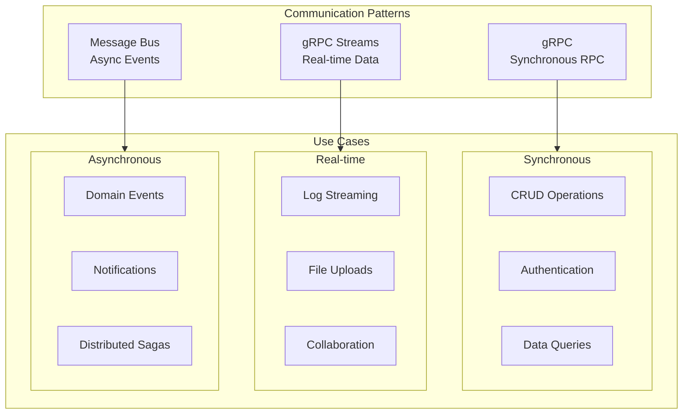

## gRPC Communication

### Protocol Buffers (Protobuf)

All service contracts are defined using Protocol Buffers:

```protobuf
// Example: Business service definition
syntax = "proto3";

package upf.business;

import "google/protobuf/timestamp.proto";
import "google/protobuf/empty.proto";

// Service definition
service OrderService {
  // Unary RPC
  rpc CreateOrder(CreateOrderRequest) returns (Order);
  rpc GetOrder(GetOrderRequest) returns (Order);
  rpc UpdateOrder(UpdateOrderRequest) returns (Order);
  rpc DeleteOrder(DeleteOrderRequest) returns (google.protobuf.Empty);

  // Server streaming - plugin sends stream of data
  rpc ListOrders(ListOrdersRequest) returns (stream Order);
  rpc WatchOrderUpdates(WatchRequest) returns (stream OrderEvent);

  // Client streaming - client sends stream of data
  rpc BatchCreateOrders(stream CreateOrderRequest) returns (BatchResult);

  // Bidirectional streaming
  rpc SyncOrders(stream OrderSync) returns (stream OrderSync);
}

// Message definitions
message Order {
  string id = 1;
  string customer_id = 2;
  repeated OrderItem items = 3;
  OrderStatus status = 4;
  Money total = 5;
  google.protobuf.Timestamp created_at = 6;
  google.protobuf.Timestamp updated_at = 7;
}

message OrderItem {
  string product_id = 1;
  int32 quantity = 2;
  Money unit_price = 3;
}

message Money {
  string currency = 1;
  int64 amount = 2; // in smallest currency unit (cents)
}

enum OrderStatus {
  ORDER_STATUS_UNSPECIFIED = 0;
  ORDER_STATUS_PENDING = 1;
  ORDER_STATUS_CONFIRMED = 2;
  ORDER_STATUS_SHIPPED = 3;
  ORDER_STATUS_DELIVERED = 4;
  ORDER_STATUS_CANCELLED = 5;
}
```

### gRPC Service Types

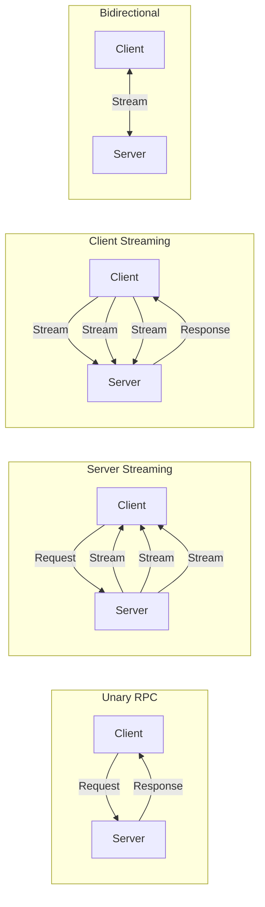

#### 1. Unary RPC

Standard request-response pattern:

```typescript
// Client usage
const order = await orderClient.getOrder({ id: "order-123" });

// Server implementation
async getOrder(request: GetOrderRequest): Promise<Order> {
  const order = await this.storage.get("orders", request.id);
  if (!order) {
    throw new GrpcError(Status.NOT_FOUND, "Order not found");
  }
  return order;
}
```

#### 2. Server Streaming

Server sends multiple responses to a single request:

```typescript
// Client usage
const stream = orderClient.listOrders({ customerId: "customer-123" });
for await (const order of stream) {
  console.log("Received order:", order.id);
}

// Server implementation
async *listOrders(request: ListOrdersRequest): AsyncIterable<Order> {
  const cursor = this.storage.query("orders", {
    where: { customerId: request.customerId },
  });

  for await (const order of cursor) {
    yield order;
  }
}
```

#### 3. Client Streaming

Client sends multiple requests, server responds once:

```typescript
// Client usage
async function batchCreate(orders: CreateOrderRequest[]): Promise<BatchResult> {
  const stream = orderClient.batchCreateOrders();

  for (const order of orders) {
    await stream.write(order);
  }

  return await stream.close();
}

// Server implementation
async batchCreateOrders(
  requests: AsyncIterable<CreateOrderRequest>
): Promise<BatchResult> {
  const results: string[] = [];

  for await (const request of requests) {
    const order = await this.createOrder(request);
    results.push(order.id);
  }

  return { createdIds: results, count: results.length };
}
```

#### 4. Bidirectional Streaming

Both client and server send streams of data:

```typescript
// Client usage
async function syncOrders(): Promise<void> {
  const stream = orderClient.syncOrders();

  // Send local changes
  stream.write({ type: "LOCAL_UPDATE", order: localOrder });

  // Receive remote changes
  for await (const sync of stream) {
    if (sync.type === "REMOTE_UPDATE") {
      applyRemoteChange(sync.order);
    }
  }
}

// Server implementation
async *syncOrders(
  requests: AsyncIterable<OrderSync>
): AsyncIterable<OrderSync> {
  // Process incoming and yield outgoing
  for await (const sync of requests) {
    const result = await this.processSync(sync);
    yield result;
  }
}
```

### gRPC Client Connection

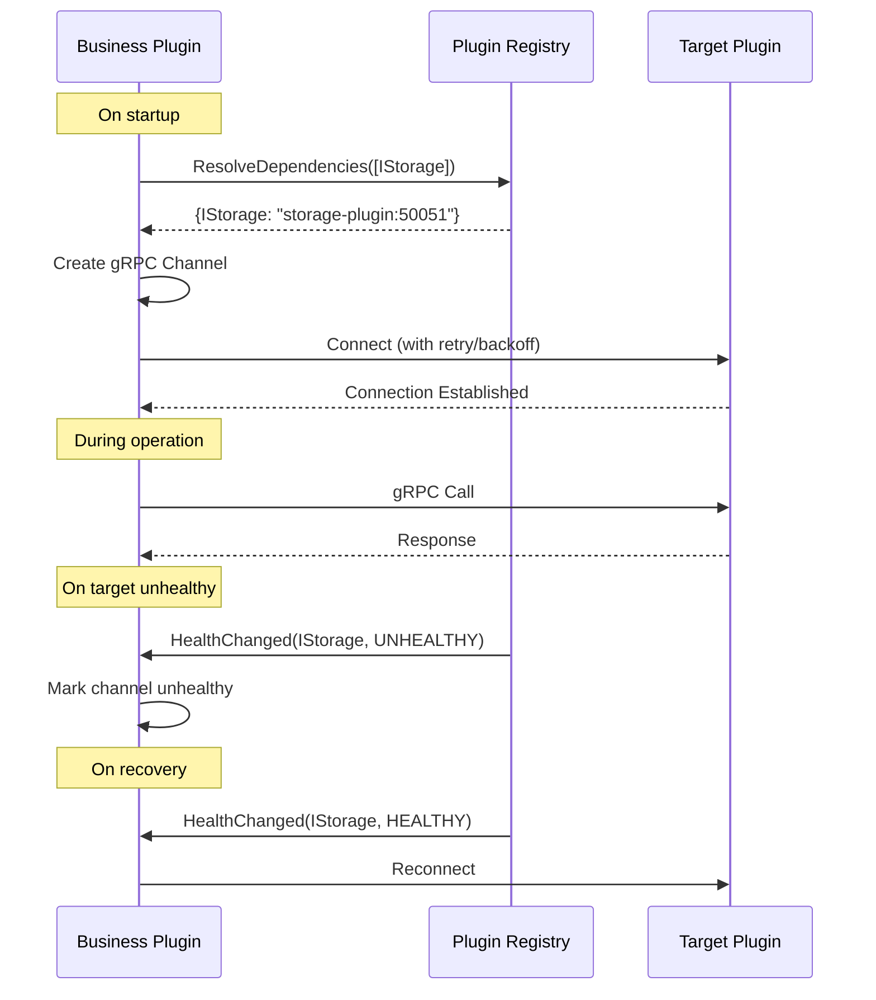

### Error Handling

```typescript
// Standard gRPC status codes
enum GrpcStatus {
  OK = 0,
  CANCELLED = 1,
  UNKNOWN = 2,
  INVALID_ARGUMENT = 3,
  DEADLINE_EXCEEDED = 4,
  NOT_FOUND = 5,
  ALREADY_EXISTS = 6,
  PERMISSION_DENIED = 7,
  RESOURCE_EXHAUSTED = 8,
  FAILED_PRECONDITION = 9,
  ABORTED = 10,
  OUT_OF_RANGE = 11,
  UNIMPLEMENTED = 12,
  INTERNAL = 13,
  UNAVAILABLE = 14,
  DATA_LOSS = 15,
  UNAUTHENTICATED = 16,
}

// Error handling in client
try {
  const order = await orderClient.getOrder({ id: 'invalid' });
} catch (error) {
  if (error.code === GrpcStatus.NOT_FOUND) {
    // Handle not found
  } else if (error.code === GrpcStatus.UNAVAILABLE) {
    // Handle service unavailable - maybe retry
  }
}
```

## Message Bus Communication

### Message Bus Abstraction

The `IMessageBus` interface provides a unified API for asynchronous messaging:

```typescript
interface IMessageBus {
  // Publish/Subscribe
  publish(topic: string, message: Message): Promise<void>;
  subscribe(topic: string, handler: MessageHandler): Promise<Subscription>;

  // Request/Reply
  request(topic: string, message: Message, timeout?: number): Promise<Message>;
  reply(topic: string, handler: RequestHandler): Promise<Subscription>;

  // Queue Groups (load-balanced consumers)
  subscribeQueue(topic: string, queue: string, handler: MessageHandler): Promise<Subscription>;

  // Streaming
  stream(topic: string): AsyncIterable<Message>;
}

interface Message {
  id: string;
  topic: string;
  data: Uint8Array;
  headers: Record<string, string>;
  timestamp: Date;
  replyTo?: string;
}

interface Subscription {
  unsubscribe(): Promise<void>;
}
```

### Message Patterns

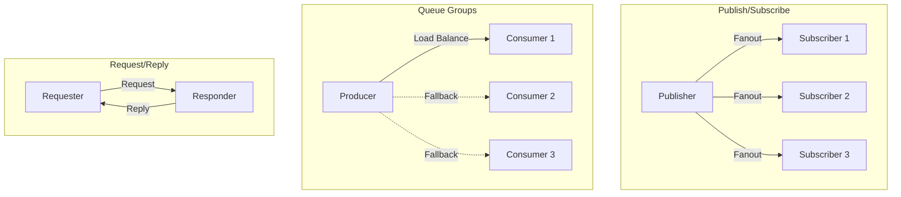

### Implementation Examples

#### Publish/Subscribe

```typescript
// Publisher
await messageBus.publish('order.created', {
  id: generateId(),
  topic: 'order.created',
  data: encode({ orderId: order.id, customerId: order.customerId }),
  headers: { 'content-type': 'application/protobuf' },
  timestamp: new Date(),
});

// Subscriber
const subscription = await messageBus.subscribe('order.created', async (message) => {
  const event = decode(message.data);
  await processOrderCreated(event);
});

// Wildcard subscription
const allOrderEvents = await messageBus.subscribe('order.*', async (message) => {
  console.log(`Order event: ${message.topic}`);
});
```

#### Queue Groups (Load Balancing)

```typescript
// Multiple workers compete for messages
// Only ONE worker receives each message

// Worker 1
await messageBus.subscribeQueue(
  'tasks.process',
  'task-workers', // Queue group name
  async (message) => {
    await processTask(message);
  },
);

// Worker 2 (same queue group)
await messageBus.subscribeQueue('tasks.process', 'task-workers', async (message) => {
  await processTask(message);
});
```

#### Request/Reply

```typescript
// Requester
const response = await messageBus.request(
  'inventory.check',
  {
    id: generateId(),
    topic: 'inventory.check',
    data: encode({ productId: 'prod-123', quantity: 5 }),
    headers: {},
    timestamp: new Date(),
  },
  5000, // 5 second timeout
);

const availability = decode(response.data);

// Responder
await messageBus.reply('inventory.check', async (request) => {
  const check = decode(request.data);
  const available = await checkInventory(check.productId, check.quantity);

  return {
    id: generateId(),
    topic: request.replyTo!,
    data: encode({ available, productId: check.productId }),
    headers: {},
    timestamp: new Date(),
  };
});
```

### Message Bus Implementations

```mermaid
flowchart TB
    subgraph Interface["IMessageBus Interface"]
        API[Unified API]
    end

    subgraph Implementations["Implementations"]
        NATS[NATS<br/>@unified-plugin-framework/message-bus-nats]
        RABBIT[RabbitMQ<br/>@unified-plugin-framework/message-bus-rabbitmq]
        REDIS[Redis Streams<br/>@unified-plugin-framework/message-bus-redis]
    end

    API --> NATS
    API --> RABBIT
    API --> REDIS
```

#### NATS Implementation (Default)

```typescript
// NATS-specific configuration
const config: NatsMessageBusConfig = {
  servers: ['nats://nats:4222'],
  user: 'upf',
  pass: 'secret',
  maxReconnectAttempts: -1, // Infinite
  reconnectTimeWait: 2000,
  jetstream: {
    enabled: true,
    domain: 'upf',
  },
};

const messageBus = new NatsMessageBus(config);
await messageBus.connect();
```

## Streaming Data

### Large Data Transfer

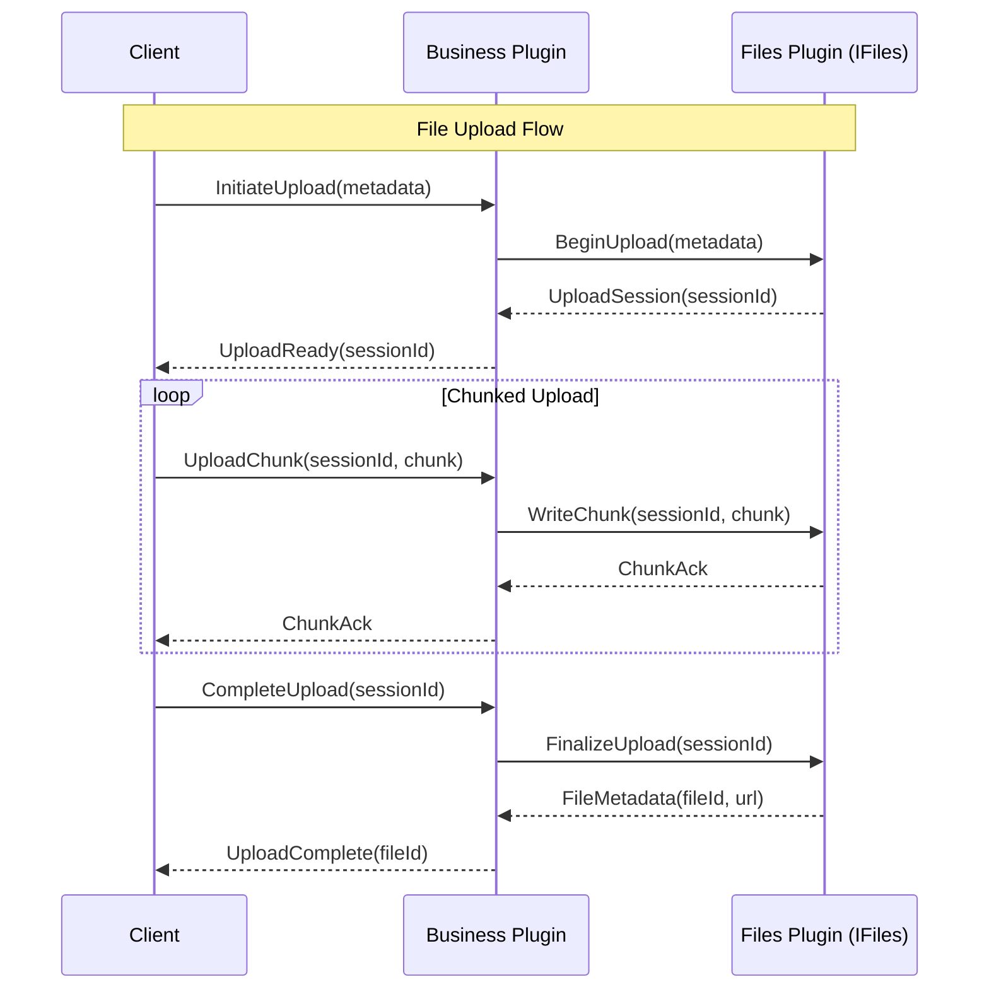

### Real-time Event Streaming

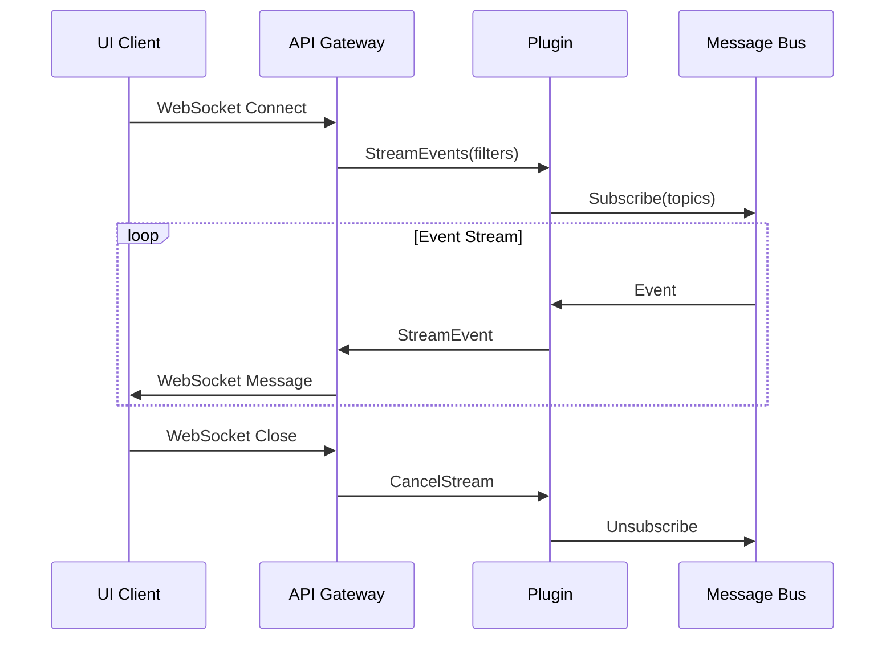

## Protocol Translation

### gRPC-Web for Browser Clients

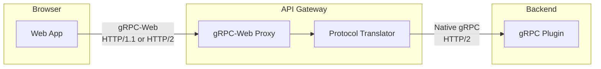

### WebSocket for Real-time

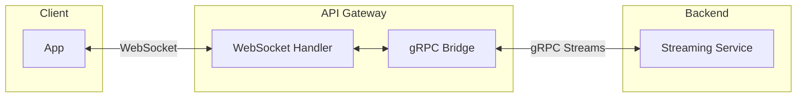

## Communication Security

### mTLS Between Plugins

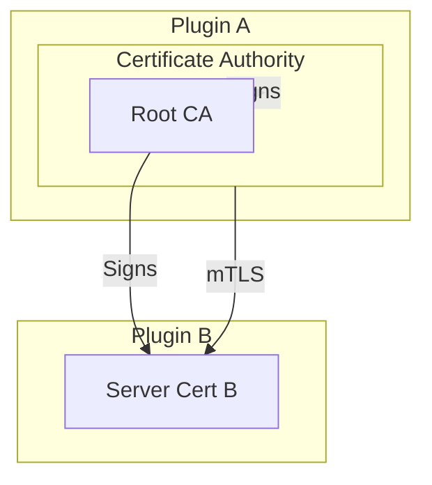

### Authentication Flow

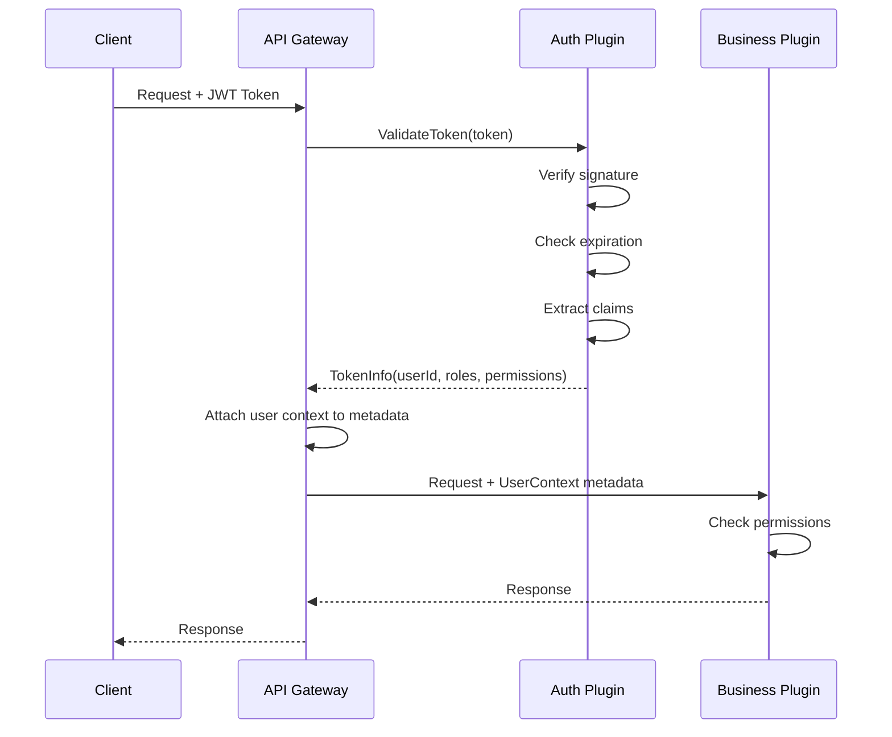

## Connection Management

### Circuit Breaker

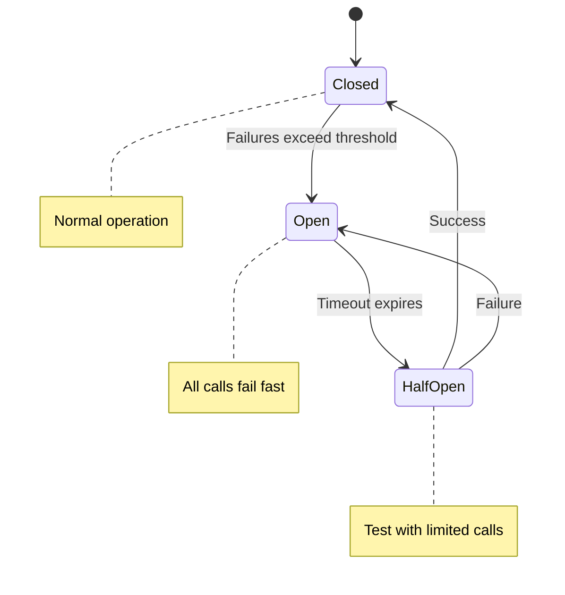

### Retry Policy

```typescript
interface RetryPolicy {
  maxAttempts: number;
  initialBackoff: number; // ms
  maxBackoff: number; // ms
  backoffMultiplier: number;
  retryableStatuses: GrpcStatus[];
}

const defaultRetryPolicy: RetryPolicy = {
  maxAttempts: 3,
  initialBackoff: 100,
  maxBackoff: 10000,
  backoffMultiplier: 2,
  retryableStatuses: [GrpcStatus.UNAVAILABLE, GrpcStatus.DEADLINE_EXCEEDED, GrpcStatus.RESOURCE_EXHAUSTED],
};
```

### Load Balancing

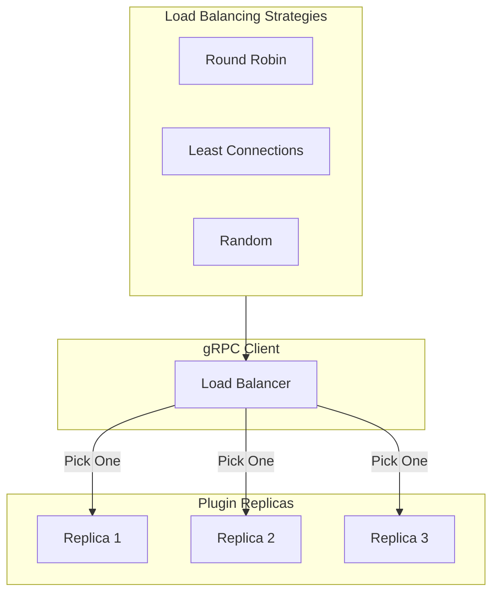

## Observability

### Distributed Tracing

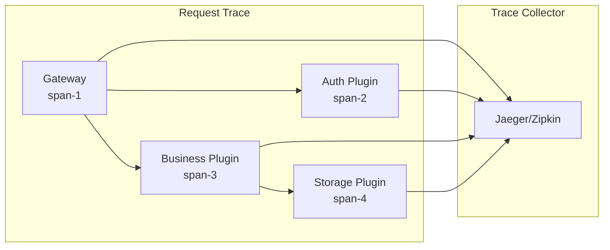

### Metrics

```typescript
// Standard gRPC metrics
interface GrpcMetrics {
  // Request metrics
  grpc_server_started_total: Counter;
  grpc_server_handled_total: Counter;
  grpc_server_msg_received_total: Counter;
  grpc_server_msg_sent_total: Counter;

  // Latency metrics
  grpc_server_handling_seconds: Histogram;

  // Stream metrics
  grpc_server_stream_msg_received: Counter;
  grpc_server_stream_msg_sent: Counter;
}
```

## Related Documentation

- [Architecture Overview](./overview.md) - High-level system architecture
- [Plugin System](./plugin-system.md) - Plugin architecture details
- [gRPC Contracts](../specifications/grpc-contracts.md) - Protobuf specifications
- [Interfaces](../specifications/interfaces.md) - Core interface definitions

---

**Previous**: [Plugin System](./plugin-system.md)
**Next**: [UI Federation](./ui-federation.md)
