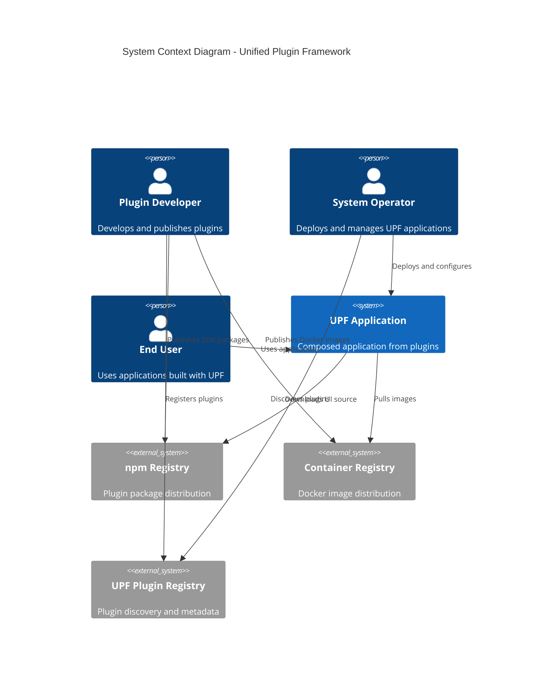
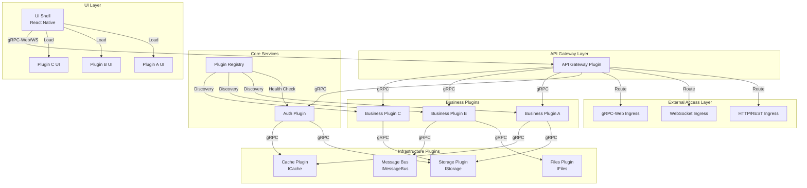
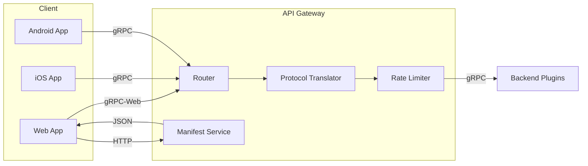
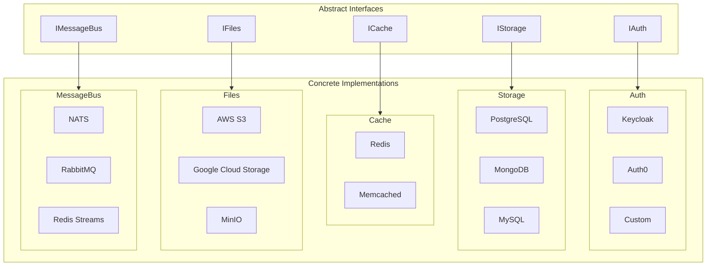
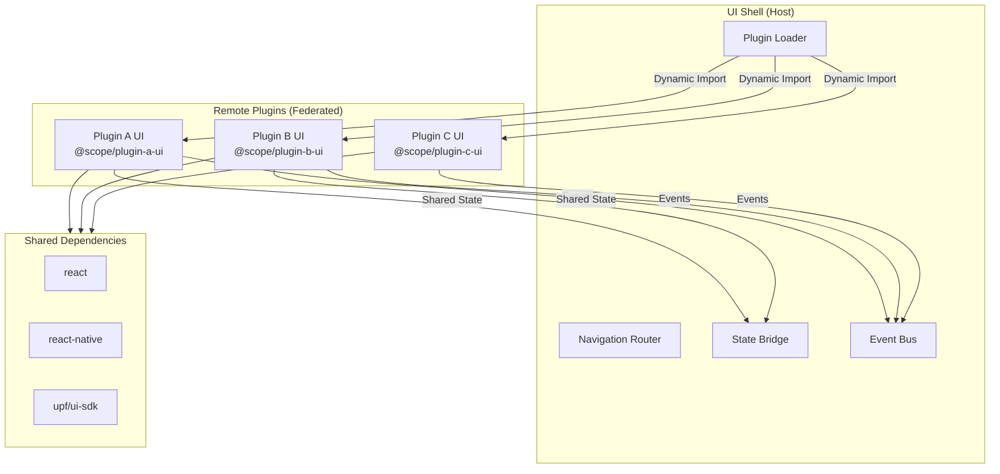
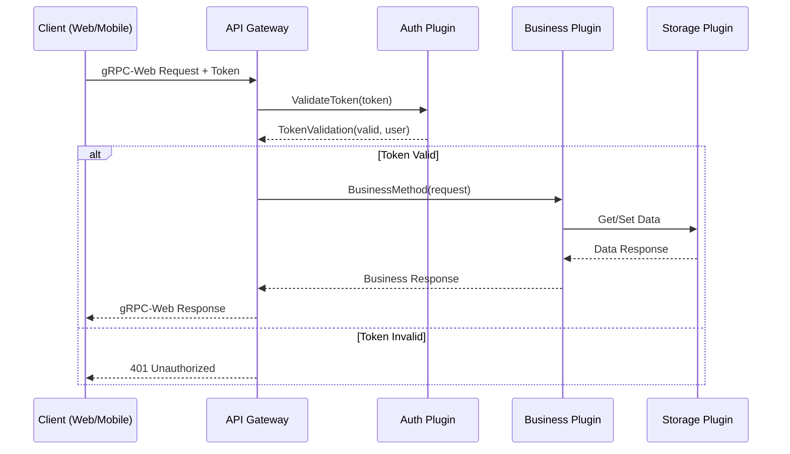
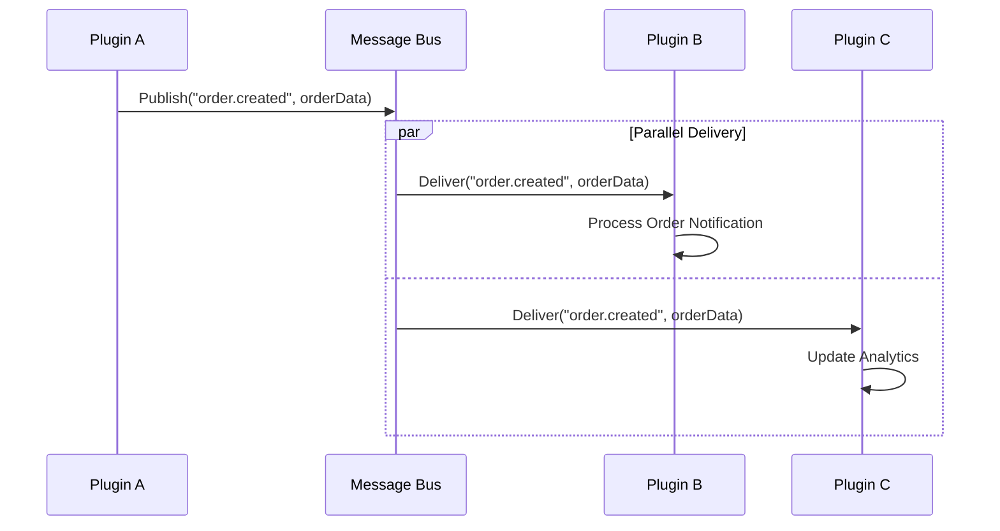
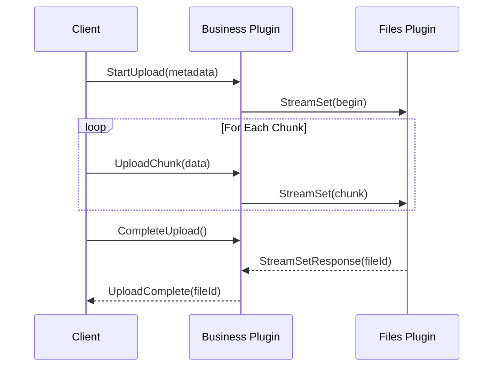
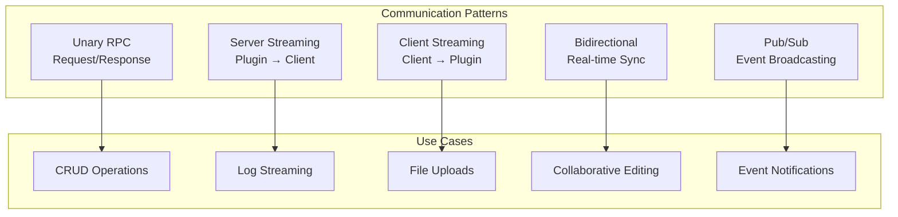
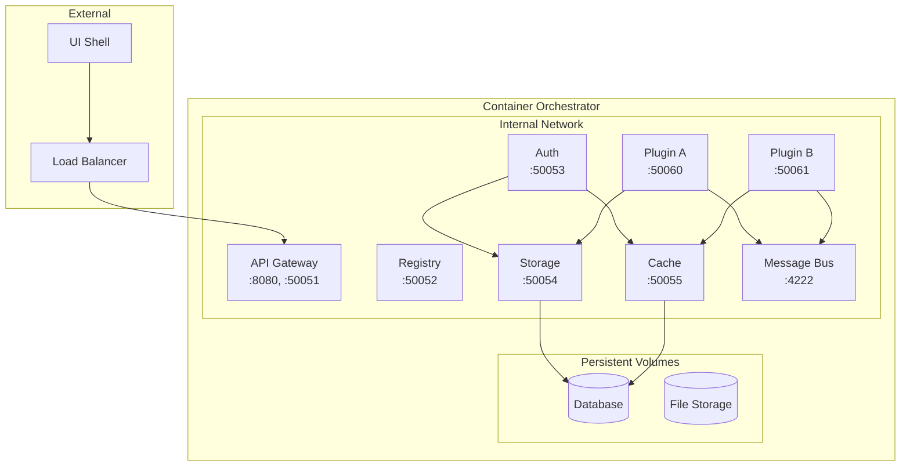

# Architecture Overview

This document provides a high-level overview of the Unified Plugin Framework (UPF) architecture, describing the key components, their interactions, and the design principles that guide the system.

## System Context

The UPF system enables developers to build, publish, and compose applications from reusable plugin building blocks. The architecture supports:

- **Plugin-based microservices** running in Docker containers
- **Cross-platform UI** via React Native with Module Federation
- **Interface-driven communication** using gRPC and message buses
- **Orchestration-agnostic deployment** supporting Docker Compose, Kubernetes, and Swarm

## High-Level Architecture

## Component Layers

### 1. External Access Layer

The entry point for all client connections. Supports multiple protocols:

| Protocol  | Use Case                | Implementation        |
| --------- | ----------------------- | --------------------- |
| HTTP/REST | Traditional API calls   | NGINX/Traefik Ingress |
| WebSocket | Real-time bidirectional | Native WS support     |
| gRPC-Web  | Browser-compatible gRPC | Envoy/gRPC-Web proxy  |

### 2. API Gateway Layer

Single entry point that handles:

- **Request Routing**: Routes requests to appropriate backend plugins
- **Protocol Translation**: Converts gRPC-Web to native gRPC
- **Authentication**: Validates tokens via Auth plugin
- **Rate Limiting**: Protects backend services from overload
- **Plugin Manifest Serving**: Provides UI with plugin metadata

### 3. Core Services

Essential services that enable the plugin ecosystem:

#### Plugin Registry

- Tracks all registered plugins and their manifests
- Performs health checks and service discovery
- Validates interface compatibility
- Manages plugin lifecycle (register, unregister, update)

#### Auth Plugin

- Centralized authentication and authorization
- Implements `IAuth` interface
- Pluggable implementations (Keycloak, Auth0, custom)
- Selected at installation time

### 4. Infrastructure Plugins

Foundational services that other plugins depend on:

### 5. Business Plugins

Application-specific functionality built by developers:

- Implement business logic
- Expose gRPC services
- Provide UI components
- Declare interface requirements in manifest

### 6. UI Layer

Cross-platform user interface using React Native:

## Data Flow Patterns

### Request Flow (Client → Backend)

### Event Flow (Plugin → Plugin)

### Streaming Flow (Large Data)

## Plugin Communication Matrix

## Deployment Architecture

## Key Design Decisions

| Decision             | Choice                    | Rationale                                                      |
| -------------------- | ------------------------- | -------------------------------------------------------------- |
| Runtime              | Bun                       | Fast startup, native TypeScript, built-in testing              |
| Communication        | gRPC                      | Strong typing, streaming support, high performance             |
| UI Framework         | React Native              | Cross-platform, large ecosystem, Module Federation via Re.Pack |
| Message Bus          | Abstracted (NATS default) | Flexibility, vendor independence                               |
| Containerization     | Docker                    | Industry standard, orchestrator agnostic                       |
| Package Distribution | npm                       | Developer familiarity, versioning, dependency management       |

## Related Documentation

- [Plugin System](./plugin-system.md) - Detailed plugin architecture
- [Communication](./communication.md) - Inter-plugin communication patterns
- [UI Federation](./ui-federation.md) - React Native Module Federation
- [Deployment](./deployment.md) - Orchestration and deployment patterns

---

**Next**: [Plugin System Architecture](./plugin-system.md)
