# Architecture Overview

This document provides a high-level overview of the Unified Plugin Framework (UPF) architecture, describing the key components, their interactions, and the design principles that guide the system.

## System Context

The UPF system enables developers to build, publish, and compose applications from reusable plugin building blocks. The architecture supports:

- **Plugin-based microservices** running in Docker containers
- **Cross-platform UI** via React Native with Module Federation
- **Interface-driven communication** using gRPC and message buses
- **Orchestration-agnostic deployment** supporting Docker Compose, Kubernetes, and Swarm

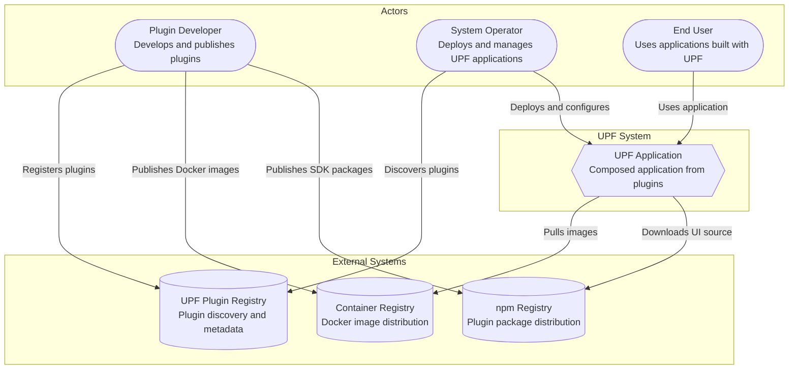

## High-Level Architecture

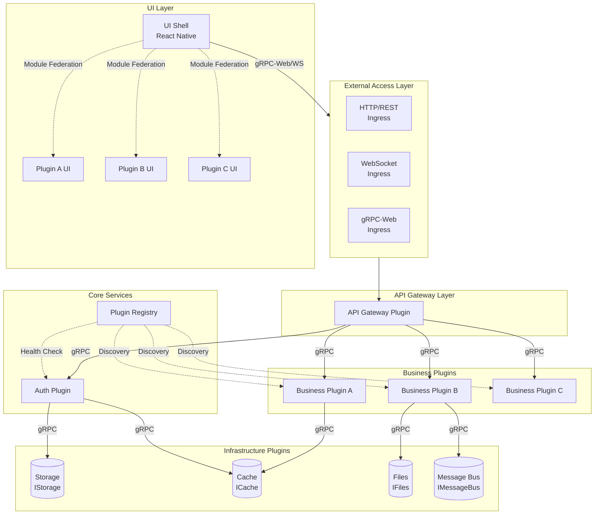

## Component Layers

### 1. External Access Layer

The entry point for all client connections. This layer handles protocol termination, TLS encryption, and initial request routing before forwarding to the API Gateway.

#### Responsibilities

- **Protocol Termination**: Accept connections over HTTP/1.1, HTTP/2, and WebSocket protocols
- **TLS/SSL Encryption**: Manage certificates and encrypt all external traffic
- **Load Balancing**: Distribute traffic across multiple API Gateway instances
- **DDoS Protection**: Basic protection against denial-of-service attacks
- **Request Logging**: Capture access logs for monitoring and debugging

#### Supported Protocols

| Protocol  | Use Case                | Implementation        | Port   |
| --------- | ----------------------- | --------------------- | ------ |
| HTTP/REST | Traditional API calls   | NGINX/Traefik Ingress | 80/443 |
| WebSocket | Real-time bidirectional | Native WS support     | 80/443 |
| gRPC-Web  | Browser-compatible gRPC | Envoy/gRPC-Web proxy  | 443    |

#### Protocol Details

**HTTP/REST**

- Used for plugin manifest retrieval, health checks, and legacy API compatibility
- Supports standard REST verbs (GET, POST, PUT, DELETE)
- Content types: `application/json`, `application/protobuf`

**WebSocket**

- Enables real-time bidirectional communication for UI updates
- Used for live notifications, collaborative features, and event streaming
- Automatic reconnection with exponential backoff

**gRPC-Web**

- Browser-compatible variant of gRPC protocol
- Supports unary and server-streaming calls (bidirectional streaming via WebSocket bridge)
- Requires Envoy or similar proxy for protocol translation to native gRPC

#### Configuration Example

```yaml
# Traefik ingress configuration
entryPoints:
  web:
    address: ':80'
    http:
      redirections:
        entryPoint:
          to: websecure
  websecure:
    address: ':443'
    http:
      tls:
        certResolver: letsencrypt

routers:
  api:
    rule: 'Host(`api.example.com`)'
    service: gateway
    entryPoints:
      - websecure
```

### 2. API Gateway Layer

The API Gateway serves as the single entry point for all client requests, providing unified access to the plugin ecosystem while handling cross-cutting concerns.

#### Responsibilities

- **Request Routing**: Routes requests to appropriate backend plugins based on service name and method
- **Protocol Translation**: Converts gRPC-Web to native gRPC for browser compatibility
- **Authentication**: Validates JWT tokens via Auth plugin before forwarding requests
- **Rate Limiting**: Protects backend services from overload using token bucket algorithm
- **Plugin Manifest Serving**: Provides UI with plugin metadata for dynamic loading
- **Load Balancing**: Distributes requests across plugin replicas
- **Circuit Breaking**: Prevents cascade failures when downstream services are unhealthy

#### Architecture

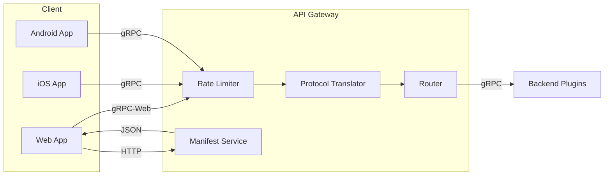

#### Internal Components

| Component               | Purpose                                  | Implementation                               |
| ----------------------- | ---------------------------------------- | -------------------------------------------- |
| **Router**              | Service discovery and request forwarding | Dynamic routing table from Plugin Registry   |
| **Protocol Translator** | gRPC-Web ↔ gRPC conversion               | Built-in Envoy-compatible translation        |
| **Rate Limiter**        | Request throttling per client/API key    | Token bucket with Redis backend              |
| **Manifest Service**    | Serve plugin UI manifests to shell       | REST endpoint returning aggregated manifests |
| **Auth Interceptor**    | Token validation on every request        | gRPC interceptor calling Auth Plugin         |
| **Circuit Breaker**     | Fail-fast on unhealthy services          | Per-service health tracking                  |

#### Request Processing Pipeline

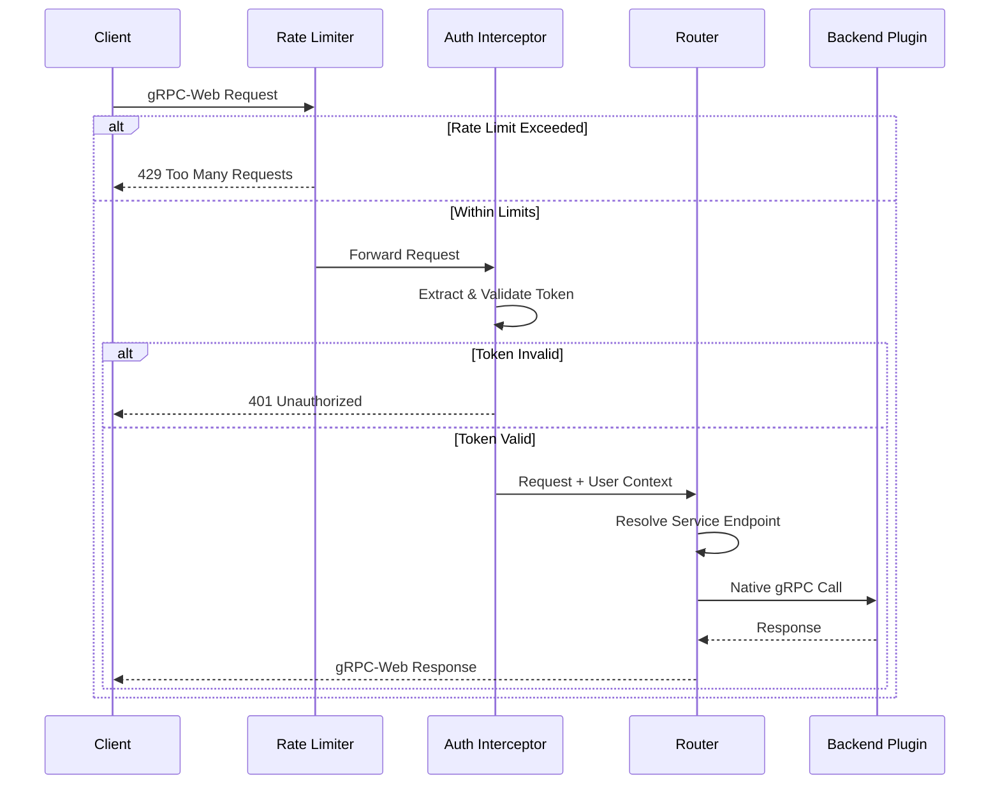

#### Configuration

```typescript
interface GatewayConfig {
  // Server configuration
  grpcPort: number; // Native gRPC port (default: 50051)
  httpPort: number; // HTTP/gRPC-Web port (default: 8080)

  // Authentication
  authPluginUrl: string; // Auth plugin endpoint
  publicPaths: string[]; // Paths that skip authentication

  // Rate limiting
  rateLimiting: {
    enabled: boolean;
    requestsPerSecond: number;
    burstSize: number;
    keyExtractor: 'ip' | 'token' | 'apiKey';
  };

  // Circuit breaker
  circuitBreaker: {
    enabled: boolean;
    failureThreshold: number; // Failures before opening
    resetTimeout: number; // Seconds before half-open
  };

  // Registry integration
  registryUrl: string; // Plugin Registry endpoint
  routeRefreshInterval: number; // Seconds between route updates
}
```

#### Manifest Endpoint

The Gateway exposes a REST endpoint for the UI Shell to discover available plugins:

```http
GET /api/manifests

Response:
{
  "plugins": [
    {
      "id": "orders-plugin",
      "version": "1.2.0",
      "ui": {
        "remoteEntry": "https://cdn.example.com/orders/remoteEntry.js",
        "exposedModules": ["./OrderDashboard", "./OrderWidget"],
        "navigation": [
          { "path": "/orders", "title": "Orders", "icon": "shopping-cart" }
        ]
      }
    }
  ]
}
```

### 3. Core Services

Essential system services that enable the plugin ecosystem to function. These are always deployed and required for UPF to operate.

#### Plugin Registry

The Plugin Registry is the central nervous system of UPF, managing all plugin metadata and enabling service discovery.

##### Responsibilities

- **Plugin Registration**: Accept and validate plugin manifests during startup
- **Service Discovery**: Provide endpoint resolution for inter-plugin communication
- **Health Monitoring**: Continuously check plugin health and track availability
- **Interface Matching**: Validate that required interfaces have compatible providers
- **Lifecycle Management**: Handle plugin registration, updates, and graceful removal

##### Architecture

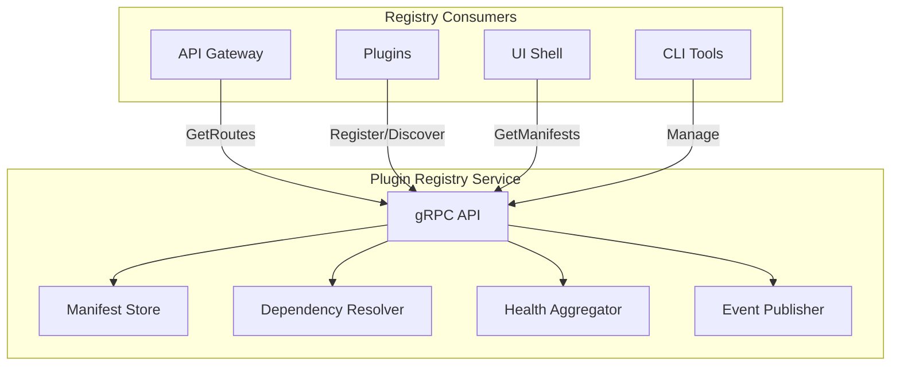

##### Key Operations

| Operation         | Description                                       | Triggered By               |
| ----------------- | ------------------------------------------------- | -------------------------- |
| `Register`        | Store plugin manifest and start health monitoring | Plugin container startup   |
| `Unregister`      | Remove plugin and notify dependents               | Plugin shutdown or failure |
| `GetProviders`    | Find plugins implementing a specific interface    | Dependency resolution      |
| `ResolveEndpoint` | Get connection details for a plugin               | Service discovery          |
| `WatchHealth`     | Stream health status changes                      | Gateway, monitoring        |

##### Dependency Resolution

When a plugin declares required interfaces, the Registry resolves them using this algorithm:

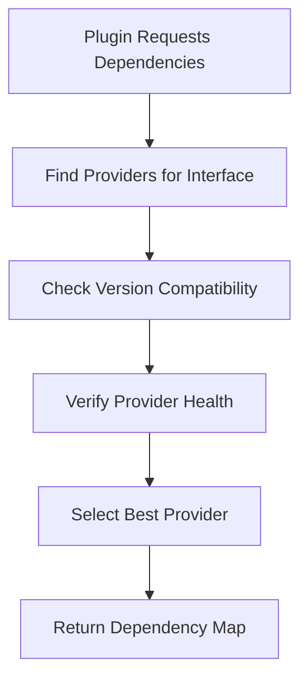

##### Health States

| State       | Description                               | Action                        |
| ----------- | ----------------------------------------- | ----------------------------- |
| `HEALTHY`   | All checks pass, plugin fully operational | Route traffic normally        |
| `DEGRADED`  | Non-critical dependency unhealthy         | Route with caution, alert     |
| `UNHEALTHY` | Critical failure detected                 | Stop routing, attempt restart |

#### Auth Plugin

The Auth Plugin provides centralized authentication and authorization for the entire UPF ecosystem.

##### Responsibilities

- **Token Validation**: Verify JWT tokens on every authenticated request
- **User Management**: Store and retrieve user information
- **Permission Checking**: Enforce role-based and attribute-based access control
- **Session Management**: Handle login, logout, and token refresh
- **Identity Federation**: Integrate with external identity providers

##### Interface: IAuth

The Auth Plugin implements the `IAuth` interface, allowing it to be swapped for different implementations:

```typescript
interface IAuth {
  // Token validation
  validateToken(token: string): Promise<TokenValidation>;

  // User information
  getUserInfo(userId: string): Promise<UserInfo>;

  // Token refresh
  refreshToken(refreshToken: string): Promise<TokenResponse>;

  // Session management
  logout(token: string): Promise<void>;

  // Permissions
  getPermissions(userId: string): Promise<Permission[]>;
  checkPermission(userId: string, permission: string): Promise<boolean>;
}

interface TokenValidation {
  valid: boolean;
  userId: string;
  email: string;
  roles: string[];
  permissions: string[];
  expiresAt: number;
}
```

##### Available Implementations

| Implementation | Use Case              | Features                                    |
| -------------- | --------------------- | ------------------------------------------- |
| **Keycloak**   | Enterprise SSO        | OIDC, SAML, LDAP integration, admin console |
| **Auth0**      | SaaS/Managed auth     | Social login, passwordless, easy setup      |
| **Custom**     | Specific requirements | Full control, custom user store             |

##### Authentication Flow

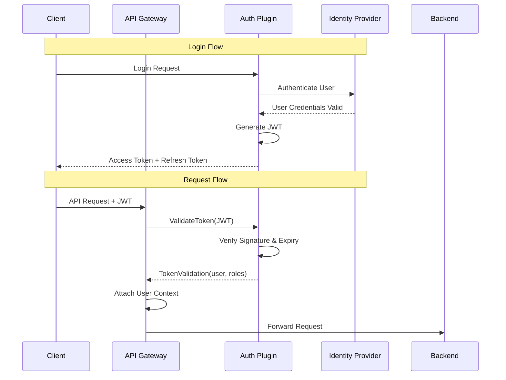

##### Configuration

```yaml
# Auth plugin configuration
auth:
  provider: keycloak # keycloak | auth0 | custom

  keycloak:
    serverUrl: https://keycloak.example.com
    realm: upf
    clientId: upf-gateway
    clientSecret: ${KEYCLOAK_SECRET}

  jwt:
    issuer: https://auth.example.com
    audience: upf-api
    publicKeyUrl: https://auth.example.com/.well-known/jwks.json

  session:
    accessTokenTTL: 3600 # 1 hour
    refreshTokenTTL: 604800 # 7 days
```

### 4. Infrastructure Plugins

Infrastructure plugins provide foundational services that business plugins depend on. They implement standardized interfaces, allowing operators to choose the best implementation for their environment without changing business plugin code.

#### Design Principles

- **Interface-First**: Each infrastructure concern has a well-defined interface
- **Swappable Implementations**: Multiple implementations per interface
- **Vendor Independence**: No lock-in to specific databases or services
- **Configuration at Deploy Time**: Select implementation via deployment configuration

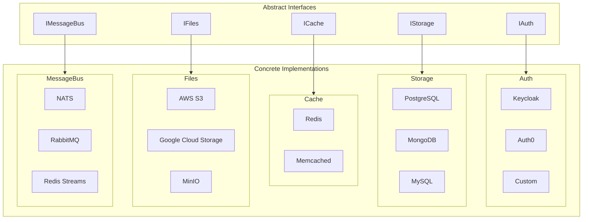

#### IStorage - Persistent Data Storage

Provides persistent data storage with CRUD operations, queries, and transactions.

##### Purpose

- Store and retrieve structured data
- Support complex queries with filtering and sorting
- Enable batch operations for efficiency
- Provide transaction support for data consistency

##### Interface Overview

```typescript
interface IStorage {
  // CRUD operations
  get<T>(collection: string, id: string): Promise<T | null>;
  set<T>(collection: string, id: string, data: T): Promise<void>;
  delete(collection: string, id: string): Promise<boolean>;
  exists(collection: string, id: string): Promise<boolean>;

  // Batch operations
  batchGet<T>(collection: string, ids: string[]): Promise<Map<string, T>>;
  batchSet<T>(collection: string, items: Map<string, T>): Promise<void>;

  // Query operations
  query<T>(collection: string, query: Query): Promise<QueryResult<T>>;

  // Streaming for large datasets
  stream<T>(collection: string, query: Query): AsyncIterable<T>;

  // Transaction support
  transaction<T>(fn: (tx: Transaction) => Promise<T>): Promise<T>;
}
```

##### gRPC Methods

| Method        | Type          | Description                       |
| ------------- | ------------- | --------------------------------- |
| `Get`         | Unary         | Retrieve single record by ID      |
| `Set`         | Unary         | Create or update a record         |
| `Delete`      | Unary         | Remove a record                   |
| `BatchGet`    | Unary         | Retrieve multiple records         |
| `Query`       | Unary         | Query with filters and pagination |
| `StreamQuery` | Server Stream | Stream large query results        |
| `StreamSet`   | Client Stream | Bulk insert via streaming         |

##### Available Implementations

| Plugin             | Backend    | Best For                                               |
| ------------------ | ---------- | ------------------------------------------------------ |
| `storage-postgres` | PostgreSQL | Relational data, complex queries, ACID compliance      |
| `storage-mongodb`  | MongoDB    | Document storage, flexible schemas, horizontal scaling |
| `storage-mysql`    | MySQL      | Traditional RDBMS, mature ecosystem                    |

---

#### ICache - In-Memory Caching

Provides fast in-memory caching for frequently accessed data and distributed coordination.

##### Purpose

- Cache frequently accessed data to reduce database load
- Store session data and temporary state
- Implement distributed locks for coordination
- Enable pub/sub for real-time cache invalidation

##### Interface Overview

```typescript
interface ICache {
  // Basic operations
  get<T>(key: string): Promise<T | null>;
  set<T>(key: string, value: T, options?: SetOptions): Promise<void>;
  delete(key: string): Promise<boolean>;

  // Batch operations
  mget<T>(keys: string[]): Promise<Map<string, T>>;
  mset<T>(items: Map<string, T>, options?: SetOptions): Promise<void>;

  // Pattern-based operations
  keys(pattern: string): Promise<string[]>;
  invalidate(pattern: string): Promise<number>;

  // Atomic operations
  increment(key: string, delta?: number): Promise<number>;
  decrement(key: string, delta?: number): Promise<number>;

  // Distributed locking
  acquireLock(key: string, ttl: number): Promise<Lock | null>;
}

interface SetOptions {
  ttl?: number; // Time-to-live in seconds
  nx?: boolean; // Only set if not exists
  xx?: boolean; // Only set if exists
}
```

##### gRPC Methods

| Method        | Type  | Description                   |
| ------------- | ----- | ----------------------------- |
| `Get`         | Unary | Retrieve cached value         |
| `Set`         | Unary | Store value with optional TTL |
| `Delete`      | Unary | Remove cached value           |
| `MGet`        | Unary | Retrieve multiple values      |
| `Invalidate`  | Unary | Delete keys matching pattern  |
| `AcquireLock` | Unary | Acquire distributed lock      |

##### Available Implementations

| Plugin            | Backend   | Best For                                      |
| ----------------- | --------- | --------------------------------------------- |
| `cache-redis`     | Redis     | Full-featured caching, pub/sub, Lua scripting |
| `cache-memcached` | Memcached | Simple key-value caching, memory efficiency   |

---

#### IFiles - File and Object Storage

Provides file upload, download, and management capabilities for binary data.

##### Purpose

- Store and retrieve files and binary objects
- Support streaming for large file transfers
- Generate signed URLs for secure direct access
- Manage file metadata and organization

##### Interface Overview

```typescript
interface IFiles {
  // Upload operations
  upload(path: string, data: Uint8Array | AsyncIterable<Uint8Array>, options?: UploadOptions): Promise<FileMetadata>;

  // Download operations
  download(path: string): Promise<Uint8Array>;
  downloadStream(path: string): AsyncIterable<Uint8Array>;

  // File operations
  delete(path: string): Promise<boolean>;
  copy(source: string, destination: string): Promise<FileMetadata>;
  move(source: string, destination: string): Promise<FileMetadata>;
  exists(path: string): Promise<boolean>;

  // Metadata
  getMetadata(path: string): Promise<FileMetadata>;

  // Directory listing
  list(prefix: string, options?: ListOptions): Promise<ListResult>;

  // Signed URLs for direct access
  getSignedUrl(path: string, operation: 'read' | 'write', expiresIn: number): Promise<string>;
}

interface FileMetadata {
  path: string;
  size: number;
  contentType: string;
  etag: string;
  lastModified: Date;
  metadata: Record<string, string>;
}
```

##### gRPC Methods

| Method         | Type          | Description                   |
| -------------- | ------------- | ----------------------------- |
| `Upload`       | Client Stream | Upload file in chunks         |
| `Download`     | Server Stream | Download file in chunks       |
| `Delete`       | Unary         | Delete a file                 |
| `GetMetadata`  | Unary         | Retrieve file information     |
| `List`         | Server Stream | List files with prefix        |
| `GetSignedUrl` | Unary         | Generate temporary access URL |

##### Available Implementations

| Plugin        | Backend              | Best For                                |
| ------------- | -------------------- | --------------------------------------- |
| `files-s3`    | AWS S3               | Production AWS environments, global CDN |
| `files-gcs`   | Google Cloud Storage | GCP environments, BigQuery integration  |
| `files-minio` | MinIO                | Self-hosted, S3-compatible, development |

---

#### IMessageBus - Asynchronous Messaging

Provides asynchronous messaging for event-driven communication between plugins.

##### Purpose

- Publish domain events for loose coupling
- Enable fan-out to multiple subscribers
- Support queue groups for load-balanced consumers
- Implement request-reply for async RPC

##### Interface Overview

```typescript
interface IMessageBus {
  // Publish/Subscribe
  publish(topic: string, message: Message): Promise<void>;
  subscribe(topic: string, options?: SubscribeOptions): AsyncIterable<Message>;

  // Queue groups (load-balanced consumers)
  subscribeQueue(topic: string, queue: string, options?: SubscribeOptions): AsyncIterable<Message>;

  // Request/Reply pattern
  request(topic: string, message: Message, timeout?: number): Promise<Message>;
  reply(topic: string, handler: (msg: Message) => Promise<Message>): Promise<Subscription>;

  // Message acknowledgment
  ack(message: Message): Promise<void>;
  nak(message: Message, delay?: number): Promise<void>;
}

interface Message {
  id: string;
  topic: string;
  data: Uint8Array;
  headers: Record<string, string>;
  timestamp: Date;
  replyTo?: string;
}
```

##### Communication Patterns

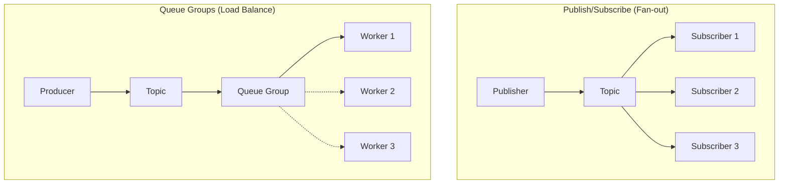

##### gRPC Methods

| Method      | Type          | Description                    |
| ----------- | ------------- | ------------------------------ |
| `Publish`   | Unary         | Publish message to topic       |
| `Subscribe` | Server Stream | Subscribe to topic messages    |
| `Request`   | Unary         | Send request and await reply   |
| `Ack`       | Unary         | Acknowledge message processing |

##### Available Implementations

| Plugin                 | Backend       | Best For                                                |
| ---------------------- | ------------- | ------------------------------------------------------- |
| `message-bus-nats`     | NATS          | High performance, JetStream persistence, default choice |
| `message-bus-rabbitmq` | RabbitMQ      | Advanced routing, mature ecosystem, management UI       |
| `message-bus-redis`    | Redis Streams | Simple setup, if Redis already deployed                 |

---

#### Selecting Infrastructure Plugins

Infrastructure plugins are selected at deployment time via configuration:

```yaml
# deployment.yaml
infrastructure:
  storage:
    plugin: storage-postgres
    config:
      connectionString: ${DATABASE_URL}
      maxConnections: 20

  cache:
    plugin: cache-redis
    config:
      url: ${REDIS_URL}
      keyPrefix: 'upf:'

  files:
    plugin: files-minio
    config:
      endpoint: ${MINIO_ENDPOINT}
      bucket: upf-files
      accessKey: ${MINIO_ACCESS_KEY}
      secretKey: ${MINIO_SECRET_KEY}

  messageBus:
    plugin: message-bus-nats
    config:
      servers:
        - ${NATS_URL}
      jetstream:
        enabled: true
```

### 5. Business Plugins

Business plugins contain application-specific functionality built by developers. They are the building blocks for domain logic and user-facing features.

#### Characteristics

- **Domain-Focused**: Implement specific business capabilities (orders, payments, inventory, etc.)
- **Self-Contained**: Include backend services, UI components, and configuration
- **Interface-Driven**: Declare what they provide and require via manifest
- **Independently Deployable**: Can be updated without affecting other plugins

#### Plugin Structure

A business plugin consists of:

```
my-business-plugin/
├── manifest.yaml           # Plugin declaration
├── proto/                  # gRPC service definitions
│   └── service.proto
├── backend/                # Server-side code
│   ├── src/
│   │   ├── index.ts       # Entry point
│   │   ├── service.ts     # gRPC service implementation
│   │   └── handlers/      # Business logic
│   ├── Dockerfile
│   └── package.json
├── frontend/               # UI components (optional)
│   ├── src/
│   │   ├── components/
│   │   ├── screens/
│   │   └── hooks/
│   ├── webpack.config.js  # Module Federation config
│   └── package.json
└── container.yaml          # Deployment configuration
```

#### Manifest Declaration

The manifest defines what the plugin provides and requires:

```yaml
# manifest.yaml
id: orders-plugin
version: 1.2.0
name: Orders Management
description: Order creation, tracking, and fulfillment
type: business

# What this plugin PROVIDES to others
provides:
  - name: IOrderService
    version: 1.0.0
    protoFile: ./proto/orders.proto
    methods:
      - CreateOrder
      - GetOrder
      - ListOrders
      - UpdateOrderStatus

# What this plugin REQUIRES from others
requires:
  - interface: IStorage
    version: '>=1.0.0'
    optional: false
  - interface: ICache
    version: '>=1.0.0'
    optional: true
  - interface: IMessageBus
    version: '>=1.0.0'
    optional: false

# UI configuration
ui:
  enabled: true
  exposedModules:
    - name: ./OrderDashboard
      type: page
    - name: ./OrderWidget
      type: widget
  navigation:
    - path: /orders
      title: Orders
      icon: shopping-cart
```

#### Plugin Lifecycle

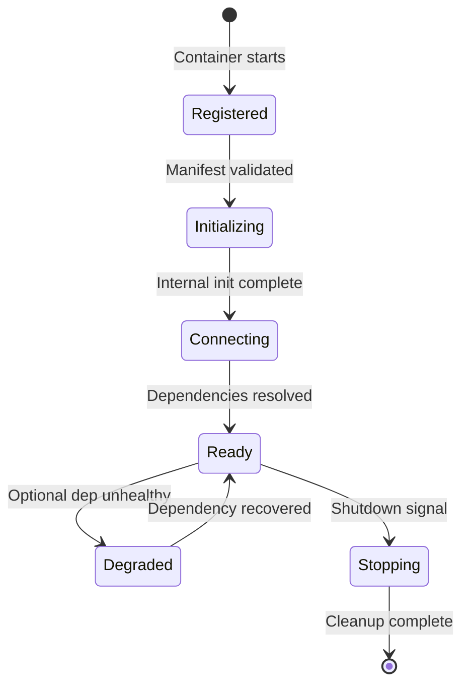

##### Lifecycle Phases

| Phase            | Description                              | Actions                                     |
| ---------------- | ---------------------------------------- | ------------------------------------------- |
| **Registered**   | Plugin manifest registered with Registry | Manifest validation, health monitor started |
| **Initializing** | Plugin performing internal setup         | Load config, initialize internal state      |
| **Connecting**   | Resolving and connecting to dependencies | Query Registry, establish gRPC connections  |
| **Ready**        | Fully operational, serving requests      | Accept traffic, respond to health checks    |
| **Degraded**     | Operating with reduced capability        | Optional dependencies unavailable           |
| **Stopping**     | Graceful shutdown in progress            | Drain requests, close connections, cleanup  |

#### Communication Patterns

Business plugins can communicate using multiple patterns:

##### 1. Direct gRPC Calls

For synchronous request-response operations:

```typescript
// Calling another plugin's service
const inventory = await inventoryClient.checkStock({
  productId: 'prod-123',
  quantity: 5,
});

if (inventory.available) {
  await orderService.confirmOrder(orderId);
}
```

##### 2. Event Publishing

For asynchronous notifications:

```typescript
// Publish domain event
await messageBus.publish('order.created', {
  id: generateId(),
  topic: 'order.created',
  data: encode({
    orderId: order.id,
    customerId: order.customerId,
    total: order.total,
  }),
  headers: { 'content-type': 'application/protobuf' },
  timestamp: new Date(),
});
```

##### 3. Event Subscription

For reacting to other plugins' events:

```typescript
// Subscribe to events from other plugins
const subscription = await messageBus.subscribe('payment.completed', async (msg) => {
  const event = decode(msg.data);
  await updateOrderStatus(event.orderId, 'PAID');
});
```

#### Example Plugins

| Plugin                 | Domain        | Key Features                          |
| ---------------------- | ------------- | ------------------------------------- |
| `orders-plugin`        | E-commerce    | Order CRUD, status tracking, history  |
| `payments-plugin`      | Finance       | Payment processing, refunds, invoices |
| `inventory-plugin`     | Warehouse     | Stock management, reservations        |
| `notifications-plugin` | Communication | Email, SMS, push notifications        |
| `analytics-plugin`     | Reporting     | Metrics collection, dashboards        |
| `cms-plugin`           | Content       | Pages, media, templates               |

### 6. UI Layer

The UI Layer provides a cross-platform user interface using React Native with Module Federation, enabling dynamic composition of plugin UIs at runtime.

#### Technology Stack

- **React Native**: Cross-platform framework for Web, iOS, and Android
- **Re.Pack**: Webpack-based bundler with Module Federation support for React Native
- **Module Federation**: Dynamic loading of remote UI modules at runtime
- **UPF UI SDK**: Shared components, hooks, and utilities

#### Architecture Overview

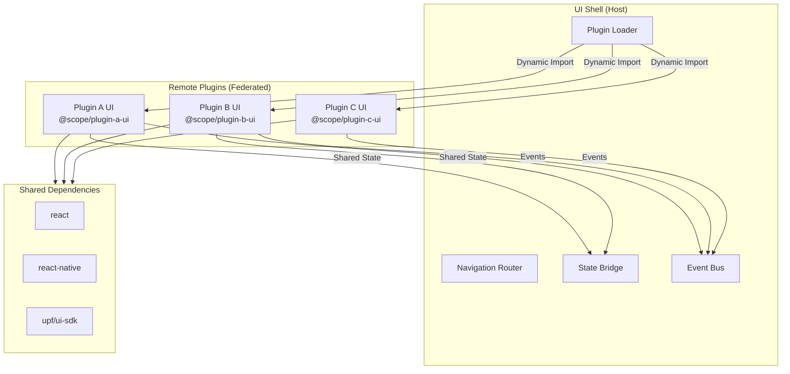

#### UI Shell (Host Application)

The UI Shell is the host application that loads and orchestrates plugin UIs.

##### Core Components

| Component             | Purpose                | Description                                        |
| --------------------- | ---------------------- | -------------------------------------------------- |
| **Plugin Loader**     | Dynamic module loading | Fetches and initializes remote plugin UI bundles   |
| **Navigation Router** | Route management       | Dynamically registers routes from plugin manifests |
| **State Bridge**      | Cross-plugin state     | Enables controlled state sharing between plugins   |
| **Event Bus**         | Inter-plugin events    | Allows plugins to communicate via events           |
| **Theme Provider**    | Consistent styling     | Provides shared design tokens and components       |
| **Auth Context**      | Authentication state   | Shares user authentication across all plugins      |

##### Plugin Loading Flow

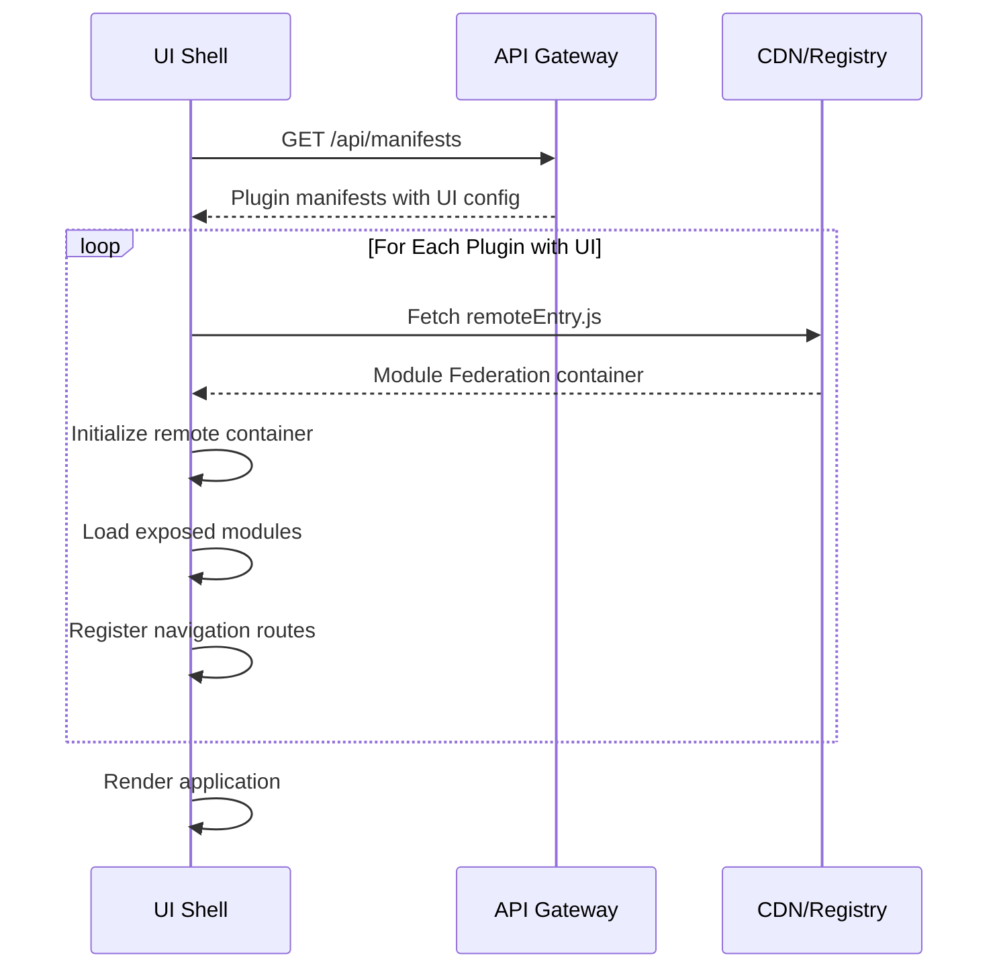

#### Module Federation

Module Federation enables loading plugin UIs as remote modules at runtime.

##### How It Works

1. **Build Time**: Each plugin UI is built as a separate bundle with exposed modules
2. **Runtime**: The UI Shell dynamically loads remote bundles and imports modules
3. **Shared Dependencies**: Common libraries (React, React Native) are shared to reduce bundle size

##### Host Configuration (UI Shell)

```javascript
// webpack.config.js (UI Shell)
const { withModuleFederation } = require('@callstack/repack/plugins');

module.exports = {
  plugins: [
    withModuleFederation({
      name: 'host',
      shared: {
        react: { singleton: true, eager: true },
        'react-native': { singleton: true, eager: true },
        '@unified-plugin-framework/ui-sdk': { singleton: true, eager: true },
      },
    }),
  ],
};
```

##### Remote Configuration (Plugin UI)

```javascript
// webpack.config.js (Plugin)
const { withModuleFederation } = require('@callstack/repack/plugins');

module.exports = {
  plugins: [
    withModuleFederation({
      name: 'ordersPlugin',
      exposes: {
        './OrderDashboard': './src/screens/OrderDashboard',
        './OrderWidget': './src/components/OrderWidget',
        './useOrders': './src/hooks/useOrders',
      },
      shared: {
        react: { singleton: true, eager: false },
        'react-native': { singleton: true, eager: false },
        '@unified-plugin-framework/ui-sdk': { singleton: true, eager: false },
      },
    }),
  ],
};
```

#### State Management

##### State Bridge

The State Bridge enables controlled state sharing between plugins:

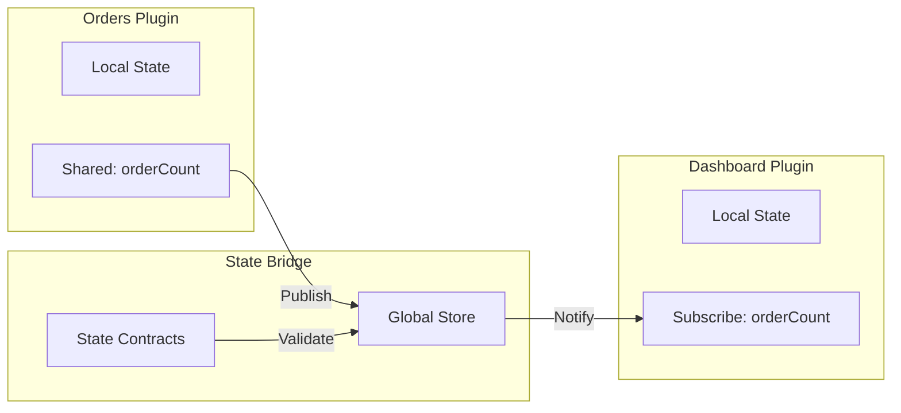

##### State Contracts

Plugins declare shared state in their manifest:

```yaml
# manifest.yaml
ui:
  sharedState:
    - name: orders
      schema:
        type: object
        properties:
          items: { type: array }
          totalCount: { type: number }
      readonly: false # This plugin can modify
```

##### Using Shared State

```typescript
// In plugin component
import { useSharedState, useSetSharedState } from '@unified-plugin-framework/ui-sdk';

function OrderCounter() {
  // Read shared state
  const orders = useSharedState<OrderState>('orders');

  // Write shared state (if allowed)
  const setOrders = useSetSharedState<OrderState>('orders', 'orders-plugin');

  return <Text>Orders: {orders?.totalCount ?? 0}</Text>;
}
```

#### Event Bus

The Event Bus enables loose coupling between plugin UIs:

```typescript
// Publishing events
import { useEventBus } from '@unified-plugin-framework/ui-sdk';

function OrderActions() {
  const eventBus = useEventBus();

  const handleCreateOrder = async () => {
    const order = await createOrder(orderData);
    eventBus.emit('order.created', { orderId: order.id });
  };

  return <Button onPress={handleCreateOrder}>Create Order</Button>;
}

// Subscribing to events
import { useEvent } from '@unified-plugin-framework/ui-sdk';

function NotificationBadge() {
  const [count, setCount] = useState(0);

  useEvent('order.created', () => {
    setCount(c => c + 1);
  });

  return <Badge count={count} />;
}
```

#### API Communication

##### gRPC-Web Client

Plugin UIs communicate with backend plugins via gRPC-Web:

```typescript
import { createGrpcTransport } from '@unified-plugin-framework/ui-sdk';
import { OrderServiceClient } from './generated/orders.client';

// Create transport with auth
const transport = createGrpcTransport({
  baseUrl: 'https://api.example.com',
  getAuthToken: () => authState.token,
});

// Create typed client
const orderClient = new OrderServiceClient(transport);

// Make calls
const { response } = await orderClient.createOrder({
  customerId: 'cust-123',
  items: [{ productId: 'prod-456', quantity: 2 }],
});
```

##### WebSocket for Real-time

```typescript
import { useWebSocket } from '@unified-plugin-framework/ui-sdk';

function LiveOrderUpdates() {
  const [orders, setOrders] = useState<Order[]>([]);

  useWebSocket<OrderUpdate>({
    url: 'wss://api.example.com/orders/live',
    onMessage: (update) => {
      setOrders(current => applyUpdate(current, update));
    },
  });

  return <OrderList orders={orders} />;
}
```

#### Cross-Platform Support

The UI Layer targets multiple platforms from a single codebase:

| Platform    | Bundler           | Output                          |
| ----------- | ----------------- | ------------------------------- |
| **Web**     | Re.Pack + Webpack | JavaScript bundles for browsers |
| **iOS**     | Re.Pack + Metro   | Native iOS application          |
| **Android** | Re.Pack + Metro   | Native Android application      |

##### Platform-Specific Components

```typescript
// Components can have platform-specific implementations
import { Platform } from 'react-native';

export const CameraButton = Platform.select({
  web: () => require('./CameraButton.web').default,
  ios: () => require('./CameraButton.ios').default,
  android: () => require('./CameraButton.android').default,
})!;
```

#### UI Plugin Manifest

```yaml
# manifest.yaml - UI section
ui:
  enabled: true
  remoteEntry: /static/remoteEntry.js

  # Modules exposed to the shell
  exposedModules:
    - name: ./OrderDashboard
      path: ./src/screens/OrderDashboard
      type: page
    - name: ./OrderWidget
      path: ./src/components/OrderWidget
      type: widget
    - name: ./useOrders
      path: ./src/hooks/useOrders
      type: hook

  # Navigation entries
  navigation:
    - path: /orders
      title: Orders
      icon: shopping-cart
      module: ./OrderDashboard
    - path: /orders/:id
      title: Order Details
      module: ./OrderDashboard

  # Shared state declarations
  sharedState:
    - name: orders
      schema:
        type: object
        properties:
          items: { type: array }
          totalCount: { type: number }
      readonly: false
```

## Data Flow Patterns

### Request Flow (Client → Backend)

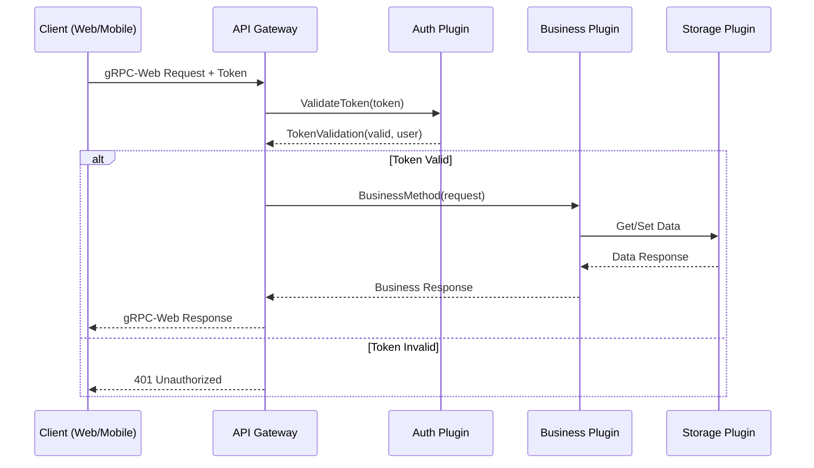

### Event Flow (Plugin → Plugin)

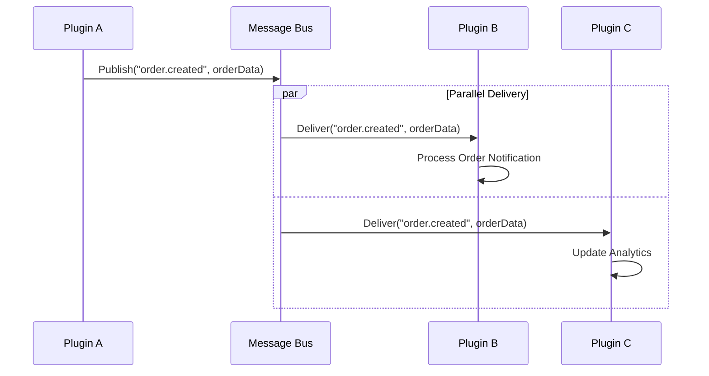

### Streaming Flow (Large Data)

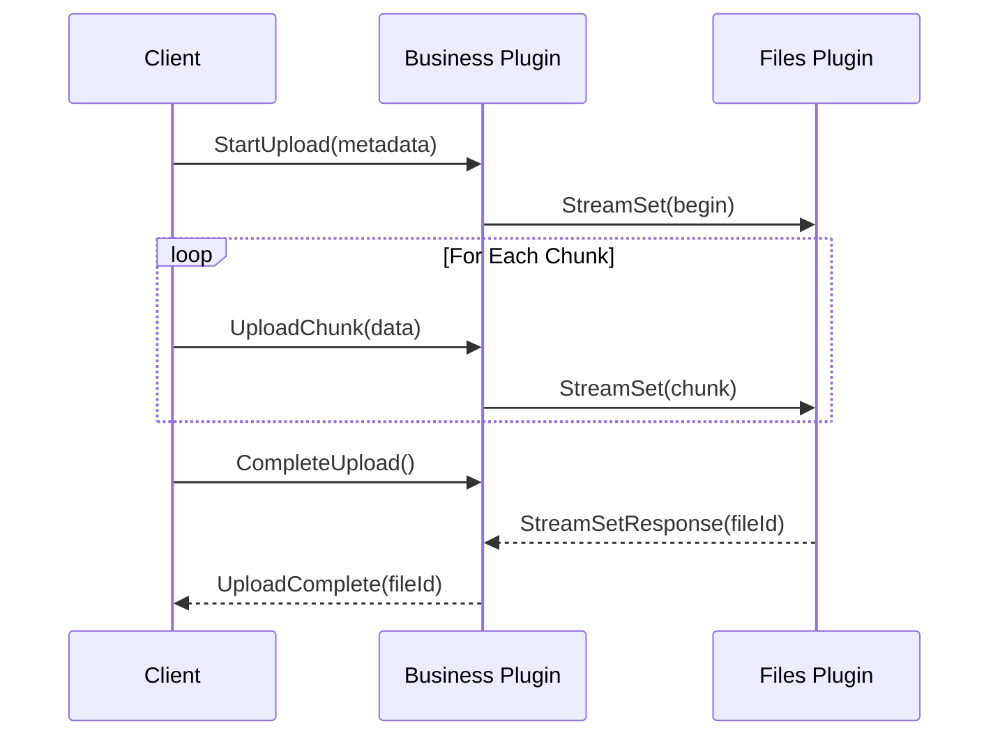

## Plugin Communication Matrix

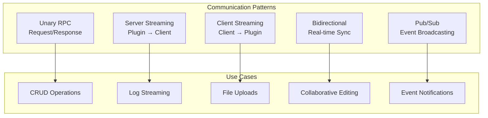

## Deployment Architecture

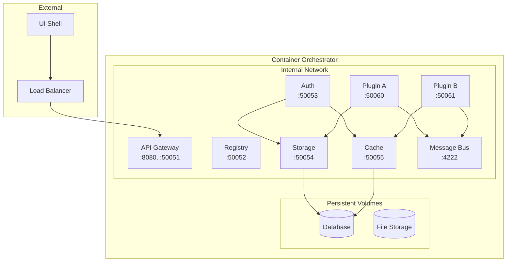

## Key Design Decisions

| Decision             | Choice                    | Rationale                                                      |
| -------------------- | ------------------------- | -------------------------------------------------------------- |
| Runtime              | Bun                       | Fast startup, native TypeScript, built-in testing              |
| Communication        | gRPC                      | Strong typing, streaming support, high performance             |
| UI Framework         | React Native              | Cross-platform, large ecosystem, Module Federation via Re.Pack |
| Message Bus          | Abstracted (NATS default) | Flexibility, vendor independence                               |
| Containerization     | Docker                    | Industry standard, orchestrator agnostic                       |
| Package Distribution | npm                       | Developer familiarity, versioning, dependency management       |

## Related Documentation

- [Plugin System](./plugin-system.md) - Detailed plugin architecture
- [Communication](./communication.md) - Inter-plugin communication patterns
- [UI Federation](./ui-federation.md) - React Native Module Federation
- [Deployment](./deployment.md) - Orchestration and deployment patterns

---

**Next**: [Plugin System Architecture](./plugin-system.md)
