# Plugin System Architecture

This document describes the plugin system architecture, including plugin structure, lifecycle management, the plugin registry, and manifest specifications.

## Plugin Concept

A **plugin** in UPF is a self-contained, deployable unit that provides:

1. **Backend Services** - gRPC services implementing business logic
2. **Frontend Components** - React Native UI components (optional)
3. **Interface Contracts** - Declared capabilities and requirements
4. **Configuration** - Runtime configuration and resource requirements

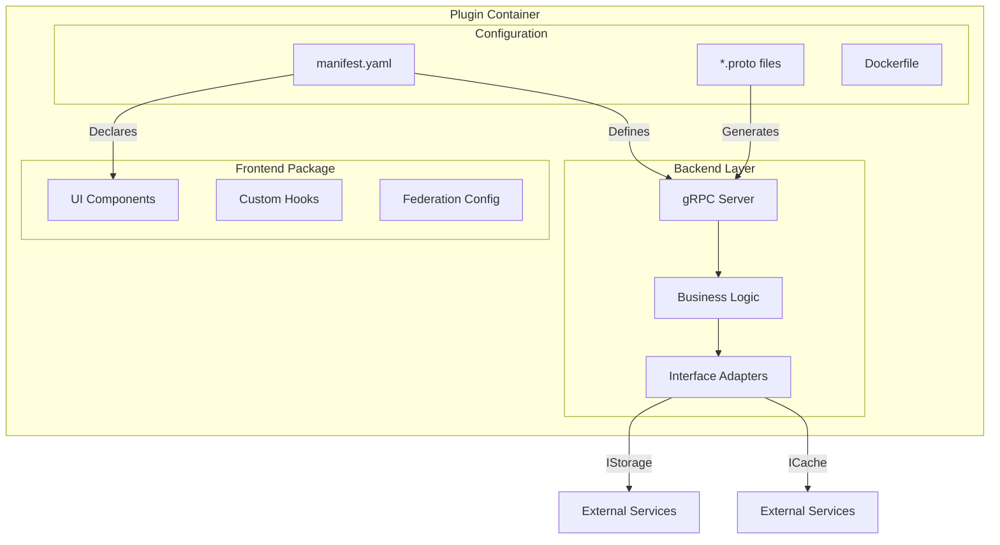

## Plugin Types

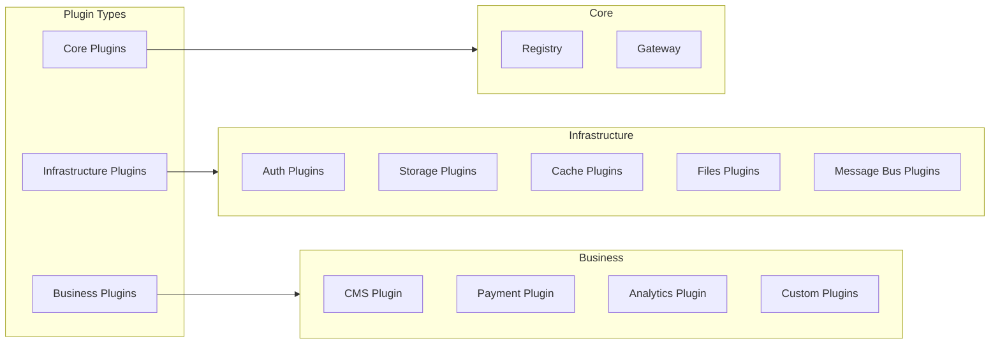

### Core Plugins

System-essential plugins that enable the UPF ecosystem:

| Plugin       | Purpose                                              |
| ------------ | ---------------------------------------------------- |
| **Registry** | Plugin discovery, health checks, manifest management |
| **Gateway**  | Request routing, protocol translation, rate limiting |

### Infrastructure Plugins

Foundational services implementing standard interfaces:

| Interface     | Purpose                        | Example Implementations       |
| ------------- | ------------------------------ | ----------------------------- |
| `IAuth`       | Authentication & authorization | Keycloak, Auth0, Custom       |
| `IStorage`    | Persistent data storage        | PostgreSQL, MongoDB, MySQL    |
| `ICache`      | Fast in-memory caching         | Redis, Memcached              |
| `IFiles`      | File/object storage            | S3, GCS, MinIO                |
| `IMessageBus` | Async messaging                | NATS, RabbitMQ, Redis Streams |

### Business Plugins

Application-specific plugins built by developers:

- Implement domain-specific logic
- May provide or require interfaces
- Include UI components for user interaction
- Versioned and published independently

## Plugin Lifecycle

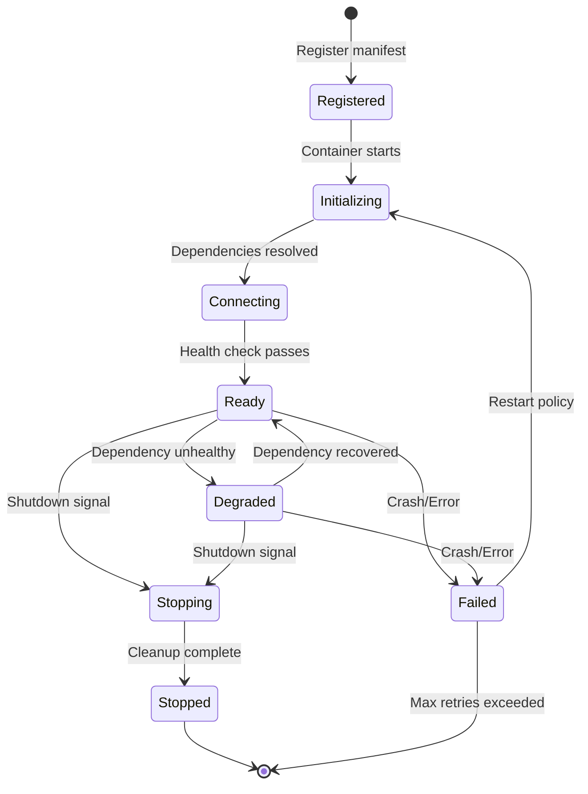

### Lifecycle Phases

#### 1. Registration

Plugin manifest is registered with the Plugin Registry:

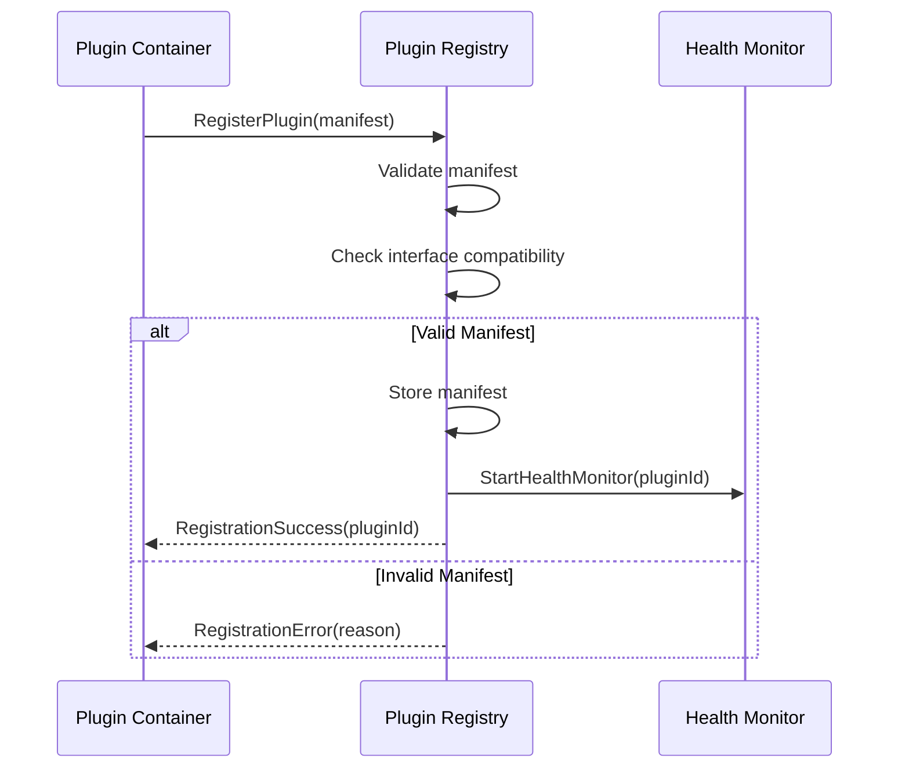

#### 2. Initialization

Plugin initializes internal state and connects to dependencies:

```typescript
// Plugin initialization flow
interface PluginLifecycle {
  // Called when container starts
  onInit(): Promise<void>;

  // Called after dependencies are resolved
  onDependenciesReady(deps: DependencyMap): Promise<void>;

  // Called when plugin should start serving
  onStart(): Promise<void>;

  // Called on shutdown signal
  onStop(): Promise<void>;
}
```

#### 3. Dependency Resolution

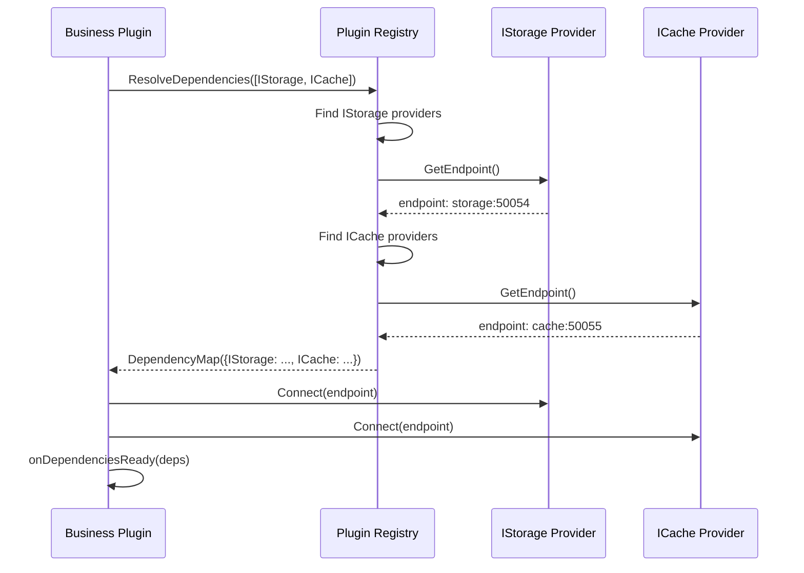

#### 4. Health Monitoring

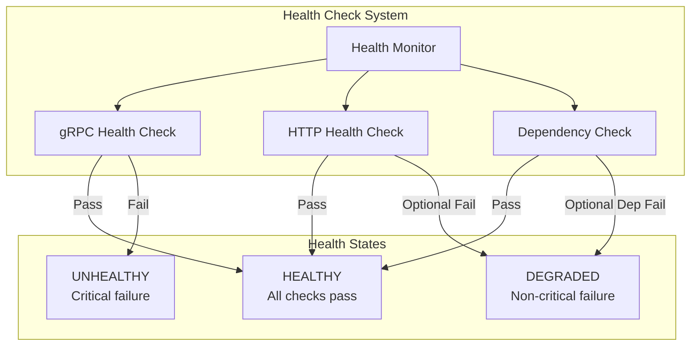

## Plugin Manifest

The manifest is the contract that defines a plugin's capabilities and requirements.

### Manifest Structure

```yaml
# manifest.yaml
id: my-business-plugin
version: 1.2.0
name: My Business Plugin
description: Handles business domain operations
type: business # core | infrastructure | business

# Maintainer information
maintainer:
  name: Developer Name
  email: developer@example.com
  url: https://github.com/developer/plugin

# Interfaces this plugin PROVIDES
provides:
  - name: IBusinessService
    version: 1.0.0
    protoFile: ./proto/business.proto
    methods:
      - CreateOrder
      - GetOrder
      - UpdateOrder
      - DeleteOrder
      - StreamOrderUpdates

# Interfaces this plugin REQUIRES
requires:
  - interface: IStorage
    version: '>=1.0.0'
    optional: false
  - interface: ICache
    version: '>=1.0.0'
    optional: true
  - interface: IMessageBus
    version: '>=1.0.0'
    optional: false

# gRPC service definitions
grpc:
  port: 50051
  reflection: true
  services:
    - name: BusinessService
      protoFile: ./proto/business.proto
  protoFiles:
    - ./proto/business.proto
    - ./proto/models.proto

# UI Components (optional)
ui:
  enabled: true
  remoteEntry: /static/remoteEntry.js
  exposedModules:
    - name: ./OrderDashboard
      path: ./src/components/OrderDashboard
      type: page
    - name: ./OrderWidget
      path: ./src/components/OrderWidget
      type: widget
    - name: ./useOrders
      path: ./src/hooks/useOrders
      type: hook
  navigation:
    - path: /orders
      title: Orders
      icon: shopping-cart
      module: ./OrderDashboard
  sharedState:
    - name: orders
      schema:
        type: object
        properties:
          items:
            type: array
          totalCount:
            type: number
      readonly: false

# Streaming capabilities
streams:
  produces:
    - name: order.events
      dataType: OrderEvent
      encoding: protobuf
  consumes:
    - name: inventory.updates
      dataType: InventoryUpdate
      encoding: protobuf

# Health check configuration
healthCheck:
  grpc:
    port: 50051
    service: grpc.health.v1.Health
  http:
    port: 8080
    path: /health
    interval: 10s
    timeout: 5s
    failureThreshold: 3

# Resource requirements
resources:
  requests:
    cpu: 100m
    memory: 128Mi
  limits:
    cpu: 500m
    memory: 512Mi
  replicas:
    min: 1
    max: 10

# Configuration schema
config:
  schema:
    type: object
    properties:
      featureFlags:
        type: object
      rateLimit:
        type: number
        default: 100
    required: []
  envMapping:
    - key: DATABASE_URL
      path: storage.connectionString
    - key: CACHE_URL
      path: cache.connectionString

# Labels and annotations
labels:
  team: platform
  domain: orders
  tier: backend

annotations:
  prometheus.io/scrape: 'true'
  prometheus.io/port: '9090'
```

## Plugin Registry

The Plugin Registry is the central service for plugin management and discovery.

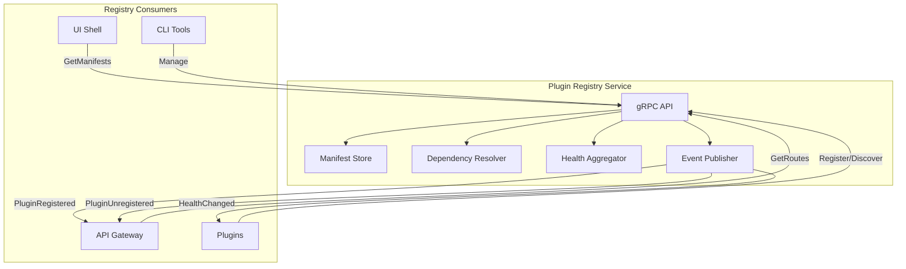

### Registry API

```protobuf
// proto/registry/registry.proto
syntax = "proto3";

package upf.registry;

service PluginRegistry {
  // Plugin registration
  rpc Register(RegisterRequest) returns (RegisterResponse);
  rpc Unregister(UnregisterRequest) returns (UnregisterResponse);
  rpc UpdateManifest(UpdateManifestRequest) returns (UpdateManifestResponse);

  // Discovery
  rpc GetPlugin(GetPluginRequest) returns (PluginInfo);
  rpc ListPlugins(ListPluginsRequest) returns (ListPluginsResponse);
  rpc GetProviders(GetProvidersRequest) returns (ProvidersResponse);
  rpc ResolveEndpoint(ResolveEndpointRequest) returns (EndpointResponse);

  // Health
  rpc GetHealth(GetHealthRequest) returns (HealthResponse);
  rpc GetAllHealth(GetAllHealthRequest) returns (AllHealthResponse);

  // Streaming
  rpc WatchPlugins(WatchRequest) returns (stream PluginEvent);
  rpc WatchHealth(WatchHealthRequest) returns (stream HealthEvent);

  // Dependency resolution
  rpc ResolveDependencies(ResolveDepsRequest) returns (ResolveDepsResponse);
  rpc ValidateManifest(ValidateRequest) returns (ValidationResult);
}

message PluginInfo {
  string id = 1;
  string version = 2;
  string name = 3;
  PluginType type = 4;
  repeated InterfaceInfo provides = 5;
  repeated InterfaceRequirement requires = 6;
  HealthStatus health = 7;
  Endpoint endpoint = 8;
  UIConfig ui = 9;
}

enum PluginType {
  PLUGIN_TYPE_UNSPECIFIED = 0;
  PLUGIN_TYPE_CORE = 1;
  PLUGIN_TYPE_INFRASTRUCTURE = 2;
  PLUGIN_TYPE_BUSINESS = 3;
}

enum HealthStatus {
  HEALTH_STATUS_UNSPECIFIED = 0;
  HEALTH_STATUS_HEALTHY = 1;
  HEALTH_STATUS_DEGRADED = 2;
  HEALTH_STATUS_UNHEALTHY = 3;
}
```

### Dependency Resolution Algorithm

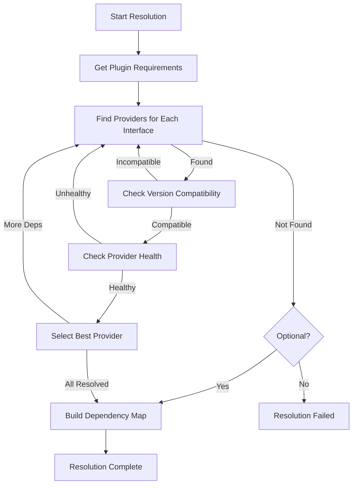

## Plugin Development Workflow

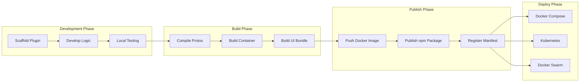

### Development Commands

```bash
# Create new plugin
npx @unified-plugin-framework/create-plugin my-plugin

# Start development mode
upf dev

# Run tests
upf test

# Build for production
upf build

# Publish plugin
upf publish
```

## Plugin Communication Patterns

### Direct gRPC Communication

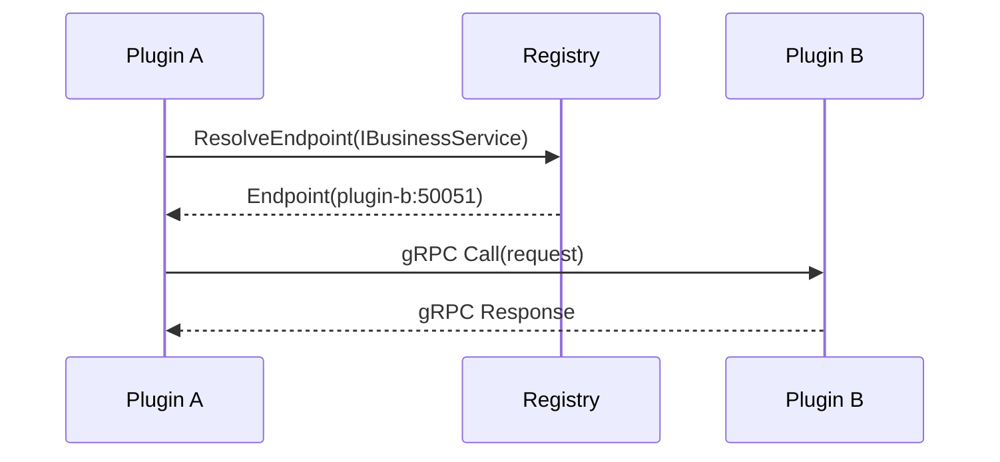

### Event-Based Communication

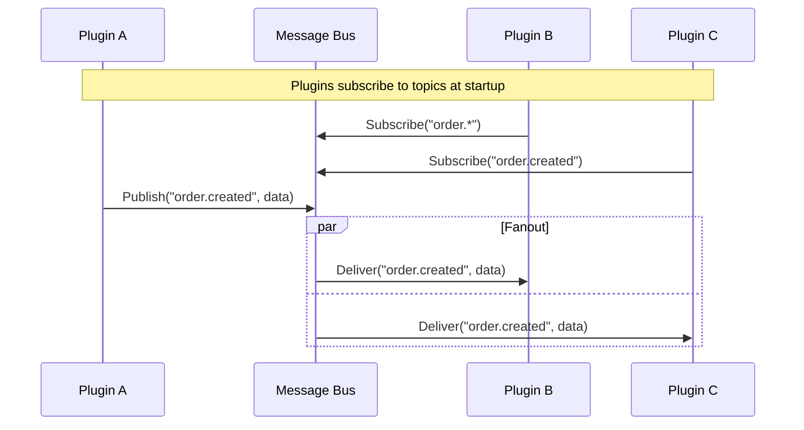

### Request-Reply via Message Bus

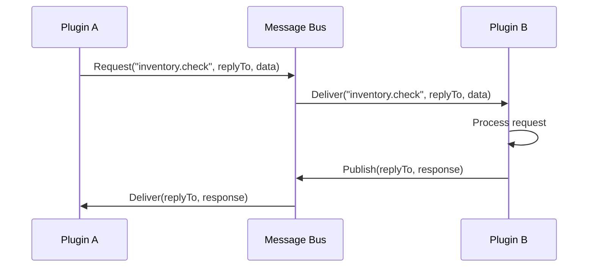

## Related Documentation

- [Architecture Overview](./overview.md) - High-level system architecture
- [Communication](./communication.md) - Inter-plugin communication details
- [Plugin Manifest Specification](../specifications/plugin-manifest.md) - Complete manifest schema
- [Interfaces Specification](../specifications/interfaces.md) - Core interface definitions

---

**Previous**: [Architecture Overview](./overview.md)
**Next**: [Communication Architecture](./communication.md)
