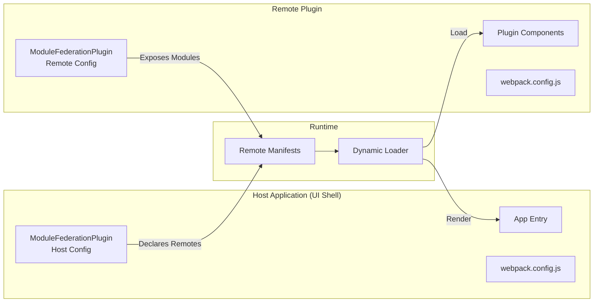
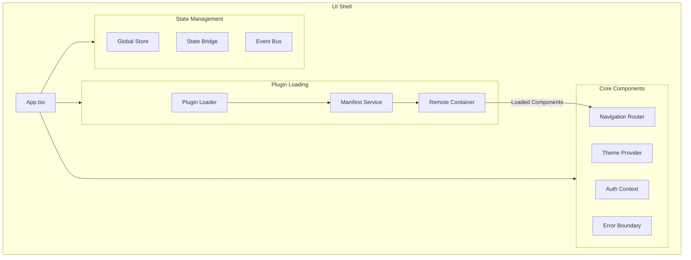
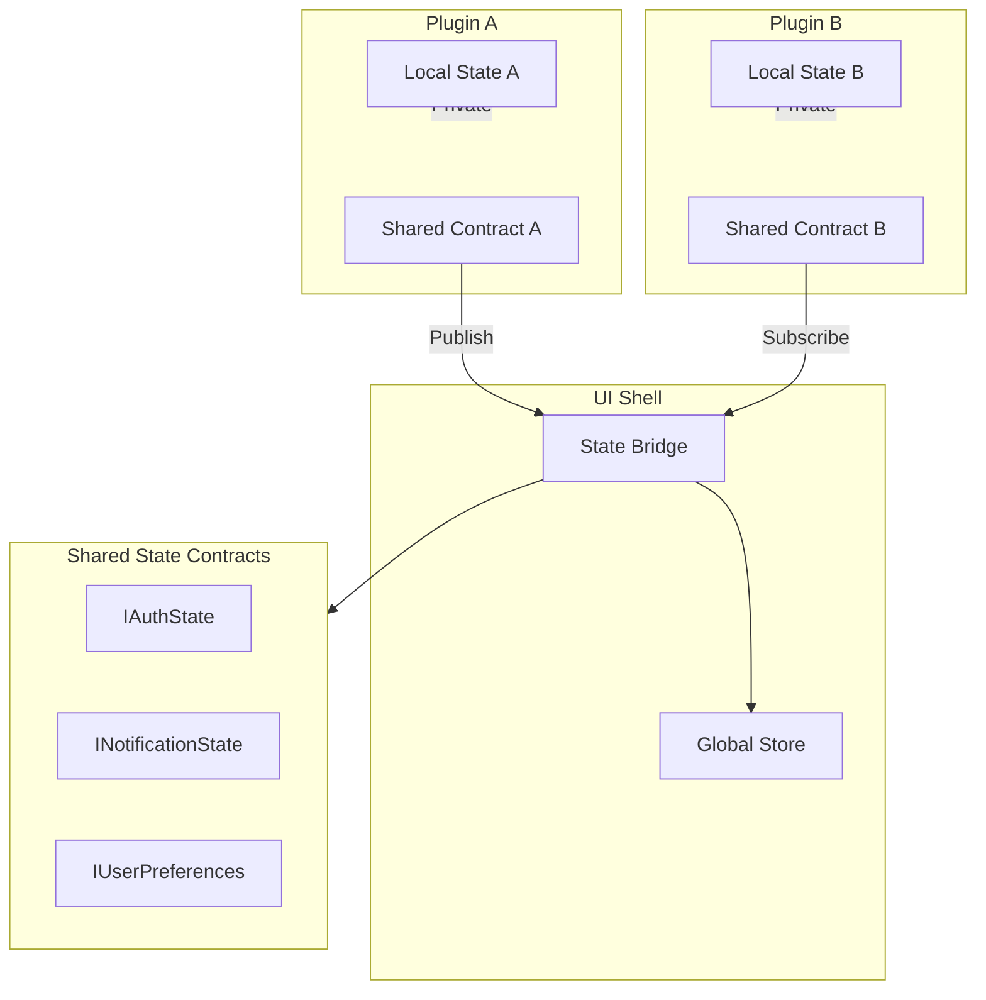
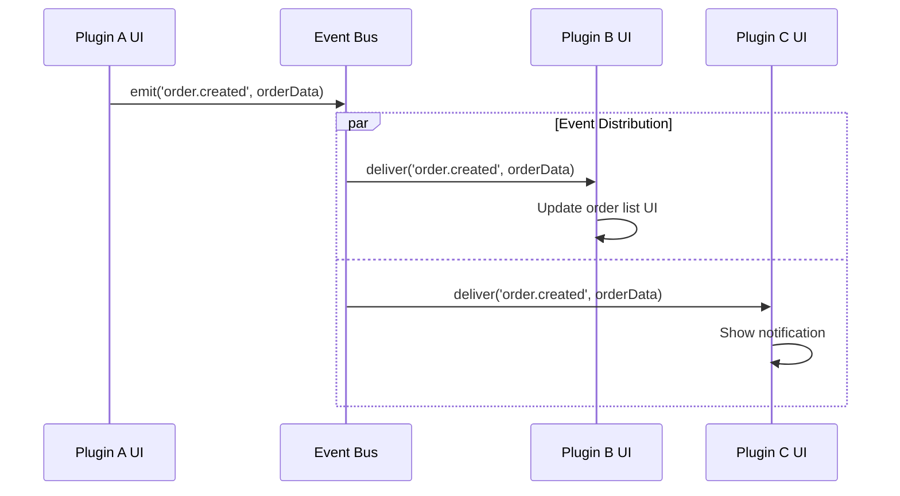
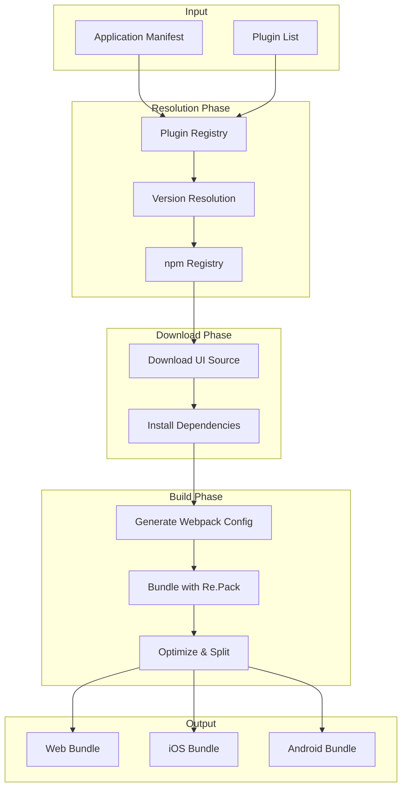
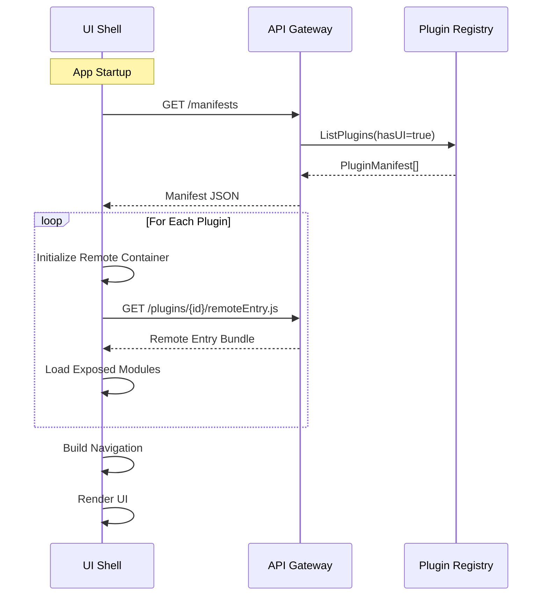

# UI Federation Architecture

This document describes the UI federation architecture using React Native and Re.Pack for Module Federation, enabling cross-platform applications composed from multiple plugin UI modules.

## Overview

UPF uses **Module Federation** to dynamically compose UI from multiple plugins at runtime. This enables:

- **Independent Deployment**: Each plugin's UI can be updated without rebuilding the entire application
- **Cross-Platform**: Single codebase for Web, iOS, and Android via React Native
- **Dynamic Loading**: Load plugin UIs on demand based on installed plugins
- **Shared Dependencies**: Common libraries shared across all plugins to reduce bundle size

```mermaid
flowchart TB
    subgraph Platforms["Target Platforms"]
        WEB[Web Browser]
        IOS[iOS App]
        ANDROID[Android App]
    end

    subgraph UIShell["UI Shell (Host)"]
        RN[React Native<br/>+ Expo]
        REPACK[Re.Pack<br/>Module Federation]
        LOADER[Plugin Loader]
    end

    subgraph Plugins["Plugin UIs (Remotes)"]
        PA[Plugin A UI]
        PB[Plugin B UI]
        PC[Plugin C UI]
    end

    subgraph Shared["Shared Dependencies"]
        REACT[react]
        RNATIVE[react-native]
        SDK[@unified-plugin-framework/ui-sdk]
    end

    REPACK --> WEB
    REPACK --> IOS
    REPACK --> ANDROID

    LOADER --> PA
    LOADER --> PB
    LOADER --> PC

    PA --> Shared
    PB --> Shared
    PC --> Shared
    UIShell --> Shared
```

## Re.Pack Module Federation

### What is Re.Pack?

[Re.Pack](https://re-pack.netlify.app/) is a toolkit for React Native that provides Webpack-based bundling with Module Federation support. It enables:

- **Webpack 5 Module Federation** for React Native
- **Code Splitting** and lazy loading
- **Dynamic Remote Loading** at runtime
- **Shared Dependencies** between host and remotes

### Architecture Components



### Host Configuration (UI Shell)

```javascript
// packages/ui-shell/webpack.config.js
const { withModuleFederation } = require('@callstack/repack/plugins');

module.exports = {
  // ... base config
  plugins: [
    withModuleFederation({
      name: 'host',
      shared: {
        react: {
          singleton: true,
          eager: true,
          requiredVersion: '^18.0.0',
        },
        'react-native': {
          singleton: true,
          eager: true,
          requiredVersion: '^0.72.0',
        },
        '@unified-plugin-framework/ui-sdk': {
          singleton: true,
          eager: true,
          requiredVersion: '^1.0.0',
        },
      },
    }),
  ],
};
```

### Remote Configuration (Plugin)

```javascript
// plugins/auth-keycloak/frontend/webpack.config.js
const { withModuleFederation } = require('@callstack/repack/plugins');

module.exports = {
  // ... base config
  plugins: [
    withModuleFederation({
      name: 'authPlugin',
      exposes: {
        './LoginScreen': './src/screens/LoginScreen',
        './ProfileWidget': './src/components/ProfileWidget',
        './useAuth': './src/hooks/useAuth',
        './AuthProvider': './src/providers/AuthProvider',
      },
      shared: {
        react: {
          singleton: true,
          eager: false,
          requiredVersion: '^18.0.0',
        },
        'react-native': {
          singleton: true,
          eager: false,
          requiredVersion: '^0.72.0',
        },
        '@unified-plugin-framework/ui-sdk': {
          singleton: true,
          eager: false,
          requiredVersion: '^1.0.0',
        },
      },
    }),
  ],
};
```

## UI Shell Architecture

### Shell Components



### Plugin Loader

The Plugin Loader dynamically loads UI components from registered plugins:

```typescript
// packages/ui-shell/src/plugin-loader.ts

import { Federated } from '@callstack/repack/client';
import type { PluginManifest, ExposedModule } from '@unified-plugin-framework/types';

interface LoadedPlugin {
  id: string;
  modules: Map<string, React.ComponentType>;
}

class PluginLoader {
  private loadedPlugins: Map<string, LoadedPlugin> = new Map();
  private remoteContainers: Map<string, unknown> = new Map();

  async loadPlugin(manifest: PluginManifest): Promise<LoadedPlugin> {
    if (this.loadedPlugins.has(manifest.id)) {
      return this.loadedPlugins.get(manifest.id)!;
    }

    const remoteUrl = this.resolveRemoteUrl(manifest);

    // Initialize remote container
    const container = await Federated.importModule(manifest.id, remoteUrl);
    this.remoteContainers.set(manifest.id, container);

    // Load exposed modules
    const modules = new Map<string, React.ComponentType>();

    for (const exposed of manifest.ui?.exposedModules ?? []) {
      const module = await this.loadModule(manifest.id, exposed);
      modules.set(exposed.name, module);
    }

    const loadedPlugin: LoadedPlugin = { id: manifest.id, modules };
    this.loadedPlugins.set(manifest.id, loadedPlugin);

    return loadedPlugin;
  }

  async loadModule(pluginId: string, exposed: ExposedModule): Promise<React.ComponentType> {
    const module = await Federated.importModule(pluginId, exposed.name);
    return module.default ?? module;
  }

  private resolveRemoteUrl(manifest: PluginManifest): string {
    // In development: use dev server URL
    // In production: use CDN or gateway URL
    const baseUrl = process.env.PLUGIN_REGISTRY_URL;
    return `${baseUrl}/plugins/${manifest.id}/remoteEntry.js`;
  }

  getLoadedModule(pluginId: string, moduleName: string): React.ComponentType | undefined {
    return this.loadedPlugins.get(pluginId)?.modules.get(moduleName);
  }
}

export const pluginLoader = new PluginLoader();
```

### Dynamic Navigation

```typescript
// packages/ui-shell/src/navigation/DynamicNavigator.tsx

import React, { useEffect, useState } from 'react';
import { createStackNavigator } from '@react-navigation/stack';
import { usePluginRegistry } from '@unified-plugin-framework/ui-sdk';
import { pluginLoader } from '../plugin-loader';

const Stack = createStackNavigator();

interface DynamicRoute {
  name: string;
  component: React.ComponentType;
  options?: object;
}

export function DynamicNavigator(): JSX.Element {
  const { plugins } = usePluginRegistry();
  const [routes, setRoutes] = useState<DynamicRoute[]>([]);

  useEffect(() => {
    async function loadRoutes(): Promise<void> {
      const loadedRoutes: DynamicRoute[] = [];

      for (const plugin of plugins) {
        if (!plugin.ui?.navigation) continue;

        const loaded = await pluginLoader.loadPlugin(plugin);

        for (const nav of plugin.ui.navigation) {
          const component = loaded.modules.get(nav.module);
          if (component) {
            loadedRoutes.push({
              name: nav.path,
              component,
              options: { title: nav.title },
            });
          }
        }
      }

      setRoutes(loadedRoutes);
    }

    loadRoutes();
  }, [plugins]);

  return (
    <Stack.Navigator>
      {routes.map((route) => (
        <Stack.Screen
          key={route.name}
          name={route.name}
          component={route.component}
          options={route.options}
        />
      ))}
    </Stack.Navigator>
  );
}
```

## State Management

### State Bridge

The State Bridge enables controlled state sharing between plugins:



### State Contract Definition

```typescript
// packages/core/types/ui-contracts.ts

import { z } from 'zod';

// Auth state contract - plugins can subscribe to this
export const AuthStateSchema = z.object({
  isAuthenticated: z.boolean(),
  user: z
    .object({
      id: z.string(),
      email: z.string(),
      displayName: z.string(),
      avatarUrl: z.string().optional(),
      roles: z.array(z.string()),
    })
    .nullable(),
  token: z.string().nullable(),
  expiresAt: z.number().nullable(),
});

export type IAuthState = z.infer<typeof AuthStateSchema>;

// Notification state contract
export const NotificationStateSchema = z.object({
  notifications: z.array(
    z.object({
      id: z.string(),
      type: z.enum(['info', 'success', 'warning', 'error']),
      title: z.string(),
      message: z.string(),
      timestamp: z.number(),
      read: z.boolean(),
    }),
  ),
  unreadCount: z.number(),
});

export type INotificationState = z.infer<typeof NotificationStateSchema>;

// Shared state contract declaration in manifest
export interface SharedStateContract {
  name: string;
  schema: z.ZodSchema;
  readonly: boolean;
  owner: string; // Plugin that owns this state
}
```

### State Bridge Implementation

```typescript
// packages/ui-sdk/src/state-bridge.ts

import { createContext, useContext, useSyncExternalStore } from 'react';
import type { SharedStateContract } from '@unified-plugin-framework/types';

type StateListener = () => void;

class StateBridge {
  private state: Map<string, unknown> = new Map();
  private contracts: Map<string, SharedStateContract> = new Map();
  private listeners: Map<string, Set<StateListener>> = new Map();

  registerContract(contract: SharedStateContract): void {
    this.contracts.set(contract.name, contract);
    this.listeners.set(contract.name, new Set());
  }

  setState<T>(name: string, value: T, pluginId: string): void {
    const contract = this.contracts.get(name);

    if (!contract) {
      throw new Error(`Unknown state contract: ${name}`);
    }

    if (contract.readonly && contract.owner !== pluginId) {
      throw new Error(`State ${name} is readonly for plugin ${pluginId}`);
    }

    // Validate against schema
    const result = contract.schema.safeParse(value);
    if (!result.success) {
      throw new Error(`Invalid state for ${name}: ${result.error.message}`);
    }

    this.state.set(name, value);
    this.notifyListeners(name);
  }

  getState<T>(name: string): T | undefined {
    return this.state.get(name) as T | undefined;
  }

  subscribe(name: string, listener: StateListener): () => void {
    const listeners = this.listeners.get(name);
    if (!listeners) {
      throw new Error(`Unknown state contract: ${name}`);
    }

    listeners.add(listener);
    return () => listeners.delete(listener);
  }

  private notifyListeners(name: string): void {
    const listeners = this.listeners.get(name);
    listeners?.forEach((listener) => listener());
  }
}

export const stateBridge = new StateBridge();

// React hook for using shared state
export function useSharedState<T>(name: string): T | undefined {
  return useSyncExternalStore(
    (callback) => stateBridge.subscribe(name, callback),
    () => stateBridge.getState<T>(name),
  );
}

// Hook for setting shared state
export function useSetSharedState<T>(name: string, pluginId: string) {
  return (value: T) => stateBridge.setState(name, value, pluginId);
}
```

## Event Bus

### Cross-Plugin Events



### Event Bus Implementation

```typescript
// packages/ui-sdk/src/event-bus.ts

type EventHandler<T = unknown> = (data: T) => void;

interface EventSubscription {
  unsubscribe: () => void;
}

class EventBus {
  private handlers: Map<string, Set<EventHandler>> = new Map();

  emit<T>(event: string, data: T): void {
    const handlers = this.handlers.get(event);
    handlers?.forEach((handler) => {
      try {
        handler(data);
      } catch (error) {
        console.error(`Error in event handler for ${event}:`, error);
      }
    });

    // Also emit to wildcard listeners
    const wildcardHandlers = this.handlers.get('*');
    wildcardHandlers?.forEach((handler) => {
      try {
        handler({ event, data });
      } catch (error) {
        console.error(`Error in wildcard handler for ${event}:`, error);
      }
    });
  }

  on<T>(event: string, handler: EventHandler<T>): EventSubscription {
    if (!this.handlers.has(event)) {
      this.handlers.set(event, new Set());
    }

    this.handlers.get(event)!.add(handler as EventHandler);

    return {
      unsubscribe: () => {
        this.handlers.get(event)?.delete(handler as EventHandler);
      },
    };
  }

  once<T>(event: string, handler: EventHandler<T>): EventSubscription {
    const wrappedHandler: EventHandler<T> = (data) => {
      subscription.unsubscribe();
      handler(data);
    };

    const subscription = this.on(event, wrappedHandler);
    return subscription;
  }
}

export const eventBus = new EventBus();

// React hook
export function useEventBus() {
  return eventBus;
}

export function useEvent<T>(event: string, handler: EventHandler<T>): void {
  useEffect(() => {
    const subscription = eventBus.on(event, handler);
    return () => subscription.unsubscribe();
  }, [event, handler]);
}
```

## API Communication

### gRPC-Web Client

```typescript
// packages/ui-sdk/src/grpc-client.ts

import { GrpcWebFetchTransport } from '@protobuf-ts/grpcweb-transport';
import type { RpcTransport } from '@protobuf-ts/runtime-rpc';

interface GrpcClientConfig {
  baseUrl: string;
  getAuthToken: () => string | null;
}

export function createGrpcTransport(config: GrpcClientConfig): RpcTransport {
  return new GrpcWebFetchTransport({
    baseUrl: config.baseUrl,
    meta: () => {
      const token = config.getAuthToken();
      return token ? { Authorization: `Bearer ${token}` } : {};
    },
  });
}

// Usage in plugin
import { OrderServiceClient } from './generated/order.client';

const transport = createGrpcTransport({
  baseUrl: 'https://api.example.com',
  getAuthToken: () => authState.token,
});

const orderClient = new OrderServiceClient(transport);

// Make calls
const { response } = await orderClient.getOrder({ id: 'order-123' });
```

### WebSocket for Real-time

```typescript
// packages/ui-sdk/src/websocket-client.ts

import { useEffect, useState, useCallback } from 'react';

interface WebSocketConfig {
  url: string;
  getAuthToken: () => string | null;
  reconnectInterval?: number;
}

export function useWebSocket<T>(config: WebSocketConfig, onMessage: (data: T) => void) {
  const [connected, setConnected] = useState(false);
  const [socket, setSocket] = useState<WebSocket | null>(null);

  useEffect(() => {
    const token = config.getAuthToken();
    const wsUrl = `${config.url}?token=${token}`;

    const ws = new WebSocket(wsUrl);

    ws.onopen = () => {
      setConnected(true);
    };

    ws.onmessage = (event) => {
      const data = JSON.parse(event.data) as T;
      onMessage(data);
    };

    ws.onclose = () => {
      setConnected(false);
      // Reconnect logic
      setTimeout(() => {
        // Reconnect
      }, config.reconnectInterval ?? 5000);
    };

    setSocket(ws);

    return () => {
      ws.close();
    };
  }, [config.url]);

  const send = useCallback(
    (data: unknown) => {
      socket?.send(JSON.stringify(data));
    },
    [socket],
  );

  return { connected, send };
}
```

## Build and Deployment

### Federated Build Process



### Build Configuration

```typescript
// tools/build-service/src/federated-builder.ts

interface BuildConfig {
  plugins: PluginManifest[];
  platform: 'web' | 'ios' | 'android';
  environment: 'development' | 'production';
}

async function buildFederatedApp(config: BuildConfig): Promise<BuildResult> {
  // 1. Download plugin UI sources
  for (const plugin of config.plugins) {
    await downloadPluginSource(plugin);
  }

  // 2. Generate federation config
  const federationConfig = generateFederationConfig(config.plugins);

  // 3. Build host application
  const hostBundle = await buildHost(federationConfig, config.platform);

  // 4. Build plugin remotes
  const remotes = await Promise.all(config.plugins.map((p) => buildPluginRemote(p, config.platform)));

  // 5. Combine outputs
  return {
    host: hostBundle,
    remotes,
    manifest: generateRuntimeManifest(config.plugins),
  };
}
```

### Runtime Loading



## Cross-Platform Considerations

### Platform-Specific Components

```typescript
// Plugin can provide platform-specific implementations
// plugins/my-plugin/frontend/src/components/CameraButton/index.ts

import { Platform } from 'react-native';

export const CameraButton = Platform.select({
  web: () => require('./CameraButton.web').default,
  ios: () => require('./CameraButton.ios').default,
  android: () => require('./CameraButton.android').default,
})!;
```

### Responsive Design

```typescript
// packages/ui-sdk/src/responsive.ts

import { useWindowDimensions } from 'react-native';

export type Breakpoint = 'xs' | 'sm' | 'md' | 'lg' | 'xl';

export function useBreakpoint(): Breakpoint {
  const { width } = useWindowDimensions();

  if (width < 576) return 'xs';
  if (width < 768) return 'sm';
  if (width < 992) return 'md';
  if (width < 1200) return 'lg';
  return 'xl';
}

export function useResponsiveValue<T>(values: Partial<Record<Breakpoint, T>>): T {
  const breakpoint = useBreakpoint();
  const breakpoints: Breakpoint[] = ['xs', 'sm', 'md', 'lg', 'xl'];

  // Find the closest smaller breakpoint with a value
  const currentIndex = breakpoints.indexOf(breakpoint);
  for (let i = currentIndex; i >= 0; i--) {
    const value = values[breakpoints[i]];
    if (value !== undefined) return value;
  }

  throw new Error('No responsive value found');
}
```

## Related Documentation

- [Architecture Overview](./overview.md) - High-level system architecture
- [Communication](./communication.md) - Backend communication patterns
- [UI Contracts](../specifications/ui-contracts.md) - Frontend state specifications
- [Plugin Development](../guides/plugin-development.md) - Building plugin UIs

---

**Previous**: [Communication Architecture](./communication.md)
**Next**: [Deployment Architecture](./deployment.md)
