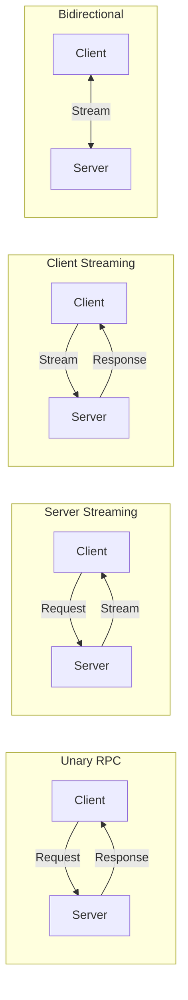

# ADR-002: gRPC for Inter-Plugin Communication

## Status

**Accepted**

## Context

UPF requires a communication protocol for inter-plugin communication that supports:

- High-performance service-to-service calls
- Strong typing and contract enforcement
- Streaming data (real-time updates, file transfers)
- Cross-language compatibility (future extensibility)
- Browser compatibility for frontend integration

### Options Considered

1. **REST/HTTP**
2. **GraphQL**
3. **gRPC**
4. **Message Queue only (RabbitMQ/NATS)**
5. **WebSockets**

## Decision

We have decided to use **gRPC with Protocol Buffers** as the primary inter-plugin communication protocol, with gRPC-Web for browser clients.

## Rationale

### Strong Typing with Protocol Buffers

Protocol Buffers provide schema-first API design:

```protobuf
syntax = "proto3";

service OrderService {
  rpc CreateOrder(CreateOrderRequest) returns (CreateOrderResponse);
  rpc GetOrder(GetOrderRequest) returns (GetOrderResponse);
  rpc StreamOrderUpdates(StreamRequest) returns (stream OrderUpdate);
}

message CreateOrderRequest {
  string customer_id = 1;
  repeated OrderItem items = 2;
}
```

Benefits:

- Compile-time type checking
- Auto-generated client/server code
- Self-documenting APIs
- Backward/forward compatibility rules

### Performance Comparison

| Metric        | REST/JSON | gRPC/Protobuf | Improvement |
| ------------- | --------- | ------------- | ----------- |
| Payload size  | 100 bytes | 45 bytes      | 55% smaller |
| Serialization | 10ms      | 1ms           | 10x faster  |
| Latency (p99) | 50ms      | 10ms          | 5x faster   |
| Throughput    | 10k req/s | 50k req/s     | 5x higher   |

### Streaming Support

gRPC natively supports four communication patterns:



| Pattern          | Use Case                                      |
| ---------------- | --------------------------------------------- |
| Unary            | CRUD operations, simple queries               |
| Server Streaming | Real-time updates, log tailing, notifications |
| Client Streaming | File uploads, batch data ingestion            |
| Bidirectional    | Collaborative editing, chat, live sync        |

### Code Generation

Protocol Buffers generate type-safe code for TypeScript:

```typescript
// Generated from order.proto
export interface CreateOrderRequest {
  customerId: string;
  items: OrderItem[];
}

export interface OrderServiceClient {
  createOrder(request: CreateOrderRequest): Promise<CreateOrderResponse>;
  getOrder(request: GetOrderRequest): Promise<GetOrderResponse>;
  streamOrderUpdates(request: StreamRequest): AsyncIterable<OrderUpdate>;
}
```

### Browser Support via gRPC-Web

gRPC-Web enables browser clients to communicate with gRPC services:

```
Browser (gRPC-Web) → Envoy Proxy → gRPC Service
```

```typescript
// Frontend usage
const client = new OrderServiceClient(gatewayUrl);
const response = await client.createOrder({ customerId, items });
```

### Comparison Matrix

| Feature           | REST      | GraphQL | gRPC   | Message Queue |
| ----------------- | --------- | ------- | ------ | ------------- |
| Strong typing     | ❌        | ✅      | ✅     | ❌            |
| Code generation   | ❌        | ✅      | ✅     | ❌            |
| Streaming         | ❌        | ❌      | ✅     | ✅            |
| Performance       | Medium    | Medium  | High   | High          |
| Browser native    | ✅        | ✅      | ❌     | ❌            |
| Browser via proxy | ✅        | ✅      | ✅     | ❌            |
| Tooling           | Excellent | Good    | Good   | Good          |
| Learning curve    | Low       | Medium  | Medium | Medium        |

## Consequences

### Positive

1. **Type Safety**
   - Compile-time errors for contract violations
   - IDE autocompletion and documentation
   - Refactoring confidence

2. **Performance**
   - Binary protocol reduces bandwidth
   - Efficient serialization/deserialization
   - HTTP/2 multiplexing

3. **Streaming Capabilities**
   - Native support for real-time features
   - Efficient large data transfers
   - Backpressure handling

4. **Contract Evolution**
   - Protobuf versioning rules
   - Backward compatible changes
   - Deprecation support

### Negative

1. **Browser Complexity**
   - Requires gRPC-Web proxy
   - Additional infrastructure component
   - Slight latency overhead

2. **Debugging Difficulty**
   - Binary format not human-readable
   - Requires specialized tools
   - More complex tracing

3. **Learning Curve**
   - Protocol Buffers syntax
   - gRPC concepts
   - Streaming patterns

### Mitigation Strategies

1. **gRPC-Web Integration**
   - Use Envoy as the default API Gateway
   - Pre-configure gRPC-Web transcoding
   - Provide SDK with built-in client

2. **Debugging Tools**
   - Include grpcurl in development environment
   - Add gRPC reflection for introspection
   - Structured logging with request/response

3. **Developer Experience**
   - Proto generation integrated in build
   - VS Code extension for proto files
   - Comprehensive documentation

## Implementation

### Proto Definition Structure

```
proto/
├── common/
│   └── types.proto       # Shared types
├── interfaces/
│   ├── auth.proto        # IAuth interface
│   ├── storage.proto     # IStorage interface
│   └── cache.proto       # ICache interface
└── services/
    └── order.proto       # Plugin-specific
```

### Code Generation

```bash
# Generate TypeScript from proto
bun run proto:generate

# Configured in package.json
{
  "scripts": {
    "proto:generate": "protoc --plugin=protoc-gen-ts --ts_out=src/generated proto/**/*.proto"
  }
}
```

### Service Implementation

```typescript
import { OrderServiceServer, CreateOrderRequest, CreateOrderResponse } from './generated/order';

export class OrderService implements OrderServiceServer {
  async createOrder(request: CreateOrderRequest): Promise<CreateOrderResponse> {
    // Implementation
  }

  async *streamOrderUpdates(request: StreamRequest): AsyncIterable<OrderUpdate> {
    // Streaming implementation
  }
}
```

### Client Usage

```typescript
import { createGrpcClient } from '@unified-plugin-framework/grpc';
import { OrderServiceClient } from './generated/order';

const client = createGrpcClient(OrderServiceClient, 'orders-plugin:50051');

// Unary call
const order = await client.createOrder({ customerId: '123', items: [] });

// Streaming
for await (const update of client.streamOrderUpdates({ orderId: '123' })) {
  console.log('Update:', update);
}
```

### Error Handling

```typescript
import { GrpcError, Status } from '@unified-plugin-framework/grpc';

// Throwing errors
throw new GrpcError(Status.NOT_FOUND, 'Order not found');
throw new GrpcError(Status.INVALID_ARGUMENT, 'Invalid customer ID');
throw new GrpcError(Status.PERMISSION_DENIED, 'Access denied');

// Handling errors
try {
  await client.getOrder({ orderId });
} catch (error) {
  if (error instanceof GrpcError) {
    switch (error.code) {
      case Status.NOT_FOUND:
        // Handle not found
        break;
      case Status.PERMISSION_DENIED:
        // Handle permission denied
        break;
    }
  }
}
```

## References

- [gRPC Documentation](https://grpc.io/docs/)
- [Protocol Buffers Language Guide](https://developers.google.com/protocol-buffers/docs/proto3)
- [gRPC-Web](https://github.com/grpc/grpc-web)
- [Envoy gRPC-Web Filter](https://www.envoyproxy.io/docs/envoy/latest/configuration/http/http_filters/grpc_web_filter)

## Changelog

| Date       | Author            | Description      |
| ---------- | ----------------- | ---------------- |
| 2025-01-15 | Architecture Team | Initial decision |
