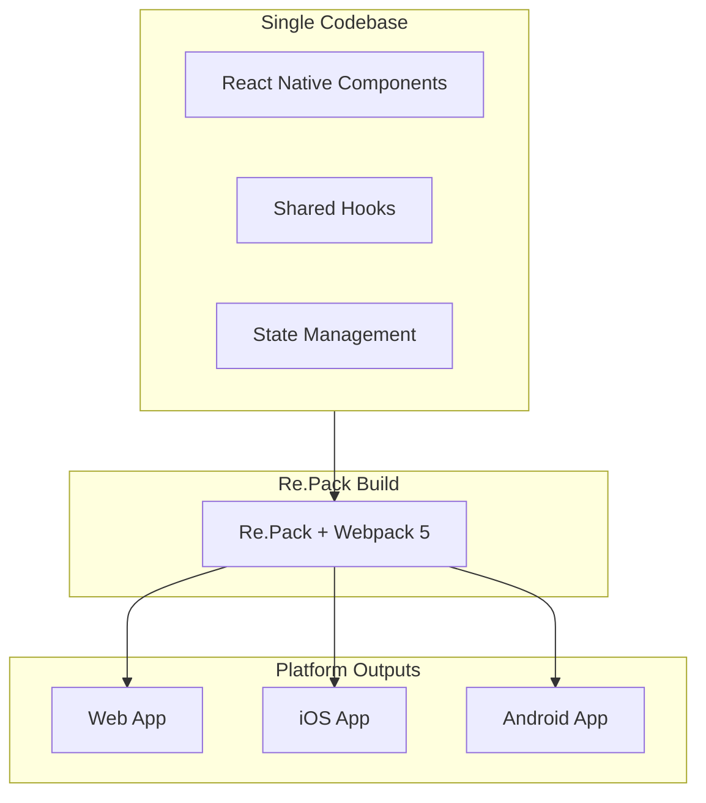

# ADR-003: React Native with Re.Pack for Cross-Platform UI

## Status

**Accepted**

## Context

UPF requires a frontend framework that supports:

- Cross-platform deployment (Web, iOS, Android)
- Module Federation for dynamic plugin UI loading
- Single codebase for all platforms
- Rich component ecosystem
- Strong developer tooling
- Native performance on mobile

### Options Considered

1. **React (Web) + Native apps (Swift/Kotlin)**
2. **Flutter**
3. **React Native with Metro bundler**
4. **React Native with Re.Pack**

## Decision

We have decided to use **React Native with Re.Pack** for the UPF frontend, enabling Module Federation across all platforms.

## Rationale

### Single Codebase, Multiple Platforms

React Native with Re.Pack allows:



### Module Federation Support

Re.Pack enables Webpack 5 Module Federation for React Native:

```javascript
// webpack.config.js (Host - UI Shell)
const { ModuleFederationPlugin } = require('webpack').container;

module.exports = {
  plugins: [
    new ModuleFederationPlugin({
      name: 'shell',
      remotes: {
        ordersPlugin: 'ordersPlugin@dynamic',
        inventoryPlugin: 'inventoryPlugin@dynamic',
      },
      shared: {
        react: { singleton: true },
        'react-native': { singleton: true },
        '@unified-plugin-framework/ui-sdk': { singleton: true },
      },
    }),
  ],
};
```

### Dynamic Remote Loading

Plugins can be loaded at runtime:

```typescript
// Dynamic plugin loading
import { loadRemote } from '@module-federation/runtime';

async function loadPluginUI(pluginId: string) {
  const manifest = await registry.getPluginManifest(pluginId);

  const remote = await loadRemote({
    name: manifest.ui.remoteName,
    entry: manifest.ui.entryUrl,
  });

  return remote;
}
```

### Comparison Matrix

| Feature                | React Web + Native     | Flutter       | RN + Metro | RN + Re.Pack |
| ---------------------- | ---------------------- | ------------- | ---------- | ------------ |
| Single codebase        | ❌                     | ✅            | ✅         | ✅           |
| Module Federation      | ✅ (web only)          | ❌            | ❌         | ✅           |
| Dynamic plugin loading | ✅ (web only)          | ❌            | ❌         | ✅           |
| Native performance     | ✅ (native) / ✅ (web) | ✅            | ✅         | ✅           |
| Ecosystem size         | Large                  | Medium        | Large      | Large        |
| Developer familiarity  | High (React)           | Medium (Dart) | High       | High         |
| Hot reload             | ✅                     | ✅            | ✅         | ✅           |
| Web support            | ✅                     | ✅ (beta)     | ✅         | ✅           |

### Why Not Metro?

Metro (default React Native bundler) lacks:

- Module Federation support
- Dynamic remote loading
- Code splitting across apps

Re.Pack replaces Metro with Webpack 5, enabling:

- Full Module Federation
- Dynamic imports
- Shared dependencies
- Tree shaking

### Performance Characteristics

| Metric        | Native   | Flutter | React Native |
| ------------- | -------- | ------- | ------------ |
| Startup time  | Baseline | +10%    | +15%         |
| Animation FPS | 60       | 60      | 60\*         |
| Memory usage  | Baseline | +20%    | +25%         |
| Bundle size   | Baseline | +15%    | +10%         |

\*With proper optimization and native driver

## Consequences

### Positive

1. **True Cross-Platform**
   - Write once, deploy everywhere
   - Consistent UX across platforms
   - Shared business logic

2. **Dynamic Plugin Loading**
   - Load plugin UIs at runtime
   - No app store updates for new plugins
   - A/B testing capability

3. **Shared Dependencies**
   - Single React instance across plugins
   - Reduced bundle sizes
   - Consistent component library

4. **Developer Experience**
   - React ecosystem familiarity
   - TypeScript support
   - Hot reload across all platforms

### Negative

1. **Build Complexity**
   - Webpack configuration required
   - More complex than Metro setup
   - Platform-specific edge cases

2. **Bundle Size**
   - JavaScript bundle larger than native
   - Initial download time
   - Requires code splitting strategy

3. **Native Module Integration**
   - Some native modules need adaptation
   - Platform-specific code occasionally needed
   - Testing across platforms

### Mitigation Strategies

1. **Build Simplification**
   - Provide pre-configured templates
   - CLI generates webpack configs
   - Document common patterns

2. **Performance Optimization**
   - Lazy loading for plugin UIs
   - Hermes JavaScript engine
   - Native driver for animations

3. **Native Integration**
   - Maintain compatibility list
   - Provide fallback patterns
   - Platform-specific code guidelines

## Implementation

### UI Shell Configuration

```typescript
// apps/shell/webpack.config.js
const { withRepack } = require('@callstack/repack');

module.exports = withRepack({
  entry: './index.js',
  output: {
    publicPath: 'auto',
  },
  plugins: [
    new Repack.plugins.ModuleFederationPlugin({
      name: 'shell',
      shared: {
        react: { singleton: true, eager: true },
        'react-native': { singleton: true, eager: true },
        '@react-navigation/native': { singleton: true },
        '@unified-plugin-framework/ui-sdk': { singleton: true },
      },
    }),
  ],
});
```

### Plugin UI Configuration

```typescript
// plugins/orders/webpack.config.js
const { withRepack } = require('@callstack/repack');

module.exports = withRepack({
  entry: './src/index.ts',
  output: {
    publicPath: 'auto',
    uniqueName: 'ordersPlugin',
  },
  plugins: [
    new Repack.plugins.ModuleFederationPlugin({
      name: 'ordersPlugin',
      exposes: {
        './OrdersScreen': './src/screens/OrdersScreen',
        './OrderCard': './src/components/OrderCard',
      },
      shared: {
        react: { singleton: true },
        'react-native': { singleton: true },
        '@unified-plugin-framework/ui-sdk': { singleton: true },
      },
    }),
  ],
});
```

### Dynamic Plugin Loader

```typescript
// UI Shell plugin loader
import { Federated } from '@callstack/repack/client';

interface PluginUIConfig {
  name: string;
  url: string;
}

export async function loadPluginComponent(config: PluginUIConfig, componentName: string) {
  const container = await Federated.importModule(config.name, config.url);

  const module = await container.get(`./${componentName}`);
  return module.default;
}

// Usage
const OrdersScreen = await loadPluginComponent(
  { name: 'ordersPlugin', url: 'http://cdn.example.com/orders/remote.js' },
  'OrdersScreen',
);
```

### Platform-Specific Handling

```typescript
// Platform-aware component
import { Platform } from 'react-native';

export function OrderCard({ order }: OrderCardProps) {
  return (
    <View style={styles.card}>
      <Text>{order.id}</Text>
      {Platform.select({
        ios: <IOSSpecificComponent />,
        android: <AndroidSpecificComponent />,
        web: <WebSpecificComponent />,
        default: <DefaultComponent />,
      })}
    </View>
  );
}
```

### Shared Dependencies

```typescript
// @unified-plugin-framework/ui-sdk shared package
export { useTheme } from './hooks/useTheme';
export { useNavigator } from './hooks/useNavigator';
export { useGrpcClient } from './hooks/useGrpcClient';
export { useSharedState } from './hooks/useSharedState';
export { useEventBus } from './hooks/useEventBus';

// Shared components
export { Button } from './components/Button';
export { Card } from './components/Card';
export { Text } from './components/Text';
export { Input } from './components/Input';
```

### Navigation Integration

```typescript
// Dynamic route registration
import { NavigationContainer } from '@react-navigation/native';
import { createStackNavigator } from '@react-navigation/stack';

const Stack = createStackNavigator();

function AppNavigator({ plugins }: { plugins: PluginConfig[] }) {
  return (
    <NavigationContainer>
      <Stack.Navigator>
        {/* Core routes */}
        <Stack.Screen name="Home" component={HomeScreen} />

        {/* Dynamic plugin routes */}
        {plugins.map((plugin) => (
          plugin.routes.map((route) => (
            <Stack.Screen
              key={`${plugin.id}-${route.path}`}
              name={route.path}
              component={route.component}
              options={{ title: route.title }}
            />
          ))
        ))}
      </Stack.Navigator>
    </NavigationContainer>
  );
}
```

## Build and Deployment

### Development

```bash
# Start Metro server (development)
bun run start

# Run on platforms
bun run ios
bun run android
bun run web
```

### Production Build

```bash
# Build for web
bun run build:web

# Build for iOS
bun run build:ios

# Build for Android
bun run build:android
```

### Plugin UI Distribution

```bash
# Build plugin remote bundle
bun run build:remote

# Output structure
dist/
├── remote.js        # Module Federation remote entry
├── chunks/          # Code-split chunks
└── assets/          # Images, fonts
```

## References

- [Re.Pack Documentation](https://re-pack.dev/)
- [Module Federation](https://webpack.js.org/concepts/module-federation/)
- [React Native](https://reactnative.dev/)
- [React Navigation](https://reactnavigation.org/)

## Changelog

| Date       | Author            | Description      |
| ---------- | ----------------- | ---------------- |
| 2025-01-15 | Architecture Team | Initial decision |
