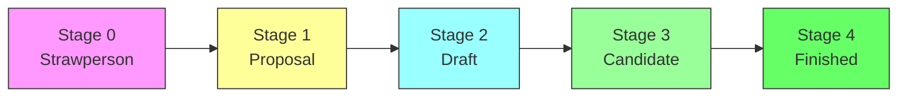

# Contributing to UPF

Welcome to the Unified Plugin Framework contribution guide. We use a **staged proposal process** inspired by the [TC39 JavaScript proposal process](https://tc39.es/process-document/) to manage contributions and feature development.

## Contribution Types

### 1. Bug Reports & Fixes

For bugs, please [open an issue](https://github.com/Unified-Plugin-Framework/docs/issues/new) with:

- Clear description of the problem
- Steps to reproduce
- Expected vs actual behavior
- Environment details (OS, Bun version, etc.)

### 2. Documentation Improvements

Documentation changes can be submitted directly via pull request. For significant restructuring, please open a discussion first.

### 3. Feature Proposals

All significant features follow our staged proposal process (see below).

---

## Proposal Stages

We use a 5-stage process to develop new features, APIs, and major changes. This ensures thorough vetting, community input, and implementation quality.



### Stage 0: Strawperson 💭

**Purpose**: Capture initial ideas for discussion

**Entry Criteria**:

- Any community member can submit
- Open a [GitHub Discussion](https://github.com/orgs/Unified-Plugin-Framework/discussions/new?category=ideas) in the "Ideas" category

**Requirements**:

- Problem statement
- Initial idea (can be rough)
- Motivation / use cases

**Exit Criteria**: Core team agrees to explore further → Stage 1

---

### Stage 1: Proposal 📝

**Purpose**: Formalize the proposal with a champion

**Entry Criteria**:

- Champion identified (can be original author or core team member)
- Initial spec outline exists

**Requirements**:

- Detailed problem statement
- High-level API design
- Key algorithms or behavior described
- Identified cross-cutting concerns (security, performance, compatibility)
- Open questions listed

**Artifacts**:

- RFC document in `rfcs/` directory
- GitHub Issue tracking the proposal

**Exit Criteria**: Core team approves detailed design → Stage 2

---

### Stage 2: Draft 📋

**Purpose**: Complete specification ready for implementation

**Entry Criteria**:

- Complete specification text
- All major design decisions made

**Requirements**:

- Full API specification
- Detailed behavior description
- Error handling defined
- TypeScript interface definitions
- Initial implementation (proof of concept)
- Migration path (if breaking change)

**Artifacts**:

- Complete RFC with spec text
- Prototype implementation branch

**Exit Criteria**: Specification is complete and stable → Stage 3

---

### Stage 3: Candidate ✅

**Purpose**: Validate through implementation and testing

**Entry Criteria**:

- Specification is frozen (editorial changes only)
- At least one complete implementation

**Requirements**:

- Full implementation with tests
- Documentation written
- Performance benchmarks (if applicable)
- Security review completed
- Integration tested with existing plugins

**Artifacts**:

- Production-ready implementation PR
- Test suite with >80% coverage
- Updated documentation

**Exit Criteria**: Implementation approved, all tests passing → Stage 4

---

### Stage 4: Finished 🎉

**Purpose**: Feature is complete and released

**Entry Criteria**:

- All Stage 3 requirements met
- Core team approval
- No outstanding objections

**What Happens**:

- PR merged to main branch
- Released in next version
- Announcement in release notes

---

## RFC Template

When creating a Stage 1 proposal, use this template:

```markdown
# RFC: [Feature Name]

## Summary

One paragraph explanation of the feature.

## Motivation

Why are we doing this? What use cases does it support?

## Detailed Design

### API

\`\`\`typescript
// Proposed interface
interface IMyFeature {
method(): Promise<Result>;
}
\`\`\`

### Behavior

Detailed description of how the feature works.

### Error Handling

How errors are handled and reported.

## Drawbacks

Why should we NOT do this?

## Alternatives

What other designs were considered?

## Unresolved Questions

What parts of the design are still TBD?

## Implementation Plan

- [ ] Step 1
- [ ] Step 2
- [ ] Step 3
```

---

## Code Contribution Guidelines

### Setup Development Environment

```bash
# Clone the repository
git clone https://github.com/Unified-Plugin-Framework/[repo].git
cd [repo]

# Install dependencies
bun install

# Run tests
bun test

# Start development server
bun run dev
```

### Code Standards

- **Language**: TypeScript (strict mode)
- **Style**: Follow [Google TypeScript Style Guide](https://google.github.io/styleguide/tsguide.html)
- **Formatting**: Prettier with project config
- **Linting**: ESLint with project config
- **Testing**: Vitest for unit tests

### Commit Messages

We follow [Conventional Commits](https://www.conventionalcommits.org/):

```
type(scope): description

[optional body]

[optional footer]
```

Types: `feat`, `fix`, `docs`, `style`, `refactor`, `test`, `chore`

Examples:

```
feat(plugin-manager): add hot reload support
fix(grpc): handle connection timeout gracefully
docs(architecture): update communication diagram
```

### Pull Request Process

1. **Fork** the repository
2. **Create** a feature branch from `main`
3. **Make** your changes with tests
4. **Ensure** all tests pass: `bun test`
5. **Submit** PR with clear description
6. **Address** review feedback
7. **Squash & merge** once approved

---

## Community Guidelines

- Be respectful and inclusive
- Provide constructive feedback
- Help others learn and grow
- Follow the [Code of Conduct](https://github.com/Unified-Plugin-Framework/.github/blob/main/CODE_OF_CONDUCT.md)

## Getting Help

- **Questions**: [GitHub Discussions](https://github.com/orgs/Unified-Plugin-Framework/discussions)
- **Bugs**: [GitHub Issues](https://github.com/Unified-Plugin-Framework/docs/issues)
- **Security**: Report privately via GitHub Security Advisory
