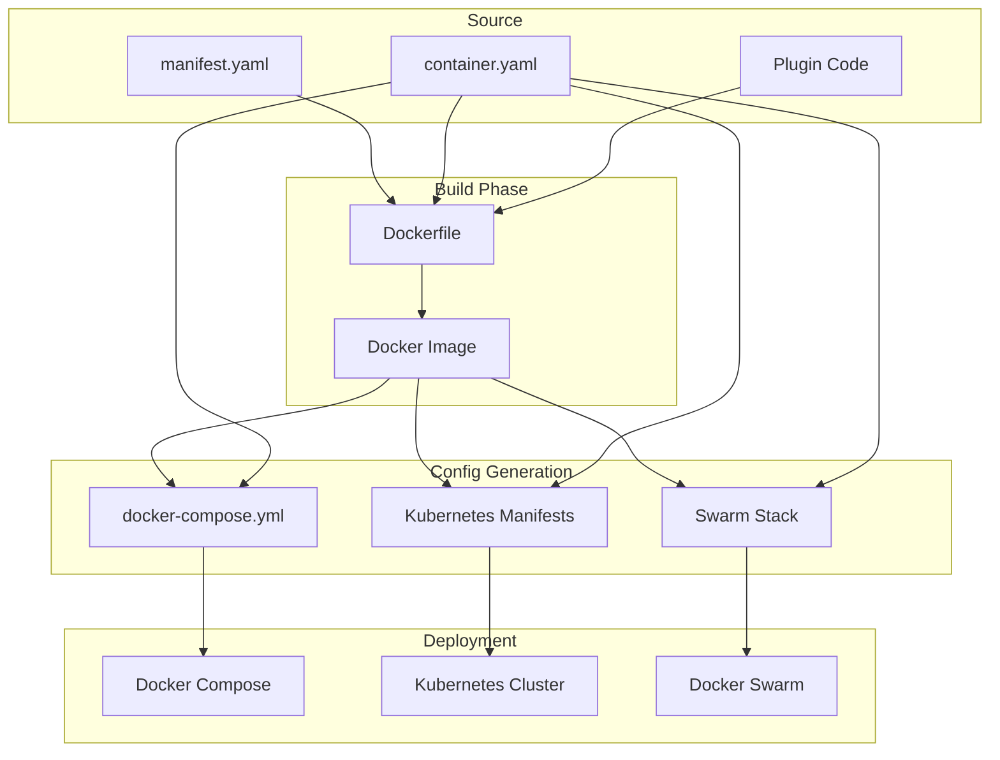
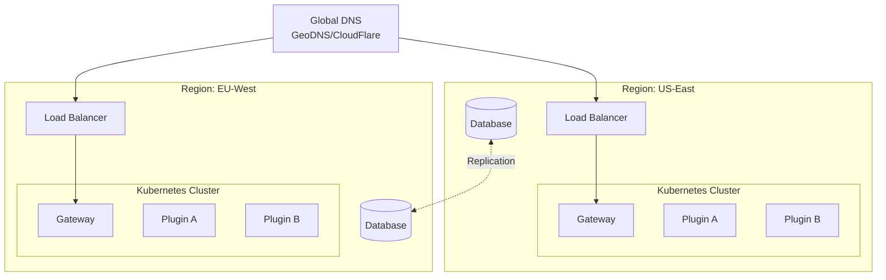

# Deployment Guide

This guide covers deploying UPF applications to various container orchestration platforms including Docker Compose, Kubernetes, and Docker Swarm.

## Table of Contents

1. [Deployment Overview](#deployment-overview)
2. [Container Configuration](#container-configuration)
3. [Docker Compose Deployment](#docker-compose-deployment)
4. [Kubernetes Deployment](#kubernetes-deployment)
5. [Docker Swarm Deployment](#docker-swarm-deployment)
6. [Configuration Management](#configuration-management)
7. [Monitoring and Observability](#monitoring-and-observability)
8. [Scaling and High Availability](#scaling-and-high-availability)

## Deployment Overview



### Deployment Workflow

1. **Build** - Create Docker images from plugin source
2. **Generate** - Generate orchestrator-specific configurations
3. **Deploy** - Deploy to target environment
4. **Verify** - Validate deployment health

## Container Configuration

### container.yaml Schema

The `container.yaml` file defines orchestration-agnostic deployment configuration:

```yaml
# container.yaml
version: '1.0'

container:
  # Base image configuration
  image:
    name: my-plugin
    registry: registry.example.com
    tag: ${VERSION:-latest}

  # Resource limits
  resources:
    requests:
      memory: 256Mi
      cpu: 100m
    limits:
      memory: 512Mi
      cpu: 500m

  # Port mappings
  ports:
    - name: grpc
      container: 50051
      protocol: TCP
    - name: http
      container: 8080
      protocol: TCP

  # Health checks
  health:
    liveness:
      grpc:
        port: 50051
      initialDelaySeconds: 10
      periodSeconds: 30
    readiness:
      grpc:
        port: 50051
      initialDelaySeconds: 5
      periodSeconds: 10

  # Environment variables
  env:
    - name: LOG_LEVEL
      value: info
    - name: NODE_ENV
      value: production

  # Secret references
  secrets:
    - name: DATABASE_PASSWORD
      source: db-credentials
      key: password
    - name: API_KEY
      source: api-secrets
      key: key

  # Volume mounts
  volumes:
    - name: data
      path: /app/data
      size: 10Gi
      persistent: true
    - name: config
      path: /app/config
      configMap: plugin-config

  # Scaling configuration
  scaling:
    replicas:
      min: 2
      max: 10
    metrics:
      - type: cpu
        target: 70
      - type: memory
        target: 80

# Network configuration
network:
  # Service discovery name
  serviceName: my-plugin
  # Internal communication
  internal: true
  # Load balancer settings
  loadBalancer:
    enabled: false
    type: ClusterIP

# Dependencies
dependencies:
  - name: storage-postgres
    required: true
  - name: cache-redis
    required: true
  - name: message-bus-nats
    required: false
```

### Dockerfile Template

```dockerfile
# Dockerfile
FROM oven/bun:1.0-alpine AS builder

WORKDIR /app

# Install dependencies
COPY package.json bun.lockb ./
RUN bun install --frozen-lockfile

# Copy source
COPY . .

# Generate proto files
RUN bun run generate

# Build
RUN bun run build

# Production image
FROM oven/bun:1.0-alpine AS runtime

WORKDIR /app

# Copy built artifacts
COPY --from=builder /app/dist ./dist
COPY --from=builder /app/node_modules ./node_modules
COPY --from=builder /app/package.json ./

# Copy frontend bundle (if exists)
COPY --from=builder /app/ui-dist ./ui-dist

# Health check
HEALTHCHECK --interval=30s --timeout=10s --start-period=5s --retries=3 \
  CMD bun run healthcheck || exit 1

# Run
ENV NODE_ENV=production
EXPOSE 50051 8080

CMD ["bun", "run", "dist/backend/index.js"]
```

## Docker Compose Deployment

### Generate Configuration

```bash
# Generate docker-compose.yml from container.yaml
upf generate --target compose

# Or with custom output
upf generate --target compose --output ./deploy/docker-compose.yml
```

### Generated docker-compose.yml

```yaml
# docker-compose.yml (generated)
version: '3.8'

services:
  # Core Services
  registry:
    image: registry.example.com/upf-registry:latest
    ports:
      - '50052:50051'
    environment:
      - LOG_LEVEL=info
    healthcheck:
      test: ['CMD', 'grpc_health_probe', '-addr=:50051']
      interval: 30s
      timeout: 10s
      retries: 3
    networks:
      - upf-network

  gateway:
    image: registry.example.com/upf-gateway:latest
    ports:
      - '8080:8080'
      - '50051:50051'
    environment:
      - REGISTRY_URL=registry:50051
      - LOG_LEVEL=info
    depends_on:
      registry:
        condition: service_healthy
    healthcheck:
      test: ['CMD', 'grpc_health_probe', '-addr=:50051']
      interval: 30s
      timeout: 10s
      retries: 3
    networks:
      - upf-network

  # Infrastructure Plugins
  storage-postgres:
    image: registry.example.com/storage-postgres:latest
    environment:
      - POSTGRES_HOST=postgres
      - POSTGRES_PORT=5432
      - POSTGRES_DB=upf
      - POSTGRES_USER=upf
      - POSTGRES_PASSWORD_FILE=/run/secrets/db_password
    secrets:
      - db_password
    depends_on:
      - postgres
      - registry
    networks:
      - upf-network

  cache-redis:
    image: registry.example.com/cache-redis:latest
    environment:
      - REDIS_URL=redis://redis:6379
    depends_on:
      - redis
      - registry
    networks:
      - upf-network

  message-bus-nats:
    image: registry.example.com/message-bus-nats:latest
    environment:
      - NATS_URL=nats://nats:4222
    depends_on:
      - nats
      - registry
    networks:
      - upf-network

  # Business Plugins
  orders-plugin:
    image: registry.example.com/orders-plugin:latest
    environment:
      - REGISTRY_URL=registry:50051
      - LOG_LEVEL=info
    depends_on:
      - registry
      - storage-postgres
      - cache-redis
    deploy:
      replicas: 2
      resources:
        limits:
          memory: 512M
          cpus: '0.5'
        reservations:
          memory: 256M
          cpus: '0.1'
    healthcheck:
      test: ['CMD', 'grpc_health_probe', '-addr=:50051']
      interval: 30s
      timeout: 10s
      retries: 3
    networks:
      - upf-network

  # UI Shell
  ui-shell:
    image: registry.example.com/upf-ui-shell:latest
    ports:
      - '3000:3000'
    environment:
      - GATEWAY_URL=http://gateway:8080
      - REGISTRY_URL=http://registry:50051
    depends_on:
      - gateway
    networks:
      - upf-network

  # Infrastructure
  postgres:
    image: postgres:16-alpine
    environment:
      - POSTGRES_DB=upf
      - POSTGRES_USER=upf
      - POSTGRES_PASSWORD_FILE=/run/secrets/db_password
    secrets:
      - db_password
    volumes:
      - postgres-data:/var/lib/postgresql/data
    networks:
      - upf-network

  redis:
    image: redis:7-alpine
    volumes:
      - redis-data:/data
    networks:
      - upf-network

  nats:
    image: nats:2.10-alpine
    ports:
      - '4222:4222'
      - '8222:8222'
    networks:
      - upf-network

networks:
  upf-network:
    driver: bridge

volumes:
  postgres-data:
  redis-data:

secrets:
  db_password:
    file: ./secrets/db_password.txt
```

### Deploy Commands

```bash
# Start all services
docker compose up -d

# View logs
docker compose logs -f orders-plugin

# Scale a service
docker compose up -d --scale orders-plugin=3

# Stop all services
docker compose down

# Stop and remove volumes
docker compose down -v
```

### Local Development

```bash
# Start only infrastructure
docker compose up -d postgres redis nats

# Run plugin locally (connects to containerized infra)
POSTGRES_HOST=localhost REDIS_URL=redis://localhost:6379 upf dev
```

## Kubernetes Deployment

### Generate Manifests

```bash
# Generate Kubernetes manifests
upf generate --target kubernetes --output ./k8s/

# Generate with Helm chart
upf generate --target helm --output ./charts/my-plugin/
```

### Generated Kubernetes Manifests

```yaml
# k8s/namespace.yaml
apiVersion: v1
kind: Namespace
metadata:
  name: upf
  labels:
    app.kubernetes.io/managed-by: upf
---
# k8s/orders-plugin/deployment.yaml
apiVersion: apps/v1
kind: Deployment
metadata:
  name: orders-plugin
  namespace: upf
  labels:
    app: orders-plugin
    app.kubernetes.io/name: orders-plugin
    app.kubernetes.io/version: '1.0.0'
spec:
  replicas: 2
  selector:
    matchLabels:
      app: orders-plugin
  template:
    metadata:
      labels:
        app: orders-plugin
      annotations:
        prometheus.io/scrape: 'true'
        prometheus.io/port: '9090'
    spec:
      serviceAccountName: orders-plugin
      containers:
        - name: orders-plugin
          image: registry.example.com/orders-plugin:1.0.0
          ports:
            - name: grpc
              containerPort: 50051
              protocol: TCP
            - name: metrics
              containerPort: 9090
              protocol: TCP
          env:
            - name: REGISTRY_URL
              value: 'registry.upf.svc.cluster.local:50051'
            - name: LOG_LEVEL
              value: 'info'
            - name: DATABASE_PASSWORD
              valueFrom:
                secretKeyRef:
                  name: db-credentials
                  key: password
          resources:
            requests:
              memory: '256Mi'
              cpu: '100m'
            limits:
              memory: '512Mi'
              cpu: '500m'
          livenessProbe:
            grpc:
              port: 50051
            initialDelaySeconds: 10
            periodSeconds: 30
          readinessProbe:
            grpc:
              port: 50051
            initialDelaySeconds: 5
            periodSeconds: 10
          volumeMounts:
            - name: config
              mountPath: /app/config
              readOnly: true
      volumes:
        - name: config
          configMap:
            name: orders-plugin-config
---
# k8s/orders-plugin/service.yaml
apiVersion: v1
kind: Service
metadata:
  name: orders-plugin
  namespace: upf
  labels:
    app: orders-plugin
spec:
  type: ClusterIP
  ports:
    - name: grpc
      port: 50051
      targetPort: grpc
      protocol: TCP
  selector:
    app: orders-plugin
---
# k8s/orders-plugin/hpa.yaml
apiVersion: autoscaling/v2
kind: HorizontalPodAutoscaler
metadata:
  name: orders-plugin
  namespace: upf
spec:
  scaleTargetRef:
    apiVersion: apps/v1
    kind: Deployment
    name: orders-plugin
  minReplicas: 2
  maxReplicas: 10
  metrics:
    - type: Resource
      resource:
        name: cpu
        target:
          type: Utilization
          averageUtilization: 70
    - type: Resource
      resource:
        name: memory
        target:
          type: Utilization
          averageUtilization: 80
---
# k8s/orders-plugin/pdb.yaml
apiVersion: policy/v1
kind: PodDisruptionBudget
metadata:
  name: orders-plugin
  namespace: upf
spec:
  minAvailable: 1
  selector:
    matchLabels:
      app: orders-plugin
---
# k8s/orders-plugin/serviceaccount.yaml
apiVersion: v1
kind: ServiceAccount
metadata:
  name: orders-plugin
  namespace: upf
---
# k8s/orders-plugin/configmap.yaml
apiVersion: v1
kind: ConfigMap
metadata:
  name: orders-plugin-config
  namespace: upf
data:
  config.yaml: |
    logging:
      level: info
      format: json
    features:
      analytics: true
      notifications: true
```

### Ingress Configuration

```yaml
# k8s/ingress.yaml
apiVersion: networking.k8s.io/v1
kind: Ingress
metadata:
  name: upf-ingress
  namespace: upf
  annotations:
    nginx.ingress.kubernetes.io/ssl-redirect: 'true'
    nginx.ingress.kubernetes.io/backend-protocol: 'GRPC'
    cert-manager.io/cluster-issuer: 'letsencrypt-prod'
spec:
  ingressClassName: nginx
  tls:
    - hosts:
        - api.example.com
      secretName: upf-tls
  rules:
    - host: api.example.com
      http:
        paths:
          - path: /
            pathType: Prefix
            backend:
              service:
                name: gateway
                port:
                  number: 8080
---
# gRPC-Web ingress (separate for grpc-web protocol)
apiVersion: networking.k8s.io/v1
kind: Ingress
metadata:
  name: upf-grpc-web-ingress
  namespace: upf
  annotations:
    nginx.ingress.kubernetes.io/backend-protocol: 'GRPC'
spec:
  ingressClassName: nginx
  rules:
    - host: grpc.example.com
      http:
        paths:
          - path: /
            pathType: Prefix
            backend:
              service:
                name: gateway
                port:
                  number: 50051
```

### Deploy Commands

```bash
# Apply all manifests
kubectl apply -f k8s/

# Check deployment status
kubectl -n upf get pods

# View logs
kubectl -n upf logs -f deployment/orders-plugin

# Scale deployment
kubectl -n upf scale deployment orders-plugin --replicas=5

# Rollout restart
kubectl -n upf rollout restart deployment orders-plugin

# Check HPA status
kubectl -n upf get hpa
```

### Helm Deployment

```bash
# Install with Helm
helm install orders-plugin ./charts/orders-plugin \
  --namespace upf \
  --create-namespace \
  --set image.tag=1.0.0 \
  --set replicaCount=3

# Upgrade
helm upgrade orders-plugin ./charts/orders-plugin \
  --namespace upf \
  --set image.tag=1.1.0

# Rollback
helm rollback orders-plugin 1 --namespace upf
```

## Docker Swarm Deployment

### Generate Stack File

```bash
upf generate --target swarm --output ./swarm/
```

### Generated Stack File

```yaml
# swarm/stack.yml
version: '3.8'

services:
  orders-plugin:
    image: registry.example.com/orders-plugin:latest
    environment:
      - REGISTRY_URL=tasks.registry:50051
      - LOG_LEVEL=info
    secrets:
      - db_password
    deploy:
      mode: replicated
      replicas: 2
      update_config:
        parallelism: 1
        delay: 10s
        failure_action: rollback
        order: start-first
      rollback_config:
        parallelism: 1
        delay: 10s
      restart_policy:
        condition: on-failure
        delay: 5s
        max_attempts: 3
      resources:
        limits:
          memory: 512M
          cpus: '0.5'
        reservations:
          memory: 256M
          cpus: '0.1'
      placement:
        constraints:
          - node.role == worker
      labels:
        - 'traefik.enable=true'
        - 'traefik.http.routers.orders.rule=PathPrefix(`/api/orders`)'
    networks:
      - upf-network
    healthcheck:
      test: ['CMD', 'grpc_health_probe', '-addr=:50051']
      interval: 30s
      timeout: 10s
      retries: 3
      start_period: 10s

networks:
  upf-network:
    driver: overlay
    attachable: true

secrets:
  db_password:
    external: true
```

### Deploy Commands

```bash
# Initialize swarm (if not already)
docker swarm init

# Create secrets
echo "mysecretpassword" | docker secret create db_password -

# Deploy stack
docker stack deploy -c swarm/stack.yml upf

# List services
docker stack services upf

# Scale service
docker service scale upf_orders-plugin=5

# View logs
docker service logs -f upf_orders-plugin

# Remove stack
docker stack rm upf
```

## Configuration Management

### Environment-Specific Configuration

```yaml
# config/base.yaml
logging:
  level: info
  format: json

features:
  analytics: true
  notifications: true

---
# config/development.yaml
logging:
  level: debug
  format: pretty

features:
  analytics: false
  mockData: true

---
# config/production.yaml
logging:
  level: warn
  format: json

features:
  analytics: true
  notifications: true

rateLimit:
  enabled: true
  requestsPerMinute: 100
```

### Secrets Management

```bash
# Docker Compose - use .env file
echo "DB_PASSWORD=secret123" >> .env

# Kubernetes - create secret
kubectl create secret generic db-credentials \
  --from-literal=password=secret123 \
  --namespace upf

# Or from file
kubectl create secret generic db-credentials \
  --from-file=password=./secrets/db-password.txt \
  --namespace upf

# External secrets (AWS Secrets Manager, HashiCorp Vault)
# Use External Secrets Operator
```

```yaml
# k8s/external-secret.yaml
apiVersion: external-secrets.io/v1beta1
kind: ExternalSecret
metadata:
  name: db-credentials
  namespace: upf
spec:
  refreshInterval: 1h
  secretStoreRef:
    name: aws-secrets-manager
    kind: ClusterSecretStore
  target:
    name: db-credentials
    creationPolicy: Owner
  data:
    - secretKey: password
      remoteRef:
        key: upf/database
        property: password
```

## Monitoring and Observability

### Prometheus Metrics

```yaml
# k8s/servicemonitor.yaml
apiVersion: monitoring.coreos.com/v1
kind: ServiceMonitor
metadata:
  name: orders-plugin
  namespace: upf
  labels:
    release: prometheus
spec:
  selector:
    matchLabels:
      app: orders-plugin
  endpoints:
    - port: metrics
      interval: 15s
      path: /metrics
```

### Grafana Dashboard

```json
{
  "dashboard": {
    "title": "UPF Plugin Metrics",
    "panels": [
      {
        "title": "Request Rate",
        "type": "graph",
        "targets": [
          {
            "expr": "sum(rate(grpc_server_handled_total{grpc_service=~\".*OrderService.*\"}[5m])) by (grpc_method)",
            "legendFormat": "{{grpc_method}}"
          }
        ]
      },
      {
        "title": "Error Rate",
        "type": "graph",
        "targets": [
          {
            "expr": "sum(rate(grpc_server_handled_total{grpc_service=~\".*OrderService.*\",grpc_code!=\"OK\"}[5m])) by (grpc_code)",
            "legendFormat": "{{grpc_code}}"
          }
        ]
      },
      {
        "title": "Latency (p99)",
        "type": "graph",
        "targets": [
          {
            "expr": "histogram_quantile(0.99, sum(rate(grpc_server_handling_seconds_bucket{grpc_service=~\".*OrderService.*\"}[5m])) by (le, grpc_method))",
            "legendFormat": "{{grpc_method}}"
          }
        ]
      }
    ]
  }
}
```

### Logging

```yaml
# k8s/fluentbit-config.yaml
apiVersion: v1
kind: ConfigMap
metadata:
  name: fluent-bit-config
  namespace: upf
data:
  fluent-bit.conf: |
    [SERVICE]
        Flush         1
        Log_Level     info
        Parsers_File  parsers.conf

    [INPUT]
        Name              tail
        Path              /var/log/containers/orders-plugin*.log
        Parser            docker
        Tag               orders.*
        Mem_Buf_Limit     5MB

    [FILTER]
        Name              parser
        Match             orders.*
        Key_Name          log
        Parser            json

    [OUTPUT]
        Name              es
        Match             *
        Host              elasticsearch.logging.svc.cluster.local
        Port              9200
        Index             upf-logs
        Type              _doc
```

### Distributed Tracing

```typescript
// Backend tracing setup
import { initTracing } from '@unified-plugin-framework/observability';

initTracing({
  serviceName: 'orders-plugin',
  exporter: {
    type: 'otlp',
    endpoint: process.env.OTEL_EXPORTER_OTLP_ENDPOINT,
  },
  sampler: {
    type: 'probabilistic',
    probability: 0.1, // Sample 10% of requests
  },
});
```

## Scaling and High Availability

### Horizontal Pod Autoscaler

```yaml
apiVersion: autoscaling/v2
kind: HorizontalPodAutoscaler
metadata:
  name: orders-plugin
  namespace: upf
spec:
  scaleTargetRef:
    apiVersion: apps/v1
    kind: Deployment
    name: orders-plugin
  minReplicas: 2
  maxReplicas: 20
  metrics:
    - type: Resource
      resource:
        name: cpu
        target:
          type: Utilization
          averageUtilization: 70
    - type: Resource
      resource:
        name: memory
        target:
          type: Utilization
          averageUtilization: 80
    - type: Pods
      pods:
        metric:
          name: grpc_requests_per_second
        target:
          type: AverageValue
          averageValue: '100'
  behavior:
    scaleDown:
      stabilizationWindowSeconds: 300
      policies:
        - type: Percent
          value: 10
          periodSeconds: 60
    scaleUp:
      stabilizationWindowSeconds: 0
      policies:
        - type: Percent
          value: 100
          periodSeconds: 15
        - type: Pods
          value: 4
          periodSeconds: 15
      selectPolicy: Max
```

### Multi-Region Deployment



### Disaster Recovery

```yaml
# k8s/backup-cronjob.yaml
apiVersion: batch/v1
kind: CronJob
metadata:
  name: database-backup
  namespace: upf
spec:
  schedule: '0 2 * * *' # Daily at 2 AM
  jobTemplate:
    spec:
      template:
        spec:
          containers:
            - name: backup
              image: postgres:16-alpine
              command:
                - /bin/sh
                - -c
                - |
                  pg_dump -h $POSTGRES_HOST -U $POSTGRES_USER $POSTGRES_DB | \
                  gzip | \
                  aws s3 cp - s3://backups/upf/$(date +%Y%m%d).sql.gz
              env:
                - name: POSTGRES_HOST
                  value: postgres.upf.svc.cluster.local
                - name: POSTGRES_USER
                  valueFrom:
                    secretKeyRef:
                      name: db-credentials
                      key: username
                - name: PGPASSWORD
                  valueFrom:
                    secretKeyRef:
                      name: db-credentials
                      key: password
          restartPolicy: OnFailure
```

## Deployment Checklist

### Pre-Deployment

- [ ] All tests passing
- [ ] Docker image built and pushed
- [ ] Secrets configured
- [ ] Resource limits defined
- [ ] Health checks configured
- [ ] Monitoring setup
- [ ] Backup strategy in place

### Deployment

- [ ] Deploy to staging first
- [ ] Verify health checks pass
- [ ] Check logs for errors
- [ ] Verify metrics collection
- [ ] Test critical paths
- [ ] Deploy to production

### Post-Deployment

- [ ] Monitor error rates
- [ ] Check latency metrics
- [ ] Verify autoscaling works
- [ ] Test failover scenarios
- [ ] Update runbooks

---

**Related Documentation:**

- [Getting Started](./getting-started.md)
- [Plugin Development Guide](./plugin-development.md)
- [Architecture Overview](../architecture/overview.md)
- [Deployment Architecture](../architecture/deployment.md)
