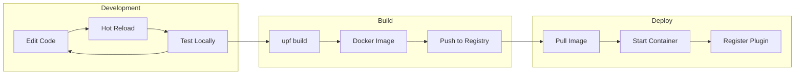

# Getting Started with UPF

This guide will help you set up your development environment and create your first UPF plugin in under 30 minutes.

## Prerequisites

Before you begin, ensure you have the following installed:

| Tool                                               | Version | Purpose                |
| -------------------------------------------------- | ------- | ---------------------- |
| [Bun](https://bun.sh)                              | ≥1.0    | JavaScript runtime     |
| [Docker](https://docker.com)                       | ≥24.0   | Container runtime      |
| [Docker Compose](https://docs.docker.com/compose/) | ≥2.20   | Local orchestration    |
| [Node.js](https://nodejs.org)                      | ≥20.0   | For React Native tools |
| [Git](https://git-scm.com)                         | ≥2.40   | Version control        |

### Verify Installation

```bash
# Check Bun
bun --version
# Expected: 1.x.x

# Check Docker
docker --version
# Expected: Docker version 24.x.x

# Check Docker Compose
docker compose version
# Expected: Docker Compose version v2.x.x

# Check Node.js
node --version
# Expected: v20.x.x
```

## Quick Start

### Step 1: Install UPF CLI

The UPF CLI helps you create, develop, and deploy plugins.

```bash
# Install globally
bun install -g @unified-plugin-framework/cli

# Verify installation
upf --version
```

### Step 2: Create a New Plugin

```bash
# Create a new plugin project
upf create my-first-plugin

# Navigate to the project
cd my-first-plugin
```

The CLI will prompt you for:

- **Plugin type**: Backend only, Frontend only, or Full-stack
- **Plugin category**: Business, Infrastructure, or Core
- **Interfaces**: Which infrastructure interfaces you need (IStorage, ICache, etc.)

### Step 3: Explore the Project Structure

```
my-first-plugin/
├── manifest.yaml           # Plugin configuration
├── package.json            # Dependencies
├── tsconfig.json           # TypeScript config
├── Dockerfile              # Container build
├── container.yaml          # Deployment config
├── src/
│   ├── backend/
│   │   ├── index.ts        # Backend entry point
│   │   ├── services/       # gRPC service implementations
│   │   └── handlers/       # Business logic
│   └── frontend/
│       ├── index.ts        # Frontend entry point
│       ├── screens/        # UI screens
│       └── components/     # Reusable components
├── proto/
│   └── service.proto       # gRPC service definition
└── tests/
    ├── backend/
    └── frontend/
```

### Step 4: Define Your Service

Edit `proto/service.proto`:

```protobuf
syntax = "proto3";

package myfirstplugin;

service MyFirstService {
  // Get a greeting
  rpc GetGreeting(GreetingRequest) returns (GreetingResponse);

  // Stream messages
  rpc StreamMessages(StreamRequest) returns (stream Message);
}

message GreetingRequest {
  string name = 1;
}

message GreetingResponse {
  string message = 1;
  string timestamp = 2;
}

message StreamRequest {
  int32 count = 1;
}

message Message {
  int32 sequence = 1;
  string content = 2;
}
```

### Step 5: Implement the Backend

Edit `src/backend/services/greeting.ts`:

```typescript
import { MyFirstServiceServer, GreetingRequest, GreetingResponse, StreamRequest, Message } from '../generated/service';

export class GreetingService implements MyFirstServiceServer {
  async getGreeting(request: GreetingRequest): Promise<GreetingResponse> {
    return {
      message: `Hello, ${request.name}! Welcome to UPF.`,
      timestamp: new Date().toISOString(),
    };
  }

  async *streamMessages(request: StreamRequest): AsyncIterable<Message> {
    for (let i = 1; i <= request.count; i++) {
      yield {
        sequence: i,
        content: `Message ${i} of ${request.count}`,
      };
      // Simulate some processing time
      await new Promise((resolve) => setTimeout(resolve, 500));
    }
  }
}
```

### Step 6: Create a Simple UI

Edit `src/frontend/screens/HomeScreen.tsx`:

```typescript
import React, { useState } from 'react';
import { View, Text, TextInput, Button, FlatList } from 'react-native';
import { useGrpcClient } from '@unified-plugin-framework/ui-sdk';
import { MyFirstServiceClient } from '../generated/service';

export function HomeScreen() {
  const [name, setName] = useState('');
  const [greeting, setGreeting] = useState('');
  const [messages, setMessages] = useState<string[]>([]);

  const client = useGrpcClient(MyFirstServiceClient);

  const handleGreet = async () => {
    const response = await client.getGreeting({ name });
    setGreeting(response.message);
  };

  const handleStream = async () => {
    setMessages([]);
    const stream = client.streamMessages({ count: 5 });

    for await (const message of stream) {
      setMessages((prev) => [...prev, message.content]);
    }
  };

  return (
    <View style={{ padding: 20 }}>
      <Text style={{ fontSize: 24, marginBottom: 20 }}>
        My First Plugin
      </Text>

      <TextInput
        placeholder="Enter your name"
        value={name}
        onChangeText={setName}
        style={{ borderWidth: 1, padding: 10, marginBottom: 10 }}
      />

      <Button title="Get Greeting" onPress={handleGreet} />

      {greeting && (
        <Text style={{ marginTop: 10, fontSize: 16 }}>
          {greeting}
        </Text>
      )}

      <Button
        title="Stream Messages"
        onPress={handleStream}
        style={{ marginTop: 20 }}
      />

      <FlatList
        data={messages}
        keyExtractor={(_, index) => index.toString()}
        renderItem={({ item }) => <Text>{item}</Text>}
        style={{ marginTop: 10 }}
      />
    </View>
  );
}
```

### Step 7: Configure the Plugin Manifest

Edit `manifest.yaml`:

```yaml
plugin:
  id: my-first-plugin
  name: My First Plugin
  version: 1.0.0
  description: A simple greeting plugin to learn UPF
  author: Your Name
  license: MIT
  category: business

runtime:
  engine: bun
  version: '>=1.0.0'

backend:
  entry: src/backend/index.ts
  grpc:
    port: 50051
    services:
      - name: MyFirstService
        proto: proto/service.proto

frontend:
  entry: src/frontend/index.ts
  exposes:
    - name: HomeScreen
      path: ./screens/HomeScreen

ui:
  navigation:
    routes:
      - path: /greeting
        component: HomeScreen
        title: Greeting
        icon: hand-wave
    menu:
      - id: greeting
        title: Greeting
        icon: hand-wave
        route: /greeting

requires:
  interfaces: [] # No infrastructure dependencies for this simple example

health:
  endpoint: /health
  interval: 30s
```

### Step 8: Run Locally

```bash
# Start the development environment
upf dev

# This will:
# 1. Generate TypeScript from proto files
# 2. Start the backend with hot reload
# 3. Start the UI development server
# 4. Launch a local plugin registry
```

Open your browser to `http://localhost:3000` to see your plugin in action.

### Step 9: Run Tests

```bash
# Run all tests
upf test

# Run backend tests only
upf test --backend

# Run frontend tests only
upf test --frontend

# Run with coverage
upf test --coverage
```

### Step 10: Build for Production

```bash
# Build the Docker image
upf build

# This creates:
# - Docker image: my-first-plugin:1.0.0
# - Generates docker-compose.yml
# - Generates Kubernetes manifests (if configured)
```

## Development Workflow



## Project Commands

| Command        | Description                               |
| -------------- | ----------------------------------------- |
| `upf dev`      | Start development server with hot reload  |
| `upf build`    | Build Docker image and deployment configs |
| `upf test`     | Run tests                                 |
| `upf lint`     | Lint code                                 |
| `upf generate` | Generate code from proto files            |
| `upf publish`  | Publish to npm and Docker registry        |

## Using Infrastructure Interfaces

To use infrastructure plugins (Storage, Cache, etc.), update your manifest:

```yaml
requires:
  interfaces:
    - interface: IStorage
      version: ^1.0.0
    - interface: ICache
      version: ^1.0.0
```

Then inject them in your backend:

```typescript
import { IStorage, ICache } from '@unified-plugin-framework/interfaces';
import { inject } from '@unified-plugin-framework/backend-sdk';

export class MyService {
  constructor(
    @inject('IStorage') private storage: IStorage,
    @inject('ICache') private cache: ICache,
  ) {}

  async getData(key: string): Promise<Data> {
    // Try cache first
    const cached = await this.cache.get(`data:${key}`);
    if (cached) {
      return JSON.parse(cached);
    }

    // Fetch from storage
    const result = await this.storage.query('SELECT * FROM data WHERE key = ?', [key]);
    const data = result.rows[0];

    // Cache for 5 minutes
    await this.cache.set(`data:${key}`, JSON.stringify(data), { ttl: 300 });

    return data;
  }
}
```

## Sharing State with Other Plugins

Register shared state in your frontend:

```typescript
import { useStateBridge } from '@unified-plugin-framework/ui-sdk';

// Register state slice
const greetingState = useStateBridge().register({
  namespace: 'greeting',
  initialState: {
    lastGreeting: null,
    greetingCount: 0,
  },
});

// Update state (other plugins can subscribe)
greetingState.update({
  lastGreeting: response.message,
  greetingCount: greetingState.get().greetingCount + 1,
});
```

Other plugins can subscribe:

```typescript
import { useSharedState } from '@unified-plugin-framework/ui-sdk';

function OtherPluginComponent() {
  const { lastGreeting, greetingCount } = useSharedState('greeting');

  return (
    <Text>
      Total greetings: {greetingCount}
    </Text>
  );
}
```

## Next Steps

Now that you've created your first plugin, explore:

1. **[Plugin Development Guide](./plugin-development.md)** - Deep dive into plugin development
2. **[Architecture Overview](../architecture/overview.md)** - Understand the system design
3. **[Interface Specifications](../specifications/interfaces.md)** - Available infrastructure interfaces
4. **[Deployment Guide](./deployment-guide.md)** - Deploy to production

## Troubleshooting

### Common Issues

**Issue: `upf dev` fails to start**

```bash
# Check if ports are in use
lsof -i :50051
lsof -i :3000

# Kill conflicting processes or use different ports
upf dev --grpc-port 50052 --ui-port 3001
```

**Issue: Proto generation fails**

```bash
# Ensure protoc is installed
brew install protobuf  # macOS
apt install protobuf-compiler  # Ubuntu

# Regenerate
upf generate --force
```

**Issue: Docker build fails**

```bash
# Check Docker is running
docker ps

# Clean build cache
docker builder prune

# Rebuild
upf build --no-cache
```

**Issue: Plugin not discovered**

```bash
# Check plugin registry logs
docker logs upf-registry

# Verify manifest is valid
upf validate manifest.yaml

# Check health endpoint
curl http://localhost:50051/health
```

## Getting Help

- **Documentation**: [https://upf.dev/docs](https://upf.dev/docs)
- **GitHub Issues**: [https://github.com/upf/upf/issues](https://github.com/upf/upf/issues)
- **Discord**: [https://discord.gg/upf](https://discord.gg/upf)
- **Stack Overflow**: Tag your questions with `upf-plugin`

---

**Next**: [Plugin Development Guide](./plugin-development.md)
