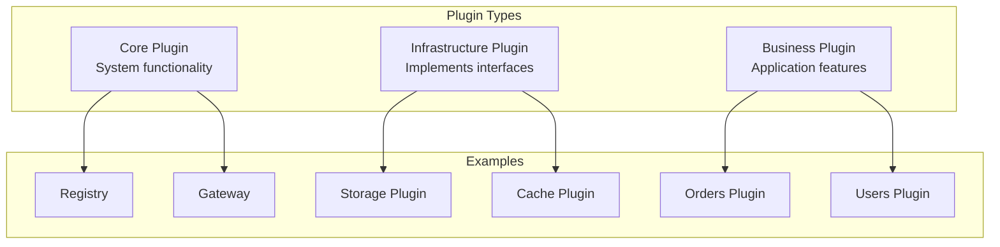

# Plugin Development Guide

This comprehensive guide covers all aspects of developing UPF plugins, from project setup to advanced patterns.

## Table of Contents

1. [Plugin Architecture](#plugin-architecture)
2. [Backend Development](#backend-development)
3. [Frontend Development](#frontend-development)
4. [Interface Implementation](#interface-implementation)
5. [Testing](#testing)
6. [Error Handling](#error-handling)
7. [Performance Optimization](#performance-optimization)
8. [Security Best Practices](#security-best-practices)

## Plugin Architecture

### Plugin Types



| Type           | Purpose                       | Examples                        |
| -------------- | ----------------------------- | ------------------------------- |
| Core           | Essential system services     | Registry, Gateway, Auth         |
| Infrastructure | Implement standard interfaces | PostgreSQL Storage, Redis Cache |
| Business       | Application-specific features | Orders, Inventory, Users        |

### Plugin Composition

A full-stack plugin consists of:

```
my-plugin/
├── manifest.yaml         # Plugin metadata and configuration
├── container.yaml        # Container orchestration config
├── Dockerfile           # Build instructions
├── package.json         # Dependencies
├── tsconfig.json        # TypeScript configuration
├── proto/               # gRPC service definitions
│   ├── service.proto    # Main service
│   └── types.proto      # Shared types
├── src/
│   ├── backend/         # Server-side code
│   │   ├── index.ts     # Entry point
│   │   ├── services/    # gRPC implementations
│   │   ├── handlers/    # Business logic
│   │   ├── models/      # Data models
│   │   └── utils/       # Utilities
│   └── frontend/        # Client-side code
│       ├── index.ts     # Entry point & federation
│       ├── screens/     # Screen components
│       ├── components/  # UI components
│       ├── hooks/       # Custom hooks
│       ├── stores/      # State management
│       └── utils/       # Utilities
└── tests/
    ├── backend/         # Backend tests
    ├── frontend/        # Frontend tests
    └── integration/     # E2E tests
```

## Backend Development

### Entry Point

`src/backend/index.ts`:

```typescript
import { PluginServer, createServer } from '@unified-plugin-framework/backend-sdk';
import { manifest } from '../manifest';
import { OrderService } from './services/order';
import { InventoryService } from './services/inventory';

async function main(): Promise<void> {
  const server = await createServer({
    manifest,
    services: [
      { service: OrderService, name: 'OrderService' },
      { service: InventoryService, name: 'InventoryService' },
    ],
  });

  // Register lifecycle hooks
  server.onStarting(async () => {
    console.log('Plugin starting...');
    // Initialize resources
  });

  server.onStarted(async () => {
    console.log('Plugin started');
    // Post-start tasks
  });

  server.onStopping(async () => {
    console.log('Plugin stopping...');
    // Cleanup
  });

  await server.start();
}

main().catch((error) => {
  console.error('Fatal error:', error);
  process.exit(1);
});
```

### gRPC Service Implementation

`src/backend/services/order.ts`:

```typescript
import { injectable, inject } from '@unified-plugin-framework/backend-sdk';
import { IStorage, ICache, IMessageBus } from '@unified-plugin-framework/interfaces';
import {
  OrderServiceServer,
  CreateOrderRequest,
  CreateOrderResponse,
  GetOrderRequest,
  GetOrderResponse,
  ListOrdersRequest,
  ListOrdersResponse,
  Order,
  OrderStatus,
} from '../generated/order';
import { GrpcError, Status } from '@unified-plugin-framework/grpc';

@injectable()
export class OrderService implements OrderServiceServer {
  constructor(
    @inject('IStorage') private storage: IStorage,
    @inject('ICache') private cache: ICache,
    @inject('IMessageBus') private messageBus: IMessageBus,
  ) {}

  async createOrder(request: CreateOrderRequest): Promise<CreateOrderResponse> {
    // Validate request
    if (!request.items || request.items.length === 0) {
      throw new GrpcError(Status.INVALID_ARGUMENT, 'Order must have at least one item');
    }

    // Calculate total
    const total = request.items.reduce((sum, item) => sum + item.price * item.quantity, 0);

    // Create order in storage
    const result = await this.storage.execute(
      `INSERT INTO orders (customer_id, items, total, status, created_at)
       VALUES (?, ?, ?, ?, ?)
       RETURNING id`,
      [request.customerId, JSON.stringify(request.items), total, OrderStatus.PENDING, new Date()],
    );

    const orderId = result.rows[0].id;

    // Publish event
    await this.messageBus.publish('orders', 'order.created', {
      orderId,
      customerId: request.customerId,
      total,
    });

    return {
      order: {
        id: orderId,
        customerId: request.customerId,
        items: request.items,
        total,
        status: OrderStatus.PENDING,
        createdAt: new Date().toISOString(),
      },
    };
  }

  async getOrder(request: GetOrderRequest): Promise<GetOrderResponse> {
    // Try cache first
    const cacheKey = `order:${request.orderId}`;
    const cached = await this.cache.get(cacheKey);

    if (cached) {
      return { order: JSON.parse(cached) };
    }

    // Fetch from storage
    const result = await this.storage.query('SELECT * FROM orders WHERE id = ?', [request.orderId]);

    if (result.rows.length === 0) {
      throw new GrpcError(Status.NOT_FOUND, `Order ${request.orderId} not found`);
    }

    const order = this.mapRowToOrder(result.rows[0]);

    // Cache for 5 minutes
    await this.cache.set(cacheKey, JSON.stringify(order), { ttl: 300 });

    return { order };
  }

  async listOrders(request: ListOrdersRequest): Promise<ListOrdersResponse> {
    const { customerId, status, pageSize = 20, pageToken } = request;

    let query = 'SELECT * FROM orders WHERE 1=1';
    const params: unknown[] = [];

    if (customerId) {
      query += ' AND customer_id = ?';
      params.push(customerId);
    }

    if (status) {
      query += ' AND status = ?';
      params.push(status);
    }

    if (pageToken) {
      query += ' AND id > ?';
      params.push(pageToken);
    }

    query += ' ORDER BY id LIMIT ?';
    params.push(pageSize + 1);

    const result = await this.storage.query(query, params);

    const hasMore = result.rows.length > pageSize;
    const orders = result.rows.slice(0, pageSize).map(this.mapRowToOrder);
    const nextPageToken = hasMore ? orders[orders.length - 1].id : undefined;

    return {
      orders,
      nextPageToken,
    };
  }

  private mapRowToOrder(row: Record<string, unknown>): Order {
    return {
      id: row.id as string,
      customerId: row.customer_id as string,
      items: JSON.parse(row.items as string),
      total: row.total as number,
      status: row.status as OrderStatus,
      createdAt: (row.created_at as Date).toISOString(),
      updatedAt: row.updated_at ? (row.updated_at as Date).toISOString() : undefined,
    };
  }
}
```

### Streaming Service

```typescript
import { injectable, inject } from '@unified-plugin-framework/backend-sdk';
import { IMessageBus } from '@unified-plugin-framework/interfaces';
import { NotificationServiceServer, SubscribeRequest, Notification } from '../generated/notification';

@injectable()
export class NotificationService implements NotificationServiceServer {
  constructor(@inject('IMessageBus') private messageBus: IMessageBus) {}

  async *subscribe(request: SubscribeRequest): AsyncIterable<Notification> {
    const { userId, topics } = request;

    // Create subscription to message bus
    const subscription = await this.messageBus.subscribe(
      topics.map((t) => `notifications.${t}`),
      { group: `user-${userId}` },
    );

    try {
      // Yield notifications as they arrive
      for await (const message of subscription) {
        if (message.data.userId === userId || message.data.broadcast) {
          yield {
            id: message.id,
            type: message.subject.split('.')[1],
            title: message.data.title,
            body: message.data.body,
            data: message.data.payload,
            timestamp: message.timestamp,
          };
        }
      }
    } finally {
      // Cleanup subscription when client disconnects
      await subscription.unsubscribe();
    }
  }
}
```

### Dependency Injection

```typescript
import { Container, injectable, inject, createContainer } from '@unified-plugin-framework/backend-sdk';
import { IStorage, ICache, IMessageBus } from '@unified-plugin-framework/interfaces';

// Define custom services
@injectable()
class OrderRepository {
  constructor(@inject('IStorage') private storage: IStorage) {}

  async findById(id: string): Promise<Order | null> {
    const result = await this.storage.query('SELECT * FROM orders WHERE id = ?', [id]);
    return result.rows[0] || null;
  }
}

@injectable()
class OrderValidator {
  validate(order: CreateOrderRequest): ValidationResult {
    const errors: string[] = [];

    if (!order.customerId) {
      errors.push('Customer ID is required');
    }

    if (!order.items?.length) {
      errors.push('At least one item is required');
    }

    return { valid: errors.length === 0, errors };
  }
}

@injectable()
class OrderService {
  constructor(
    private repository: OrderRepository,
    private validator: OrderValidator,
    @inject('IMessageBus') private messageBus: IMessageBus,
  ) {}
}

// Configure container
const container = createContainer();
container.bind(OrderRepository).toSelf();
container.bind(OrderValidator).toSelf();
container.bind(OrderService).toSelf();
```

## Frontend Development

### Module Federation Setup

`src/frontend/index.ts`:

```typescript
import { registerPlugin } from '@unified-plugin-framework/ui-sdk';
import { HomeScreen } from './screens/HomeScreen';
import { OrderListScreen } from './screens/OrderListScreen';
import { OrderDetailScreen } from './screens/OrderDetailScreen';
import { OrderCard } from './components/OrderCard';

// Register plugin with the shell
registerPlugin({
  id: 'orders-plugin',
  name: 'Orders',

  // Exposed screens (for navigation)
  screens: {
    HomeScreen,
    OrderListScreen,
    OrderDetailScreen,
  },

  // Exposed components (for use by other plugins)
  components: {
    OrderCard,
  },

  // State slice
  state: {
    namespace: 'orders',
    initialState: {
      selectedOrderId: null,
      filters: { status: 'all' },
      cartItems: [],
    },
  },

  // Event handlers
  events: {
    'user.authenticated': (event) => {
      console.log('User logged in:', event.payload.userId);
    },
    'cart.checkout': (event) => {
      console.log('Checkout requested');
    },
  },
});
```

### Screen Components

`src/frontend/screens/OrderListScreen.tsx`:

```typescript
import React, { useState, useCallback } from 'react';
import { View, FlatList, RefreshControl, StyleSheet } from 'react-native';
import { useQuery, useInfiniteQuery } from '@tanstack/react-query';
import { useGrpcClient, useTheme, useNavigator } from '@unified-plugin-framework/ui-sdk';
import { OrderServiceClient } from '../generated/order';
import { OrderCard } from '../components/OrderCard';
import { FilterBar } from '../components/FilterBar';
import { EmptyState } from '../components/EmptyState';
import { ErrorState } from '../components/ErrorState';
import { LoadingState } from '../components/LoadingState';

export function OrderListScreen() {
  const theme = useTheme();
  const navigator = useNavigator();
  const client = useGrpcClient(OrderServiceClient);

  const [filters, setFilters] = useState({ status: 'all' });

  const {
    data,
    isLoading,
    isError,
    error,
    refetch,
    fetchNextPage,
    hasNextPage,
    isFetchingNextPage,
  } = useInfiniteQuery({
    queryKey: ['orders', filters],
    queryFn: async ({ pageParam }) => {
      const response = await client.listOrders({
        status: filters.status === 'all' ? undefined : filters.status,
        pageSize: 20,
        pageToken: pageParam,
      });
      return response;
    },
    getNextPageParam: (lastPage) => lastPage.nextPageToken,
  });

  const orders = data?.pages.flatMap((page) => page.orders) ?? [];

  const handleOrderPress = useCallback(
    (orderId: string) => {
      navigator.navigate(`/orders/${orderId}`);
    },
    [navigator],
  );

  const handleEndReached = useCallback(() => {
    if (hasNextPage && !isFetchingNextPage) {
      fetchNextPage();
    }
  }, [hasNextPage, isFetchingNextPage, fetchNextPage]);

  if (isLoading) {
    return <LoadingState message="Loading orders..." />;
  }

  if (isError) {
    return <ErrorState error={error} onRetry={refetch} />;
  }

  return (
    <View style={[styles.container, { backgroundColor: theme.colors.background }]}>
      <FilterBar filters={filters} onFilterChange={setFilters} />

      {orders.length === 0 ? (
        <EmptyState
          icon="package"
          title="No Orders"
          message="You don't have any orders yet"
          actionLabel="Browse Products"
          onAction={() => navigator.navigateToPlugin('catalog', '/products')}
        />
      ) : (
        <FlatList
          data={orders}
          keyExtractor={(item) => item.id}
          renderItem={({ item }) => <OrderCard order={item} onPress={() => handleOrderPress(item.id)} />}
          refreshControl={<RefreshControl refreshing={isLoading} onRefresh={refetch} />}
          onEndReached={handleEndReached}
          onEndReachedThreshold={0.5}
          contentContainerStyle={styles.list}
        />
      )}
    </View>
  );
}

const styles = StyleSheet.create({
  container: {
    flex: 1,
  },
  list: {
    padding: 16,
  },
});
```

### Reusable Components

`src/frontend/components/OrderCard.tsx`:

```typescript
import React from 'react';
import { View, Text, TouchableOpacity, StyleSheet } from 'react-native';
import { useTheme, formatCurrency, formatDate } from '@unified-plugin-framework/ui-sdk';
import { Order, OrderStatus } from '../generated/order';
import { StatusBadge } from './StatusBadge';

interface OrderCardProps {
  order: Order;
  onPress?: () => void;
  compact?: boolean;
}

export function OrderCard({ order, onPress, compact = false }: OrderCardProps) {
  const { theme } = useTheme();

  const statusColors: Record<OrderStatus, string> = {
    [OrderStatus.PENDING]: theme.colors.warning,
    [OrderStatus.PROCESSING]: theme.colors.info,
    [OrderStatus.SHIPPED]: theme.colors.primary,
    [OrderStatus.DELIVERED]: theme.colors.success,
    [OrderStatus.CANCELLED]: theme.colors.error,
  };

  return (
    <TouchableOpacity
      style={[
        styles.card,
        {
          backgroundColor: theme.colors.surface,
          borderRadius: theme.borderRadius.md,
        },
      ]}
      onPress={onPress}
      disabled={!onPress}
    >
      <View style={styles.header}>
        <Text style={[styles.orderId, { color: theme.colors.text.primary }]}>#{order.id.slice(-8)}</Text>
        <StatusBadge status={order.status} color={statusColors[order.status]} />
      </View>

      {!compact && (
        <View style={styles.items}>
          <Text style={[styles.itemCount, { color: theme.colors.text.secondary }]}>
            {order.items.length} item{order.items.length !== 1 ? 's' : ''}
          </Text>
        </View>
      )}

      <View style={styles.footer}>
        <Text style={[styles.date, { color: theme.colors.text.secondary }]}>{formatDate(order.createdAt)}</Text>
        <Text style={[styles.total, { color: theme.colors.text.primary }]}>{formatCurrency(order.total)}</Text>
      </View>
    </TouchableOpacity>
  );
}

const styles = StyleSheet.create({
  card: {
    padding: 16,
    marginBottom: 12,
    elevation: 2,
    shadowColor: '#000',
    shadowOffset: { width: 0, height: 1 },
    shadowOpacity: 0.1,
    shadowRadius: 2,
  },
  header: {
    flexDirection: 'row',
    justifyContent: 'space-between',
    alignItems: 'center',
  },
  orderId: {
    fontSize: 16,
    fontWeight: '600',
  },
  items: {
    marginTop: 8,
  },
  itemCount: {
    fontSize: 14,
  },
  footer: {
    flexDirection: 'row',
    justifyContent: 'space-between',
    alignItems: 'center',
    marginTop: 12,
    paddingTop: 12,
    borderTopWidth: 1,
    borderTopColor: 'rgba(0,0,0,0.05)',
  },
  date: {
    fontSize: 12,
  },
  total: {
    fontSize: 18,
    fontWeight: '700',
  },
});
```

### Custom Hooks

`src/frontend/hooks/useOrders.ts`:

```typescript
import { useQuery, useMutation, useQueryClient } from '@tanstack/react-query';
import { useGrpcClient, useEventBus } from '@unified-plugin-framework/ui-sdk';
import { OrderServiceClient } from '../generated/order';

export function useOrder(orderId: string) {
  const client = useGrpcClient(OrderServiceClient);

  return useQuery({
    queryKey: ['order', orderId],
    queryFn: async () => {
      const response = await client.getOrder({ orderId });
      return response.order;
    },
    enabled: !!orderId,
  });
}

export function useCreateOrder() {
  const client = useGrpcClient(OrderServiceClient);
  const queryClient = useQueryClient();
  const eventBus = useEventBus();

  return useMutation({
    mutationFn: async (data: CreateOrderData) => {
      const response = await client.createOrder(data);
      return response.order;
    },
    onSuccess: (order) => {
      // Invalidate order list cache
      queryClient.invalidateQueries({ queryKey: ['orders'] });

      // Emit event for other plugins
      eventBus.emit('order.created', {
        orderId: order.id,
        total: order.total,
      });
    },
  });
}

export function useCancelOrder() {
  const client = useGrpcClient(OrderServiceClient);
  const queryClient = useQueryClient();

  return useMutation({
    mutationFn: async (orderId: string) => {
      await client.cancelOrder({ orderId });
      return orderId;
    },
    onSuccess: (orderId) => {
      queryClient.invalidateQueries({ queryKey: ['order', orderId] });
      queryClient.invalidateQueries({ queryKey: ['orders'] });
    },
  });
}
```

### State Management

`src/frontend/stores/orderStore.ts`:

```typescript
import { useStateBridge, useSharedState } from '@unified-plugin-framework/ui-sdk';

// Define state shape
interface OrderState {
  selectedOrderId: string | null;
  filters: {
    status: string;
    dateRange: { start: string; end: string } | null;
  };
  cartItems: CartItem[];
  cartTotal: number;
}

interface CartItem {
  productId: string;
  name: string;
  price: number;
  quantity: number;
}

// Initialize state slice
const stateBridge = useStateBridge();

export const orderState = stateBridge.register<OrderState>({
  namespace: 'orders',
  initialState: {
    selectedOrderId: null,
    filters: {
      status: 'all',
      dateRange: null,
    },
    cartItems: [],
    cartTotal: 0,
  },
  persist: {
    enabled: true,
    storage: 'local',
    key: 'orders-state',
  },
});

// Actions
export const orderActions = {
  selectOrder: (orderId: string | null) => {
    orderState.update({ selectedOrderId: orderId });
  },

  setFilters: (filters: Partial<OrderState['filters']>) => {
    orderState.update({
      filters: { ...orderState.get().filters, ...filters },
    });
  },

  addToCart: (item: Omit<CartItem, 'quantity'>) => {
    const { cartItems } = orderState.get();
    const existing = cartItems.find((i) => i.productId === item.productId);

    if (existing) {
      const updated = cartItems.map((i) => (i.productId === item.productId ? { ...i, quantity: i.quantity + 1 } : i));
      orderState.update({
        cartItems: updated,
        cartTotal: calculateTotal(updated),
      });
    } else {
      const updated = [...cartItems, { ...item, quantity: 1 }];
      orderState.update({
        cartItems: updated,
        cartTotal: calculateTotal(updated),
      });
    }
  },

  removeFromCart: (productId: string) => {
    const { cartItems } = orderState.get();
    const updated = cartItems.filter((i) => i.productId !== productId);
    orderState.update({
      cartItems: updated,
      cartTotal: calculateTotal(updated),
    });
  },

  clearCart: () => {
    orderState.update({
      cartItems: [],
      cartTotal: 0,
    });
  },
};

function calculateTotal(items: CartItem[]): number {
  return items.reduce((sum, item) => sum + item.price * item.quantity, 0);
}

// Hooks for components
export function useOrderState() {
  return useSharedState<OrderState>('orders');
}

export function useCartItems() {
  const { cartItems, cartTotal } = useSharedState<OrderState>('orders');
  return { items: cartItems, total: cartTotal };
}
```

## Interface Implementation

### Implementing IStorage

`src/backend/storage/postgres.ts`:

```typescript
import { injectable } from '@unified-plugin-framework/backend-sdk';
import { IStorage, QueryResult, TransactionContext, MigrationInfo } from '@unified-plugin-framework/interfaces';
import { Pool, PoolClient } from 'pg';

@injectable()
export class PostgresStorage implements IStorage {
  private pool: Pool;

  constructor() {
    this.pool = new Pool({
      host: process.env.POSTGRES_HOST,
      port: parseInt(process.env.POSTGRES_PORT || '5432'),
      database: process.env.POSTGRES_DB,
      user: process.env.POSTGRES_USER,
      password: process.env.POSTGRES_PASSWORD,
      max: 20,
      idleTimeoutMillis: 30000,
    });
  }

  async query(sql: string, params?: unknown[]): Promise<QueryResult> {
    const result = await this.pool.query(sql, params);
    return {
      rows: result.rows,
      rowCount: result.rowCount ?? 0,
    };
  }

  async execute(sql: string, params?: unknown[]): Promise<QueryResult> {
    return this.query(sql, params);
  }

  async transaction<T>(fn: (ctx: TransactionContext) => Promise<T>): Promise<T> {
    const client = await this.pool.connect();

    try {
      await client.query('BEGIN');

      const ctx: TransactionContext = {
        query: (sql, params) => client.query(sql, params).then((r) => ({ rows: r.rows, rowCount: r.rowCount ?? 0 })),
        execute: (sql, params) => client.query(sql, params).then((r) => ({ rows: r.rows, rowCount: r.rowCount ?? 0 })),
      };

      const result = await fn(ctx);

      await client.query('COMMIT');
      return result;
    } catch (error) {
      await client.query('ROLLBACK');
      throw error;
    } finally {
      client.release();
    }
  }

  async migrate(migrations: MigrationInfo[]): Promise<void> {
    // Ensure migrations table exists
    await this.execute(`
      CREATE TABLE IF NOT EXISTS _migrations (
        id SERIAL PRIMARY KEY,
        name VARCHAR(255) NOT NULL UNIQUE,
        applied_at TIMESTAMP DEFAULT CURRENT_TIMESTAMP
      )
    `);

    // Get applied migrations
    const result = await this.query('SELECT name FROM _migrations');
    const applied = new Set(result.rows.map((r) => r.name));

    // Apply new migrations
    for (const migration of migrations) {
      if (!applied.has(migration.name)) {
        await this.transaction(async (ctx) => {
          await ctx.execute(migration.up);
          await ctx.execute('INSERT INTO _migrations (name) VALUES (?)', [migration.name]);
        });
        console.log(`Applied migration: ${migration.name}`);
      }
    }
  }

  async close(): Promise<void> {
    await this.pool.end();
  }
}
```

## Testing

### Backend Unit Tests

`tests/backend/services/order.test.ts`:

```typescript
import { describe, it, expect, beforeEach, mock } from 'bun:test';
import { OrderService } from '../../../src/backend/services/order';
import { OrderStatus } from '../../../src/backend/generated/order';

describe('OrderService', () => {
  let service: OrderService;
  let mockStorage: MockStorage;
  let mockCache: MockCache;
  let mockMessageBus: MockMessageBus;

  beforeEach(() => {
    mockStorage = createMockStorage();
    mockCache = createMockCache();
    mockMessageBus = createMockMessageBus();

    service = new OrderService(mockStorage, mockCache, mockMessageBus);
  });

  describe('createOrder', () => {
    it('should create order with valid data', async () => {
      mockStorage.execute.mockResolvedValue({
        rows: [{ id: 'order-123' }],
        rowCount: 1,
      });

      const result = await service.createOrder({
        customerId: 'customer-1',
        items: [{ productId: 'prod-1', name: 'Widget', price: 10, quantity: 2 }],
      });

      expect(result.order.id).toBe('order-123');
      expect(result.order.total).toBe(20);
      expect(result.order.status).toBe(OrderStatus.PENDING);
      expect(mockMessageBus.publish).toHaveBeenCalledWith('orders', 'order.created', expect.any(Object));
    });

    it('should reject order with no items', async () => {
      await expect(
        service.createOrder({
          customerId: 'customer-1',
          items: [],
        }),
      ).rejects.toThrow('Order must have at least one item');
    });
  });

  describe('getOrder', () => {
    it('should return cached order', async () => {
      const cachedOrder = {
        id: 'order-123',
        status: OrderStatus.DELIVERED,
      };
      mockCache.get.mockResolvedValue(JSON.stringify(cachedOrder));

      const result = await service.getOrder({ orderId: 'order-123' });

      expect(result.order).toEqual(cachedOrder);
      expect(mockStorage.query).not.toHaveBeenCalled();
    });

    it('should fetch from storage on cache miss', async () => {
      mockCache.get.mockResolvedValue(null);
      mockStorage.query.mockResolvedValue({
        rows: [
          {
            id: 'order-123',
            customer_id: 'cust-1',
            items: '[]',
            total: 100,
            status: OrderStatus.PENDING,
            created_at: new Date(),
          },
        ],
        rowCount: 1,
      });

      const result = await service.getOrder({ orderId: 'order-123' });

      expect(result.order.id).toBe('order-123');
      expect(mockCache.set).toHaveBeenCalled();
    });

    it('should throw NOT_FOUND for missing order', async () => {
      mockCache.get.mockResolvedValue(null);
      mockStorage.query.mockResolvedValue({ rows: [], rowCount: 0 });

      await expect(service.getOrder({ orderId: 'nonexistent' })).rejects.toThrow('not found');
    });
  });
});
```

### Frontend Component Tests

`tests/frontend/components/OrderCard.test.tsx`:

```typescript
import React from 'react';
import { render, fireEvent } from '@testing-library/react-native';
import { ThemeProvider } from '@unified-plugin-framework/ui-sdk';
import { OrderCard } from '../../../src/frontend/components/OrderCard';
import { OrderStatus } from '../../../src/frontend/generated/order';

const mockTheme = {
  colors: {
    surface: '#ffffff',
    text: { primary: '#000000', secondary: '#666666' },
    warning: '#ff9800',
    info: '#2196f3',
    primary: '#1976d2',
    success: '#4caf50',
    error: '#f44336',
  },
  borderRadius: { md: 8 },
};

const mockOrder = {
  id: 'order-12345678',
  customerId: 'customer-1',
  items: [
    { productId: 'prod-1', name: 'Widget', price: 10, quantity: 2 },
    { productId: 'prod-2', name: 'Gadget', price: 25, quantity: 1 },
  ],
  total: 45,
  status: OrderStatus.PENDING,
  createdAt: '2025-01-15T10:00:00Z',
};

describe('OrderCard', () => {
  it('renders order details correctly', () => {
    const { getByText } = render(
      <ThemeProvider theme={mockTheme}>
        <OrderCard order={mockOrder} />
      </ThemeProvider>,
    );

    expect(getByText('#12345678')).toBeTruthy();
    expect(getByText('2 items')).toBeTruthy();
    expect(getByText('$45.00')).toBeTruthy();
  });

  it('calls onPress when tapped', () => {
    const onPress = jest.fn();
    const { getByTestId } = render(
      <ThemeProvider theme={mockTheme}>
        <OrderCard order={mockOrder} onPress={onPress} />
      </ThemeProvider>,
    );

    fireEvent.press(getByTestId('order-card'));
    expect(onPress).toHaveBeenCalled();
  });

  it('renders compact view without item count', () => {
    const { queryByText } = render(
      <ThemeProvider theme={mockTheme}>
        <OrderCard order={mockOrder} compact />
      </ThemeProvider>,
    );

    expect(queryByText('2 items')).toBeNull();
  });
});
```

### Integration Tests

`tests/integration/order-flow.test.ts`:

```typescript
import { describe, it, expect, beforeAll, afterAll } from 'bun:test';
import { TestContainer, createTestClient } from '@unified-plugin-framework/testing';
import { OrderServiceClient } from '../../src/backend/generated/order';

describe('Order Flow Integration', () => {
  let container: TestContainer;
  let client: OrderServiceClient;

  beforeAll(async () => {
    container = await TestContainer.start({
      plugins: ['orders-plugin', 'storage-postgres', 'cache-redis'],
      config: {
        POSTGRES_DB: 'test_orders',
      },
    });

    client = createTestClient(OrderServiceClient, container.getAddress('orders-plugin'));
  });

  afterAll(async () => {
    await container.stop();
  });

  it('should complete full order lifecycle', async () => {
    // Create order
    const createResponse = await client.createOrder({
      customerId: 'test-customer',
      items: [{ productId: 'prod-1', name: 'Test Product', price: 100, quantity: 1 }],
    });

    expect(createResponse.order.status).toBe('PENDING');
    const orderId = createResponse.order.id;

    // Get order
    const getResponse = await client.getOrder({ orderId });
    expect(getResponse.order.id).toBe(orderId);

    // Update status
    await client.updateOrderStatus({ orderId, status: 'PROCESSING' });

    // Verify update
    const updatedResponse = await client.getOrder({ orderId });
    expect(updatedResponse.order.status).toBe('PROCESSING');

    // List orders
    const listResponse = await client.listOrders({ customerId: 'test-customer' });
    expect(listResponse.orders.length).toBeGreaterThan(0);
  });
});
```

## Error Handling

### Backend Error Handling

```typescript
import { GrpcError, Status } from '@unified-plugin-framework/grpc';
import { Logger } from '@unified-plugin-framework/backend-sdk';

// Custom error types
class OrderNotFoundError extends Error {
  constructor(orderId: string) {
    super(`Order ${orderId} not found`);
    this.name = 'OrderNotFoundError';
  }
}

class InsufficientInventoryError extends Error {
  constructor(
    public productId: string,
    public requested: number,
    public available: number,
  ) {
    super(`Insufficient inventory for ${productId}: requested ${requested}, available ${available}`);
    this.name = 'InsufficientInventoryError';
  }
}

// Error handler middleware
function handleError(error: Error, logger: Logger): never {
  logger.error('Service error', { error: error.message, stack: error.stack });

  if (error instanceof OrderNotFoundError) {
    throw new GrpcError(Status.NOT_FOUND, error.message);
  }

  if (error instanceof InsufficientInventoryError) {
    throw new GrpcError(Status.FAILED_PRECONDITION, error.message, {
      productId: error.productId,
      requested: error.requested,
      available: error.available,
    });
  }

  if (error instanceof GrpcError) {
    throw error;
  }

  // Unknown errors become INTERNAL
  throw new GrpcError(Status.INTERNAL, 'An unexpected error occurred');
}

// Usage in service
@injectable()
export class OrderService {
  constructor(private logger: Logger) {}

  async getOrder(request: GetOrderRequest): Promise<GetOrderResponse> {
    try {
      const order = await this.findOrder(request.orderId);
      if (!order) {
        throw new OrderNotFoundError(request.orderId);
      }
      return { order };
    } catch (error) {
      handleError(error as Error, this.logger);
    }
  }
}
```

### Frontend Error Handling

```typescript
import { useErrorBoundary, ErrorFallback } from '@unified-plugin-framework/ui-sdk';

// Error boundary wrapper
function OrdersModule() {
  return (
    <ErrorBoundary FallbackComponent={OrderErrorFallback}>
      <OrderListScreen />
    </ErrorBoundary>
  );
}

function OrderErrorFallback({ error, resetErrorBoundary }: ErrorFallbackProps) {
  return (
    <View style={styles.container}>
      <Text style={styles.title}>Something went wrong</Text>
      <Text style={styles.message}>{error.message}</Text>
      <Button title="Try Again" onPress={resetErrorBoundary} />
    </View>
  );
}

// Hook for handling async errors
function useAsyncError() {
  const [error, setError] = useState<Error | null>(null);

  const handleError = useCallback((error: Error) => {
    console.error('Async error:', error);
    setError(error);

    // Report to monitoring
    reportError(error);
  }, []);

  const clearError = useCallback(() => {
    setError(null);
  }, []);

  return { error, handleError, clearError };
}
```

## Performance Optimization

### Backend Optimization

```typescript
// Connection pooling
const pool = new Pool({
  max: 20,
  min: 5,
  idleTimeoutMillis: 30000,
  connectionTimeoutMillis: 2000,
});

// Query batching
async function batchGetOrders(orderIds: string[]): Promise<Order[]> {
  const result = await storage.query('SELECT * FROM orders WHERE id = ANY(?)', [orderIds]);
  return result.rows.map(mapRowToOrder);
}

// Caching strategy
class CachedOrderService {
  private readonly CACHE_TTL = 300; // 5 minutes

  async getOrder(orderId: string): Promise<Order> {
    const cacheKey = `order:${orderId}`;

    // Try cache
    const cached = await this.cache.get(cacheKey);
    if (cached) return JSON.parse(cached);

    // Fetch and cache
    const order = await this.fetchOrder(orderId);
    await this.cache.set(cacheKey, JSON.stringify(order), { ttl: this.CACHE_TTL });

    return order;
  }

  async invalidateOrder(orderId: string): Promise<void> {
    await this.cache.delete(`order:${orderId}`);
  }
}

// Streaming for large datasets
async *listAllOrders(customerId: string): AsyncIterable<Order> {
  let pageToken: string | undefined;

  do {
    const response = await this.listOrders({ customerId, pageSize: 100, pageToken });
    for (const order of response.orders) {
      yield order;
    }
    pageToken = response.nextPageToken;
  } while (pageToken);
}
```

### Frontend Optimization

```typescript
// Virtualized lists
import { FlashList } from '@shopify/flash-list';

function OptimizedOrderList({ orders }: { orders: Order[] }) {
  return (
    <FlashList
      data={orders}
      renderItem={({ item }) => <OrderCard order={item} />}
      estimatedItemSize={100}
      keyExtractor={(item) => item.id}
    />
  );
}

// Memoization
const MemoizedOrderCard = React.memo(OrderCard, (prev, next) => prev.order.id === next.order.id && prev.order.status === next.order.status);

// Code splitting
const OrderDetailScreen = React.lazy(() => import('./screens/OrderDetailScreen'));

// Image optimization
import { Image } from 'expo-image';

function ProductImage({ uri }: { uri: string }) {
  return <Image source={{ uri }} style={styles.image} contentFit="cover" transition={200} cachePolicy="memory-disk" />;
}
```

## Security Best Practices

### Input Validation

```typescript
import { z } from 'zod';

// Define schemas
const CreateOrderSchema = z.object({
  customerId: z.string().uuid(),
  items: z
    .array(
      z.object({
        productId: z.string().uuid(),
        quantity: z.number().int().positive().max(100),
      }),
    )
    .min(1)
    .max(50),
  notes: z.string().max(500).optional(),
});

// Validate in service
async createOrder(request: unknown): Promise<CreateOrderResponse> {
  const validated = CreateOrderSchema.parse(request);
  // Process validated data
}
```

### Authentication & Authorization

```typescript
import { requireAuth, requirePermission, getCurrentUser } from '@unified-plugin-framework/backend-sdk';

@injectable()
export class OrderService {
  @requireAuth()
  async getOrder(request: GetOrderRequest): Promise<GetOrderResponse> {
    const user = getCurrentUser();
    const order = await this.findOrder(request.orderId);

    // Check ownership
    if (order.customerId !== user.id && !user.hasRole('admin')) {
      throw new GrpcError(Status.PERMISSION_DENIED, 'Access denied');
    }

    return { order };
  }

  @requirePermission('orders:create')
  async createOrder(request: CreateOrderRequest): Promise<CreateOrderResponse> {
    // Only users with orders:create permission can create orders
  }
}
```

### Data Sanitization

```typescript
import { sanitize } from '@unified-plugin-framework/security';

function sanitizeOrderInput(input: CreateOrderRequest): CreateOrderRequest {
  return {
    ...input,
    notes: input.notes ? sanitize(input.notes) : undefined,
    shippingAddress: {
      ...input.shippingAddress,
      street: sanitize(input.shippingAddress.street),
      city: sanitize(input.shippingAddress.city),
    },
  };
}
```

### Secrets Management

```typescript
// Use environment variables for secrets
const config = {
  dbPassword: process.env.DB_PASSWORD,
  apiKey: process.env.API_KEY,
  jwtSecret: process.env.JWT_SECRET,
};

// Never log secrets
logger.info('Connecting to database', {
  host: config.dbHost,
  port: config.dbPort,
  // password: config.dbPassword  // NEVER DO THIS
});
```

## Best Practices Summary

### Code Organization

1. **Single Responsibility** - Each service/component does one thing well
2. **Dependency Injection** - Use DI for testability and flexibility
3. **Interface Segregation** - Define focused interfaces
4. **Error Boundaries** - Contain failures, provide recovery

### Performance

1. **Cache Wisely** - Cache frequently accessed, rarely changed data
2. **Batch Operations** - Reduce network round trips
3. **Stream Large Data** - Don't load everything into memory
4. **Lazy Load** - Load code and data on demand

### Security

1. **Validate All Input** - Never trust user input
2. **Use Parameterized Queries** - Prevent SQL injection
3. **Implement Rate Limiting** - Protect against abuse
4. **Log Security Events** - Audit access and changes

### Testing

1. **Unit Test Business Logic** - Fast, isolated tests
2. **Integration Test APIs** - Verify contracts
3. **E2E Test Critical Paths** - Ensure system works together
4. **Load Test Performance** - Verify scalability

---

**Related Documentation:**

- [Getting Started](./getting-started.md)
- [Deployment Guide](./deployment-guide.md)
- [Interface Specifications](../specifications/interfaces.md)
- [Architecture Overview](../architecture/overview.md)
