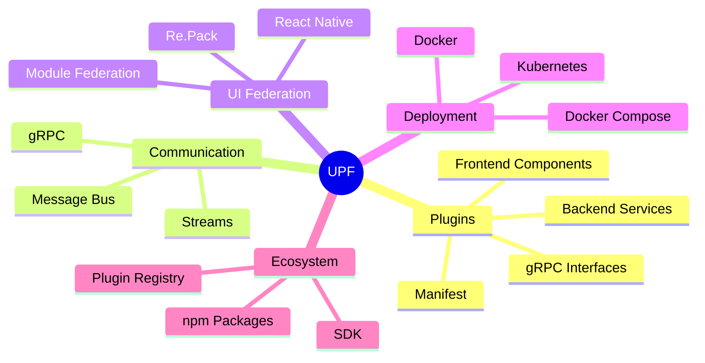

# Unified Plugin Framework (UPF) Documentation

Welcome to the Unified Plugin Framework documentation. UPF is an open plugin ecosystem enabling developers to build, share, and compose applications from reusable plugin building blocks.

## Quick Links

- [Getting Started](/guides/getting-started.md) - Start building your first plugin
- [Architecture Overview](/architecture/overview.md) - Understand the system design
- [Plugin Development Guide](/guides/plugin-development.md) - Deep dive into plugin creation

## Documentation Structure

### Architecture

Comprehensive documentation of the UPF system design and patterns.

| Document                                        | Description                                         |
| ----------------------------------------------- | --------------------------------------------------- |
| [Overview](/architecture/overview.md)           | High-level architecture and system components       |
| [Plugin System](/architecture/plugin-system.md) | Plugin lifecycle, manifest, and registry            |
| [Communication](/architecture/communication.md) | Inter-plugin communication via gRPC and message bus |
| [UI Federation](/architecture/ui-federation.md) | React Native Module Federation with Re.Pack         |
| [Deployment](/architecture/deployment.md)       | Orchestration-agnostic deployment patterns          |

### Specifications

Technical specifications and contract definitions.

| Document                                              | Description                                        |
| ----------------------------------------------------- | -------------------------------------------------- |
| [Plugin Manifest](/specifications/plugin-manifest.md) | Complete plugin manifest schema                    |
| [Interfaces](/specifications/interfaces.md)           | Core interface definitions (IAuth, IStorage, etc.) |
| [gRPC Contracts](/specifications/grpc-contracts.md)   | Protobuf service definitions                       |
| [UI Contracts](/specifications/ui-contracts.md)       | Frontend state and event contracts                 |

### Guides

Step-by-step guides for developers and operators.

| Document                                            | Description                            |
| --------------------------------------------------- | -------------------------------------- |
| [Getting Started](/guides/getting-started.md)       | Quick start for new developers         |
| [Plugin Development](/guides/plugin-development.md) | Comprehensive plugin development guide |
| [Deployment Guide](/guides/deployment-guide.md)     | Production deployment instructions     |

### Architectural Decision Records (ADRs)

Documentation of key architectural decisions and their rationale.

| ADR                                                      | Title                               | Status   |
| -------------------------------------------------------- | ----------------------------------- | -------- |
| [ADR-001](/decisions/adr-001-bun-typescript.md)          | Bun + TypeScript Runtime            | Accepted |
| [ADR-002](/decisions/adr-002-grpc-communication.md)      | gRPC for Inter-Plugin Communication | Accepted |
| [ADR-003](/decisions/adr-003-react-native-repack.md)     | React Native with Re.Pack           | Accepted |
| [ADR-004](/decisions/adr-004-interface-first-design.md)  | Interface-First Plugin Contracts    | Accepted |
| [ADR-005](/decisions/adr-005-message-bus-abstraction.md) | Message Bus Abstraction             | Accepted |

## Core Concepts

## Key Principles

1. **Interface-First Design** - All plugins communicate through versioned interfaces, not implementations
2. **Plugin Autonomy** - Each plugin is independently deployable and scalable
3. **Orchestration Agnostic** - Works with Docker Compose, Kubernetes, Swarm, or any container orchestrator
4. **Open Ecosystem** - Designed for thousands of developers to contribute plugins
5. **Cross-Platform UI** - Single React Native codebase for Web, iOS, and Android

## Technology Stack

| Layer                       | Technology                               |
| --------------------------- | ---------------------------------------- |
| Runtime                     | Bun                                      |
| Language                    | TypeScript                               |
| Frontend                    | React Native + Expo                      |
| Module Federation           | Re.Pack                                  |
| Inter-service Communication | gRPC + Protobuf                          |
| Message Bus                 | NATS (default), RabbitMQ, Redis          |
| Containerization            | Docker                                   |
| Package Management          | npm (@unified-plugin-framework/\* scope) |

## Getting Help

- **Issues**: Report bugs and request features via [GitHub Issues](https://github.com/Unified-Plugin-Framework/docs/issues)
- **Discussions**: Join [community discussions](https://github.com/orgs/Unified-Plugin-Framework/discussions) for questions and ideas
- **Contributing**: See our [Contributing Guide](/guides/contributing) for contribution guidelines

---

**Version**: 1.0.0-draft
**Last Updated**: 2025
