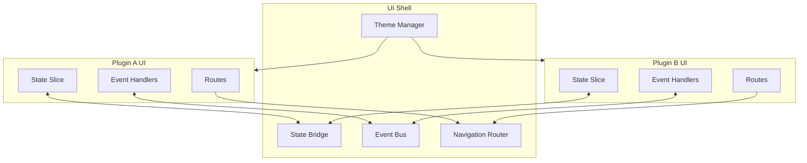
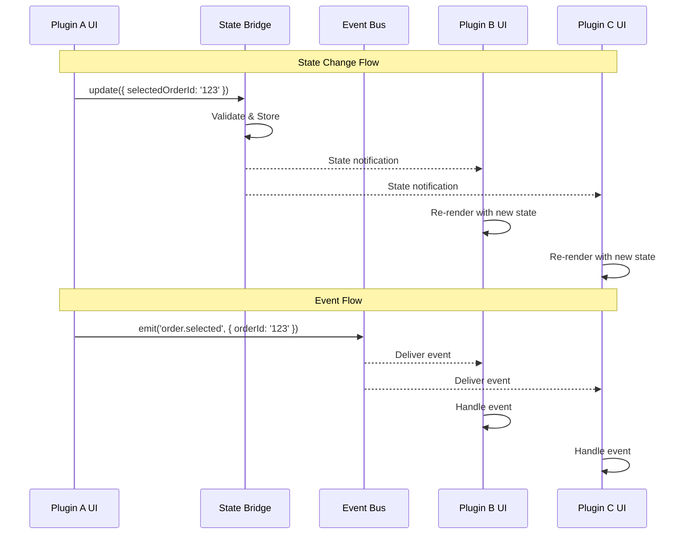

# UI Contracts Specification

This document defines the frontend state and event contracts for cross-plugin UI communication in the Unified Plugin Framework.

## Overview

UI contracts enable:

- **State Sharing** - Cross-plugin reactive state management
- **Event Communication** - Plugin-to-plugin event broadcasting
- **Navigation** - Deep linking and cross-plugin navigation
- **Theme/Branding** - Consistent styling across plugins



## State Bridge Contract

### State Slice Definition

Each plugin declares its shared state in the manifest:

```yaml
# manifest.yaml
ui:
  sharedState:
    namespace: 'orders'
    schema:
      type: object
      properties:
        selectedOrderId:
          type: string
          nullable: true
        orderFilters:
          type: object
          properties:
            status:
              type: string
              enum: [pending, processing, completed, cancelled]
            dateRange:
              type: object
              properties:
                start: { type: string, format: date }
                end: { type: string, format: date }
        cartItems:
          type: array
          items:
            type: object
            properties:
              productId: { type: string }
              quantity: { type: integer }
              price: { type: number }
```

### TypeScript Interfaces

```typescript
// @unified-plugin-framework/ui-sdk/state

/**
 * State slice configuration
 */
interface StateSliceConfig<T> {
  /** Unique namespace for this state slice */
  namespace: string;
  /** Initial state value */
  initialState: T;
  /** JSON Schema for validation */
  schema?: JSONSchema7;
  /** Persistence configuration */
  persist?: {
    enabled: boolean;
    storage: 'memory' | 'session' | 'local' | 'secure';
    key?: string;
  };
  /** Access control */
  access?: {
    read: 'public' | 'authenticated' | string[];
    write: 'owner' | 'authenticated' | string[];
  };
}

/**
 * State slice instance
 */
interface StateSlice<T> {
  /** Get current state value */
  get(): T;
  /** Set entire state */
  set(value: T): void;
  /** Update partial state */
  update(partial: Partial<T>): void;
  /** Subscribe to state changes */
  subscribe(listener: (state: T, prev: T) => void): Unsubscribe;
  /** Reset to initial state */
  reset(): void;
}

/**
 * State selector for derived state
 */
interface StateSelector<T, R> {
  (state: T): R;
}

/**
 * State Bridge API
 */
interface StateBridge {
  /** Register a new state slice */
  register<T>(config: StateSliceConfig<T>): StateSlice<T>;

  /** Get existing state slice by namespace */
  getSlice<T>(namespace: string): StateSlice<T> | undefined;

  /** Select derived state across multiple slices */
  select<R>(namespaces: string[], selector: (...states: unknown[]) => R): R;

  /** Subscribe to derived state */
  subscribeToSelector<R>(
    namespaces: string[],
    selector: (...states: unknown[]) => R,
    listener: (result: R) => void,
  ): Unsubscribe;
}

type Unsubscribe = () => void;
```

### Usage Examples

```typescript
// Plugin A: Register state slice
import { useStateBridge } from '@unified-plugin-framework/ui-sdk';

const ordersSlice = useStateBridge().register({
  namespace: 'orders',
  initialState: {
    selectedOrderId: null,
    orderFilters: { status: 'pending' },
    cartItems: [],
  },
  persist: {
    enabled: true,
    storage: 'session',
  },
});

// Plugin A: Update state
ordersSlice.update({ selectedOrderId: 'order-123' });

// Plugin B: Read and subscribe to Plugin A's state
import { useSharedState } from '@unified-plugin-framework/ui-sdk';

function OrderDetails() {
  const { selectedOrderId } = useSharedState('orders');

  if (!selectedOrderId) {
    return <Text>No order selected</Text>;
  }

  return <OrderView orderId={selectedOrderId} />;
}
```

### React Hooks

```typescript
// @unified-plugin-framework/ui-sdk/hooks

/**
 * Hook to access shared state from any namespace
 */
function useSharedState<T>(namespace: string): T;

/**
 * Hook to access and update own plugin's state
 */
function usePluginState<T>(): [T, (partial: Partial<T>) => void];

/**
 * Hook for derived state from multiple namespaces
 */
function useDerivedState<R>(namespaces: string[], selector: (...states: unknown[]) => R, deps?: unknown[]): R;

/**
 * Hook for state actions (update, reset)
 */
function useStateActions(namespace: string): {
  update: (partial: unknown) => void;
  reset: () => void;
};
```

## Event Bus Contract

### Event Definition

Events are defined in the plugin manifest:

```yaml
# manifest.yaml
ui:
  events:
    emits:
      - name: 'order.selected'
        schema:
          type: object
          properties:
            orderId: { type: string }
            source: { type: string }
          required: [orderId]
      - name: 'cart.updated'
        schema:
          type: object
          properties:
            items: { type: array }
            total: { type: number }

    listens:
      - name: 'user.authenticated'
        handler: 'onUserAuthenticated'
      - name: 'product.added'
        handler: 'onProductAdded'
```

### TypeScript Interfaces

```typescript
// @unified-plugin-framework/ui-sdk/events

/**
 * Event definition
 */
interface EventDefinition<T = unknown> {
  /** Event name (dot-notation namespace) */
  name: string;
  /** Event payload */
  payload: T;
  /** Source plugin ID */
  source: string;
  /** Timestamp */
  timestamp: number;
  /** Correlation ID for tracking */
  correlationId?: string;
}

/**
 * Event handler function
 */
type EventHandler<T = unknown> = (event: EventDefinition<T>) => void | Promise<void>;

/**
 * Event subscription options
 */
interface SubscribeOptions {
  /** Only receive events from specific plugins */
  fromPlugins?: string[];
  /** Filter events by payload predicate */
  filter?: (payload: unknown) => boolean;
  /** Process events in order (default: parallel) */
  sequential?: boolean;
}

/**
 * Event Bus API
 */
interface EventBus {
  /** Emit an event to all listeners */
  emit<T>(name: string, payload: T, options?: EmitOptions): void;

  /** Subscribe to events */
  on<T>(name: string, handler: EventHandler<T>, options?: SubscribeOptions): Unsubscribe;

  /** Subscribe to events once */
  once<T>(name: string, handler: EventHandler<T>): Unsubscribe;

  /** Unsubscribe from all events for this plugin */
  offAll(): void;

  /** Wait for an event (Promise-based) */
  waitFor<T>(
    name: string,
    options?: { timeout?: number; filter?: (payload: T) => boolean },
  ): Promise<EventDefinition<T>>;
}

interface EmitOptions {
  /** Correlation ID for tracking event chains */
  correlationId?: string;
  /** Delay emission (ms) */
  delay?: number;
}
```

### Standard Events

```typescript
// @unified-plugin-framework/ui-sdk/events/standard

/**
 * Standard system events that all plugins can listen to
 */
namespace StandardEvents {
  /** User authentication state changed */
  interface UserAuthenticated {
    userId: string;
    roles: string[];
    permissions: string[];
  }

  interface UserLoggedOut {
    userId: string;
    reason: 'manual' | 'timeout' | 'revoked';
  }

  /** Navigation events */
  interface NavigationRequested {
    target: string;
    params?: Record<string, string>;
    source: string;
  }

  interface NavigationCompleted {
    route: string;
    params: Record<string, string>;
    previousRoute: string;
  }

  /** Plugin lifecycle */
  interface PluginLoaded {
    pluginId: string;
    version: string;
  }

  interface PluginUnloaded {
    pluginId: string;
    reason: 'manual' | 'error' | 'update';
  }

  /** Theme changes */
  interface ThemeChanged {
    theme: 'light' | 'dark' | 'system';
    colors: ThemeColors;
  }

  /** Notifications */
  interface NotificationRequested {
    type: 'info' | 'success' | 'warning' | 'error';
    title: string;
    message?: string;
    duration?: number;
    action?: {
      label: string;
      event: string;
      payload?: unknown;
    };
  }

  /** Modal/Dialog */
  interface ModalRequested {
    id: string;
    component: string;
    props?: Record<string, unknown>;
    options?: {
      dismissible?: boolean;
      size?: 'small' | 'medium' | 'large' | 'fullscreen';
    };
  }

  interface ModalClosed {
    id: string;
    result?: unknown;
  }
}

// Event name constants
const EVENTS = {
  USER_AUTHENTICATED: 'system.user.authenticated',
  USER_LOGGED_OUT: 'system.user.loggedOut',
  NAVIGATION_REQUESTED: 'system.navigation.requested',
  NAVIGATION_COMPLETED: 'system.navigation.completed',
  PLUGIN_LOADED: 'system.plugin.loaded',
  PLUGIN_UNLOADED: 'system.plugin.unloaded',
  THEME_CHANGED: 'system.theme.changed',
  NOTIFICATION_REQUESTED: 'system.notification.requested',
  MODAL_REQUESTED: 'system.modal.requested',
  MODAL_CLOSED: 'system.modal.closed',
} as const;
```

### Usage Examples

```typescript
// Plugin A: Emit events
import { useEventBus, EVENTS } from '@unified-plugin-framework/ui-sdk';

function OrderList() {
  const eventBus = useEventBus();

  const handleOrderSelect = (orderId: string) => {
    eventBus.emit('order.selected', { orderId, source: 'list' });
  };

  const showNotification = () => {
    eventBus.emit(EVENTS.NOTIFICATION_REQUESTED, {
      type: 'success',
      title: 'Order Created',
      message: 'Your order has been placed successfully',
    });
  };

  return <OrderListView onSelect={handleOrderSelect} />;
}

// Plugin B: Listen to events
import { useEventListener } from '@unified-plugin-framework/ui-sdk';

function OrderTracking() {
  useEventListener('order.selected', (event) => {
    console.log(`Order ${event.payload.orderId} selected from ${event.source}`);
    // Navigate to tracking view
  });

  return <TrackingView />;
}
```

### React Hooks

```typescript
// @unified-plugin-framework/ui-sdk/hooks

/**
 * Hook to access event bus
 */
function useEventBus(): EventBus;

/**
 * Hook to subscribe to events (auto-unsubscribes on unmount)
 */
function useEventListener<T>(eventName: string, handler: EventHandler<T>, options?: SubscribeOptions): void;

/**
 * Hook to emit events
 */
function useEventEmitter(): <T>(name: string, payload: T) => void;

/**
 * Hook to wait for an event
 */
function useWaitForEvent<T>(eventName: string, options?: { timeout?: number }): T | null;
```

## Navigation Contract

### Route Definition

```yaml
# manifest.yaml
ui:
  navigation:
    routes:
      - path: '/orders'
        component: 'OrderListScreen'
        title: 'Orders'
        icon: 'list'
      - path: '/orders/:orderId'
        component: 'OrderDetailScreen'
        title: 'Order Details'
      - path: '/orders/:orderId/tracking'
        component: 'OrderTrackingScreen'
        title: 'Track Order'

    menu:
      - id: 'orders'
        title: 'Orders'
        icon: 'shopping-cart'
        route: '/orders'
        badge:
          source: 'orders.cartItems.length'
        children:
          - id: 'orders-pending'
            title: 'Pending'
            route: '/orders?status=pending'
```

### TypeScript Interfaces

```typescript
// @unified-plugin-framework/ui-sdk/navigation

/**
 * Route definition
 */
interface RouteDefinition {
  /** Route path (supports params like :id) */
  path: string;
  /** Component name to render */
  component: string;
  /** Route title for header/tab */
  title: string | ((params: RouteParams) => string);
  /** Icon name */
  icon?: string;
  /** Required permissions */
  permissions?: string[];
  /** Route metadata */
  meta?: Record<string, unknown>;
  /** Nested routes */
  children?: RouteDefinition[];
}

/**
 * Navigation params
 */
type RouteParams = Record<string, string>;
type QueryParams = Record<string, string | string[]>;

/**
 * Navigation state
 */
interface NavigationState {
  currentRoute: string;
  params: RouteParams;
  query: QueryParams;
  history: string[];
}

/**
 * Navigation API
 */
interface Navigator {
  /** Navigate to a route */
  navigate(path: string, options?: NavigateOptions): void;

  /** Navigate to a plugin's route */
  navigateToPlugin(pluginId: string, path: string, options?: NavigateOptions): void;

  /** Go back */
  goBack(): void;

  /** Replace current route */
  replace(path: string, options?: NavigateOptions): void;

  /** Get current navigation state */
  getState(): NavigationState;

  /** Check if can go back */
  canGoBack(): boolean;

  /** Reset navigation stack */
  reset(path: string): void;
}

interface NavigateOptions {
  params?: RouteParams;
  query?: QueryParams;
  /** Animation type */
  animation?: 'push' | 'modal' | 'fade' | 'none';
  /** Replace instead of push */
  replace?: boolean;
}
```

### Deep Linking

```typescript
// @unified-plugin-framework/ui-sdk/navigation/deeplink

/**
 * Deep link configuration
 */
interface DeepLinkConfig {
  /** URL scheme (e.g., 'myapp://') */
  scheme: string;
  /** Path prefix (e.g., '/app') */
  prefix?: string;
  /** Route mappings */
  routes: Record<string, string>;
}

/**
 * Deep link handler
 */
interface DeepLinkHandler {
  /** Parse a deep link URL */
  parse(url: string): { route: string; params: RouteParams } | null;

  /** Generate a deep link URL */
  generate(route: string, params?: RouteParams): string;

  /** Handle incoming deep link */
  handle(url: string): boolean;
}
```

### Usage Examples

```typescript
// Plugin: Define navigation
import { useNavigator, useRoute } from '@unified-plugin-framework/ui-sdk';

function OrderActions({ orderId }: { orderId: string }) {
  const navigator = useNavigator();

  const viewTracking = () => {
    navigator.navigate(`/orders/${orderId}/tracking`);
  };

  const openInvoice = () => {
    navigator.navigateToPlugin('invoicing', `/invoices`, {
      query: { orderId },
    });
  };

  return (
    <View>
      <Button onPress={viewTracking}>Track Order</Button>
      <Button onPress={openInvoice}>View Invoice</Button>
    </View>
  );
}

// Plugin: Access route params
function OrderDetail() {
  const { params, query } = useRoute();
  const { orderId } = params;

  return <OrderView orderId={orderId} />;
}
```

## Theme Contract

### Theme Definition

```yaml
# manifest.yaml
ui:
  theme:
    extends: 'default'
    overrides:
      colors:
        primary: '#1976D2'
        secondary: '#424242'
      spacing:
        unit: 8
      typography:
        fontFamily: 'Inter'
```

### TypeScript Interfaces

```typescript
// @unified-plugin-framework/ui-sdk/theme

/**
 * Theme colors
 */
interface ThemeColors {
  primary: string;
  primaryLight: string;
  primaryDark: string;
  secondary: string;
  secondaryLight: string;
  secondaryDark: string;
  background: string;
  surface: string;
  error: string;
  warning: string;
  success: string;
  info: string;
  text: {
    primary: string;
    secondary: string;
    disabled: string;
    inverse: string;
  };
  border: string;
  divider: string;
}

/**
 * Theme spacing
 */
interface ThemeSpacing {
  unit: number;
  xs: number;
  sm: number;
  md: number;
  lg: number;
  xl: number;
}

/**
 * Theme typography
 */
interface ThemeTypography {
  fontFamily: string;
  fontFamilyMono: string;
  sizes: {
    xs: number;
    sm: number;
    md: number;
    lg: number;
    xl: number;
    xxl: number;
  };
  weights: {
    regular: string;
    medium: string;
    semibold: string;
    bold: string;
  };
  lineHeights: {
    tight: number;
    normal: number;
    relaxed: number;
  };
}

/**
 * Complete theme
 */
interface Theme {
  name: string;
  mode: 'light' | 'dark';
  colors: ThemeColors;
  spacing: ThemeSpacing;
  typography: ThemeTypography;
  borderRadius: {
    sm: number;
    md: number;
    lg: number;
    full: number;
  };
  shadows: {
    sm: string;
    md: string;
    lg: string;
  };
}

/**
 * Theme context API
 */
interface ThemeContext {
  theme: Theme;
  mode: 'light' | 'dark' | 'system';
  setMode: (mode: 'light' | 'dark' | 'system') => void;
  toggleMode: () => void;
}
```

### Usage Examples

```typescript
// Plugin: Use theme
import { useTheme, styled } from '@unified-plugin-framework/ui-sdk';

function OrderCard({ order }: { order: Order }) {
  const { theme } = useTheme();

  return (
    <Card style={{ backgroundColor: theme.colors.surface }}>
      <Text style={{ color: theme.colors.text.primary }}>
        {order.title}
      </Text>
      <Badge color={theme.colors.primary}>
        {order.status}
      </Badge>
    </Card>
  );
}

// Plugin: Styled components
const StyledCard = styled.View`
  background-color: ${({ theme }) => theme.colors.surface};
  padding: ${({ theme }) => theme.spacing.md}px;
  border-radius: ${({ theme }) => theme.borderRadius.md}px;
`;

const Title = styled.Text`
  font-size: ${({ theme }) => theme.typography.sizes.lg}px;
  font-weight: ${({ theme }) => theme.typography.weights.semibold};
  color: ${({ theme }) => theme.colors.text.primary};
`;
```

## Component Communication Diagram



## Contract Validation

### Runtime Validation

```typescript
// @unified-plugin-framework/ui-sdk/validation

/**
 * Validate state against schema
 */
function validateState<T>(state: T, schema: JSONSchema7): ValidationResult;

/**
 * Validate event payload against schema
 */
function validateEventPayload<T>(payload: T, schema: JSONSchema7): ValidationResult;

interface ValidationResult {
  valid: boolean;
  errors?: ValidationError[];
}

interface ValidationError {
  path: string;
  message: string;
  keyword: string;
}
```

### Development Mode Warnings

In development mode, the SDK validates:

- State updates against declared schemas
- Event payloads against declared schemas
- Cross-plugin state access permissions
- Event handler registration for declared events

## Best Practices

### State Management

1. **Minimal Shared State** - Only share state that multiple plugins need
2. **Immutable Updates** - Always create new objects when updating state
3. **Schema Validation** - Define JSON schemas for type safety
4. **Namespace Isolation** - Use unique namespaces to avoid conflicts

### Event Handling

1. **Namespaced Events** - Use dot-notation (e.g., `orders.created`)
2. **Payload Contracts** - Define clear payload schemas
3. **Idempotent Handlers** - Handle duplicate events gracefully
4. **Error Boundaries** - Don't let one handler crash others

### Navigation

1. **Deep Linking Support** - Design routes for external linking
2. **Permission Checks** - Validate access before navigation
3. **State Preservation** - Consider navigation state persistence
4. **Graceful Fallbacks** - Handle missing routes gracefully

---

**Related Documentation:**

- [UI Federation Architecture](../architecture/ui-federation.md)
- [Plugin Manifest Specification](./plugin-manifest.md)
- [Plugin Development Guide](../guides/plugin-development.md)
