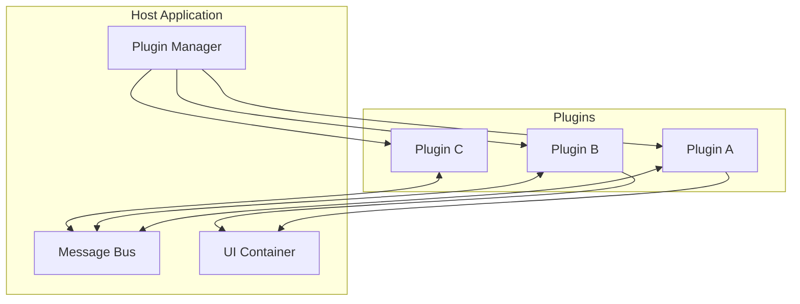

# Unified Plugin Framework

Welcome to the **Unified Plugin Framework (UPF)** documentation.

UPF is a modern, composable framework for building extensible applications through a plugin-based architecture. It enables developers to create modular, maintainable, and scalable software systems.

## Key Features

- **Plugin-Based Architecture** - Build applications as composable plugins that can be independently developed, tested, and deployed
- **gRPC Communication** - High-performance, type-safe communication between components using Protocol Buffers
- **UI Federation** - Share and compose UI components across plugins with React Native and Re.Pack
- **Interface-First Design** - Define contracts first, implement later for better decoupling
- **TypeScript & Bun** - Modern runtime with excellent developer experience

## Quick Links

- [Getting Started](/guides/getting-started) - Set up your first UPF application
- [Architecture Overview](/architecture/overview) - Understand the system design
- [Plugin Development](/guides/plugin-development) - Learn to create plugins
- [API Specifications](/specifications/interfaces) - Explore the interfaces

## Architecture at a Glance

## Getting Help

- Browse the [Architecture Decisions](/decisions/adr-001-bun-typescript) to understand our design choices
- Check the [Specifications](/specifications/plugin-manifest) for detailed technical contracts
- Visit our [GitHub Discussions](https://github.com/orgs/Unified-Plugin-Framework/discussions) for community support
