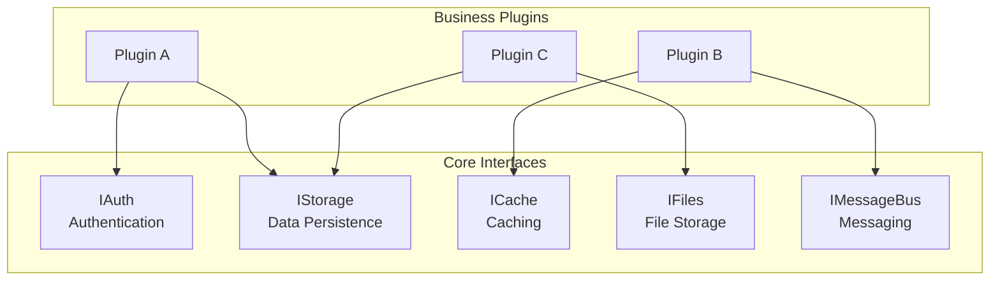
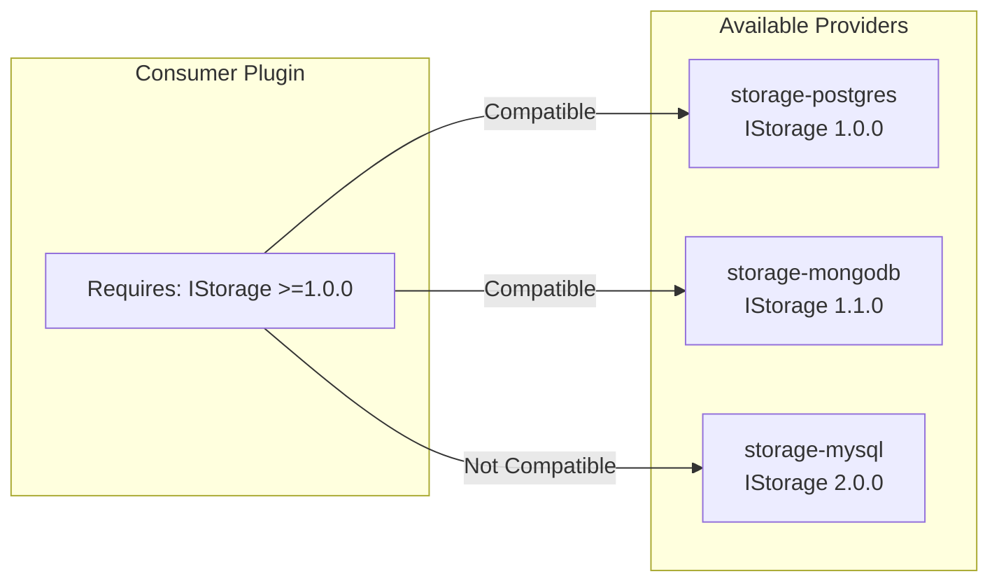

# Core Interfaces Specification

This document defines the core interfaces that form the foundation of the UPF plugin ecosystem. Infrastructure plugins implement these interfaces to provide essential services.

## Interface Overview



## IAuth Interface

Authentication and authorization interface.

### Version

`1.0.0`

### TypeScript Definition

```typescript
interface IAuth {
  // Token validation
  validateToken(token: string): Promise<TokenValidation>;

  // User information
  getUserInfo(userId: string): Promise<UserInfo>;

  // Token refresh
  refreshToken(refreshToken: string): Promise<TokenResponse>;

  // Session management
  logout(token: string): Promise<void>;

  // Permissions
  getPermissions(userId: string): Promise<Permission[]>;
  checkPermission(userId: string, permission: string): Promise<boolean>;
}

interface TokenValidation {
  valid: boolean;
  userId: string;
  email: string;
  roles: string[];
  permissions: string[];
  expiresAt: number;
}

interface UserInfo {
  id: string;
  email: string;
  displayName: string;
  avatarUrl?: string;
  roles: string[];
  metadata: Record<string, string>;
}

interface TokenResponse {
  accessToken: string;
  refreshToken: string;
  expiresIn: number;
  tokenType: string;
}

interface Permission {
  resource: string;
  action: string;
  conditions?: Record<string, unknown>;
}
```

### gRPC Methods

| Method            | Type  | Description               |
| ----------------- | ----- | ------------------------- |
| `ValidateToken`   | Unary | Validate JWT token        |
| `GetUserInfo`     | Unary | Get user details          |
| `RefreshToken`    | Unary | Refresh access token      |
| `Logout`          | Unary | Invalidate session        |
| `GetPermissions`  | Unary | List user permissions     |
| `CheckPermission` | Unary | Check specific permission |

---

## IStorage Interface

Persistent data storage interface.

### Version

`1.0.0`

### TypeScript Definition

```typescript
interface IStorage {
  // CRUD operations
  get<T>(collection: string, id: string): Promise<T | null>;
  set<T>(collection: string, id: string, data: T): Promise<void>;
  delete(collection: string, id: string): Promise<boolean>;
  exists(collection: string, id: string): Promise<boolean>;

  // Batch operations
  batchGet<T>(collection: string, ids: string[]): Promise<Map<string, T>>;
  batchSet<T>(collection: string, items: Map<string, T>): Promise<void>;
  batchDelete(collection: string, ids: string[]): Promise<number>;

  // Query operations
  query<T>(collection: string, query: Query): Promise<QueryResult<T>>;
  count(collection: string, query: Query): Promise<number>;

  // Streaming operations
  stream<T>(collection: string, query: Query): AsyncIterable<T>;
  streamSet<T>(collection: string, items: AsyncIterable<{ id: string; data: T }>): Promise<number>;

  // Transaction support
  transaction<T>(fn: (tx: Transaction) => Promise<T>): Promise<T>;
}

interface Query {
  where?: WhereClause[];
  orderBy?: OrderByClause[];
  limit?: number;
  offset?: number;
  select?: string[];
}

interface WhereClause {
  field: string;
  operator: 'eq' | 'ne' | 'gt' | 'gte' | 'lt' | 'lte' | 'in' | 'contains' | 'startsWith';
  value: unknown;
}

interface OrderByClause {
  field: string;
  direction: 'asc' | 'desc';
}

interface QueryResult<T> {
  items: T[];
  total: number;
  hasMore: boolean;
  cursor?: string;
}

interface Transaction {
  get<T>(collection: string, id: string): Promise<T | null>;
  set<T>(collection: string, id: string, data: T): Promise<void>;
  delete(collection: string, id: string): Promise<void>;
}
```

### gRPC Methods

| Method        | Type          | Description                 |
| ------------- | ------------- | --------------------------- |
| `Get`         | Unary         | Get single record           |
| `Set`         | Unary         | Create/update record        |
| `Delete`      | Unary         | Delete record               |
| `BatchGet`    | Unary         | Get multiple records        |
| `BatchSet`    | Unary         | Set multiple records        |
| `Query`       | Unary         | Query with filters          |
| `StreamQuery` | Server Stream | Stream query results        |
| `StreamSet`   | Client Stream | Stream data for bulk insert |

---

## ICache Interface

Fast in-memory caching interface.

### Version

`1.0.0`

### TypeScript Definition

```typescript
interface ICache {
  // Basic operations
  get<T>(key: string): Promise<T | null>;
  set<T>(key: string, value: T, options?: SetOptions): Promise<void>;
  delete(key: string): Promise<boolean>;
  exists(key: string): Promise<boolean>;

  // Batch operations
  mget<T>(keys: string[]): Promise<Map<string, T>>;
  mset<T>(items: Map<string, T>, options?: SetOptions): Promise<void>;
  mdelete(keys: string[]): Promise<number>;

  // Pattern operations
  keys(pattern: string): Promise<string[]>;
  invalidate(pattern: string): Promise<number>;

  // Atomic operations
  increment(key: string, delta?: number): Promise<number>;
  decrement(key: string, delta?: number): Promise<number>;

  // Pub/Sub
  subscribe(channel: string): AsyncIterable<CacheEvent>;
  publish(channel: string, message: unknown): Promise<number>;

  // Locking
  acquireLock(key: string, ttl: number): Promise<Lock | null>;
}

interface SetOptions {
  ttl?: number; // Time-to-live in seconds
  nx?: boolean; // Only set if not exists
  xx?: boolean; // Only set if exists
}

interface CacheEvent {
  channel: string;
  message: unknown;
  timestamp: number;
}

interface Lock {
  key: string;
  token: string;
  release(): Promise<boolean>;
  extend(ttl: number): Promise<boolean>;
}
```

### gRPC Methods

| Method       | Type          | Description           |
| ------------ | ------------- | --------------------- |
| `Get`        | Unary         | Get cached value      |
| `Set`        | Unary         | Set cached value      |
| `Delete`     | Unary         | Delete cached value   |
| `MGet`       | Unary         | Get multiple values   |
| `MSet`       | Unary         | Set multiple values   |
| `Invalidate` | Unary         | Invalidate by pattern |
| `Subscribe`  | Server Stream | Subscribe to channel  |
| `Publish`    | Unary         | Publish to channel    |

---

## IFiles Interface

File and object storage interface.

### Version

`1.0.0`

### TypeScript Definition

```typescript
interface IFiles {
  // Upload operations
  upload(path: string, data: Uint8Array | AsyncIterable<Uint8Array>, options?: UploadOptions): Promise<FileMetadata>;
  uploadStream(path: string, options?: UploadOptions): WritableStream<Uint8Array>;

  // Download operations
  download(path: string): Promise<Uint8Array>;
  downloadStream(path: string): AsyncIterable<Uint8Array>;

  // Metadata operations
  getMetadata(path: string): Promise<FileMetadata>;
  updateMetadata(path: string, metadata: Partial<FileMetadata>): Promise<FileMetadata>;

  // File operations
  delete(path: string): Promise<boolean>;
  copy(source: string, destination: string): Promise<FileMetadata>;
  move(source: string, destination: string): Promise<FileMetadata>;
  exists(path: string): Promise<boolean>;

  // Directory operations
  list(prefix: string, options?: ListOptions): Promise<ListResult>;
  listStream(prefix: string, options?: ListOptions): AsyncIterable<FileMetadata>;

  // URL generation
  getSignedUrl(path: string, operation: 'read' | 'write', expiresIn: number): Promise<string>;
}

interface UploadOptions {
  contentType?: string;
  metadata?: Record<string, string>;
  acl?: 'private' | 'public-read';
}

interface FileMetadata {
  path: string;
  size: number;
  contentType: string;
  etag: string;
  lastModified: Date;
  metadata: Record<string, string>;
}

interface ListOptions {
  limit?: number;
  cursor?: string;
  delimiter?: string;
}

interface ListResult {
  files: FileMetadata[];
  prefixes: string[];
  cursor?: string;
  hasMore: boolean;
}
```

### gRPC Methods

| Method         | Type          | Description             |
| -------------- | ------------- | ----------------------- |
| `Upload`       | Client Stream | Upload file in chunks   |
| `Download`     | Server Stream | Download file in chunks |
| `GetMetadata`  | Unary         | Get file metadata       |
| `Delete`       | Unary         | Delete file             |
| `List`         | Server Stream | List files              |
| `GetSignedUrl` | Unary         | Generate signed URL     |

---

## IMessageBus Interface

Asynchronous messaging interface.

### Version

`1.0.0`

### TypeScript Definition

```typescript
interface IMessageBus {
  // Publish/Subscribe
  publish(topic: string, message: Message): Promise<void>;
  subscribe(topic: string, options?: SubscribeOptions): AsyncIterable<Message>;

  // Queue groups (load-balanced consumers)
  subscribeQueue(topic: string, queue: string, options?: SubscribeOptions): AsyncIterable<Message>;

  // Request/Reply
  request(topic: string, message: Message, timeout?: number): Promise<Message>;
  reply(topic: string, handler: (msg: Message) => Promise<Message>): Promise<Subscription>;

  // Stream processing
  createStream(name: string, subjects: string[]): Promise<StreamInfo>;
  deleteStream(name: string): Promise<boolean>;

  // Consumer management
  createConsumer(stream: string, consumer: ConsumerConfig): Promise<ConsumerInfo>;
  deleteConsumer(stream: string, consumer: string): Promise<boolean>;

  // Message acknowledgment
  ack(message: Message): Promise<void>;
  nak(message: Message, delay?: number): Promise<void>;
}

interface Message {
  id: string;
  topic: string;
  data: Uint8Array;
  headers: Record<string, string>;
  timestamp: Date;
  replyTo?: string;
}

interface SubscribeOptions {
  startFrom?: 'beginning' | 'latest' | Date;
  ackPolicy?: 'explicit' | 'auto';
  maxDeliver?: number;
}

interface Subscription {
  unsubscribe(): Promise<void>;
}

interface StreamInfo {
  name: string;
  subjects: string[];
  messages: number;
  bytes: number;
}

interface ConsumerConfig {
  name: string;
  filterSubject?: string;
  deliverPolicy: 'all' | 'new' | 'last';
  ackPolicy: 'explicit' | 'none' | 'all';
  maxDeliver: number;
}
```

### gRPC Methods

| Method         | Type          | Description           |
| -------------- | ------------- | --------------------- |
| `Publish`      | Unary         | Publish message       |
| `Subscribe`    | Server Stream | Subscribe to topic    |
| `Request`      | Unary         | Request/reply pattern |
| `CreateStream` | Unary         | Create message stream |
| `Ack`          | Unary         | Acknowledge message   |

---

## Interface Versioning

Interfaces follow semantic versioning:

- **Major**: Breaking changes (method signature changes, removed methods)
- **Minor**: Backward-compatible additions (new methods, new optional parameters)
- **Patch**: Bug fixes (behavior corrections)

### Compatibility Matrix



## Related Documentation

- [Plugin Manifest](./plugin-manifest.md) - Declaring interfaces
- [gRPC Contracts](./grpc-contracts.md) - Protobuf definitions
- [Communication Architecture](../architecture/communication.md) - Communication patterns

---

**Previous**: [Plugin Manifest](./plugin-manifest.md)
**Next**: [gRPC Contracts](./grpc-contracts.md)
